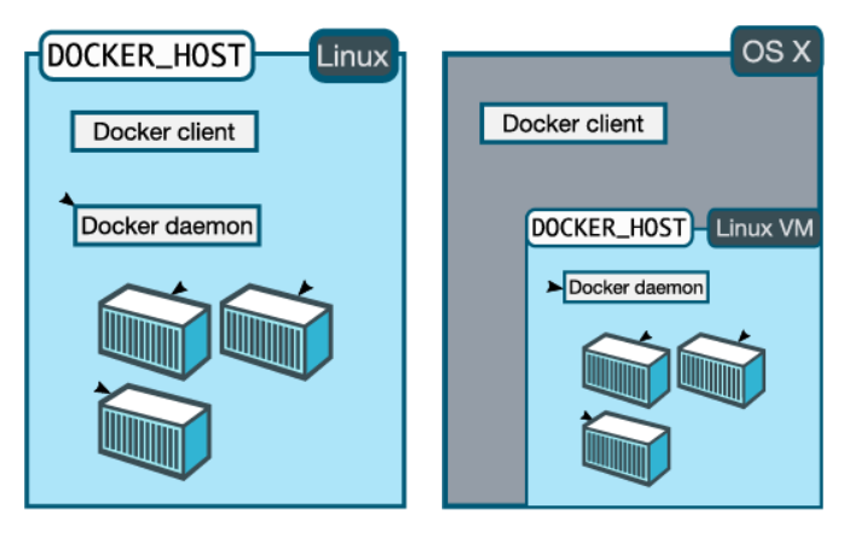

# Docker Setup


Docker CE(이하 docker)는 설치환경 및 목적에 따라 서로 다른 설치방법이 있습니다. 

예로써 아래 그림을 참고해서 보면 Docker는 Docker Client / Daemon 구조로 되어 있어(Docker daemon을 dockerd로 병행해서 쓰입니다.) Mac 및 Window 상에서 Docker를 설치 할 경우, Docker Client는 Host OS(Windows, Mac)에 설치되고 가상Linux서버를 생성해 Docker daemon이 설치되며, Linux에 설치하는 경우에는 Docker client, daemon이 동일한 Host(Linux)에 설치됩니다. 



이 문서는

- Linux에 Docker를 설치하는 가이드이며 Virtual Machine에 설치된 Ubuntu 18.04 LTS에 Docker를 설치합니다. 
- Kubernetes 실습을 위해 Kubernetes에서 지원되는 Docker의 특정 버전(18.06.0 ubuntu)을 설치하기 위한 방법을 가이드합니다.

개략적인 설치순서는 아래와 같습니다.

1. Kubernetes 1.13 버전의 지원대상 Docker 선정
2. Ubuntu에 Docker  Repository  추가
3. 추가된 Repository로부터 Docker 버전 조회
4. 설치가능한 Docker 설치


# Docker CE for CentOS(64bit)

## Requirements

### Host OS

Docker는 Linux Container기술을 기반으로 동작하기 때문에 Docker가 동작하는 Docker Host는 Linux이여야 합니다.  이 문서는 Host OS로써 SDS Cloud Colsole에서 CentOS(64bit) VM을 구성했다는 가정하에 작성되었습니다. 일부 설치 및 셋팅 방법에 있어 Linux 커널에 따라 상이한 방법이 존재하니 주의하시기 바랍니다.


### 설치계정

root계정으로 설치 및 구성합니다.

root 계정으로 로그인합니다.


## Install Docker CE

Docker를 설치하는 방법은 아래와 같이 3가지로 구분되어질 수 있는데, 여기서는 일반적으로 권장되는 설치 방법으로 Ubuntu에 Docker Repository를 추가해 docker를 설치하도록하겠습니다. 그 이외의 설치방법은 docker 공식문서를 참조바랍니다.

- Set up Docker's repositories : 일반적이고 권장되는 설치방법으로 Docker Repository를 추가해 설치하는 방법입니다. 이러한 방법은 사용자들에게 Docker의 설치와 업그레이드를 용이하게 할 수 있습니다.
- Install manually : 인터넷의 연결이 제한적인 환경하에서 설치되는 방법으로 DEB package를 다운로드 받아 수동으로 설치하는 방법입니다.
- convenience scripts : 사전에 작성된 스크립트를 수행해 자동으로 간편하게 Docker를 설치하는 방법입니다.


### Install using the repository

Host에 docker를 설치하기 위한 사전과정으로 Docker repository를 Ubuntu에 추가하는 과정입니다. 

#### SET UP THE REPOSITORY

1. 설치에 필요한 소프트웨어를 설치합니다.

   ```bash
   # yum install -y yum-utils \
     device-mapper-persistent-data \
     lvm2
   ```

2. Stable 저장소를 추가합니다.

   ```bash
   # yum-config-manager \
       --add-repo \
       https://download.docker.com/linux/centos/docker-ce.repo
   ```


#### INSTALL DOCKER CE

Kubernetes에서 지원되는 Docker 버전을 설치하기 위해 18.06.0 버전의 docker를 설치합니다.

1. 18.06.0 버전의 docker를 설치합니다.

   ```
   yum install -y docker-ce-18.06.0.ce-3.el7
   ```

2. docker0 bridge 네트워크 설정을 변경합니다.

   ```
   # mkdir -p /etc/docker
   # vi /etc/docker/daemon.json
   {
       "bip": "192.168.1.5/24",
       "fixed-cidr": "192.168.1.5/25",
       "fixed-cidr-v6": "2001:db8::/64"
   }
   ```

3. docker를 재시작합니다.

   ```
   # systemctl daemon-reload
   # systemctl restart docker
   ```

4. 정상적으로 설치되었는지 확인합니다.

   ```
   # docker version
   Client:
    Version:           18.06.0-ce
    API version:       1.38
    Go version:        go1.10.3
    Git commit:        0ffa825
    Built:             Wed Jul 18 19:09:54 2018
    OS/Arch:           linux/amd64
    Experimental:      false
   
   Server:
    Engine:
     Version:          18.06.0-ce
     API version:      1.38 (minimum version 1.12)
     Go version:       go1.10.3
     Git commit:       0ffa825
     Built:            Wed Jul 18 19:07:56 2018
     OS/Arch:          linux/amd64
     Experimental:     false
   ```

   


# DockerHub 접속하기

Docker Registry는 Docker의 이미지 저장소로써 운영환경에 따라 아래와 같이 3종류의 Registry를 사용할 수 있습니다.

- public으로 운영되는 Docker Hub
- 로컬서버에 설치해 사용할 수 있는 Private Local Registry

여기서는 Public Registry인 DockerHub를 사용하기위한 사전준비 내용에 대해 알아보도록하겠습니다.


## DockerHub 회원가입

DockerHub사이트에 접속한 후 가이드에 따라 회원가입절차를 완료합니다.

- DockerHub : https://hub.docker.com/


## Docker login

```bash
# docker login 
Username: DockerHub ID 입력
Password: DockerHub Password 입력
```

