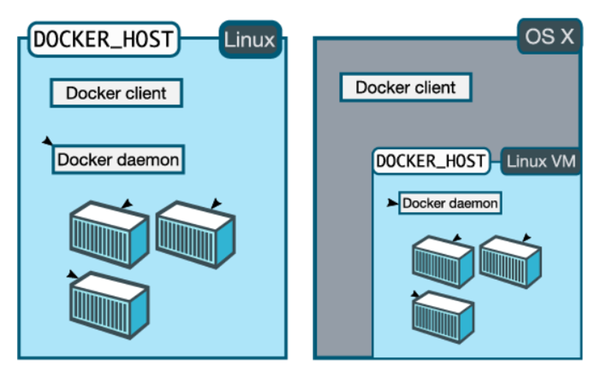
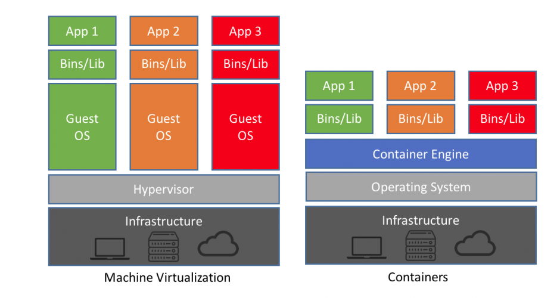

# Docker

*Outline*

[TOC]


## 실습환경


## 실습계정

docker & k8s는 root계정으로 실습됩니다.

실습전 아래와 같이 root 계정으로 로그인 부탁드립니다.

```bash
ubuntu@node0:~$ su root
Password: root
root@node0:/home/ubuntu# cd /
root@node0:/# 
```


## Docker란?

Docker는 애플리케이션과 그에 필요한 라이브러리들을 **Docker Images로 패키징**하여 **Container**라는 표준화된 규격으로 패키징한 애플리케이션을 신속하게 실행 및 배포할 수 있는 오픈소스 플랫폼입니다.

쉽게 말해, **Docker Image를 이용하여 Container를 실행하기 위한 플랫폼입니다.**


## Docker editions

Docker는 2가지 형태의 Edition을 제공합니다.

- Community Edition (CE)
- Enterprise Edition (EE)

Docker Community Edition (CE)은 무료버전으로 개인 및 작은 팀단위로 Docker를 활용할때 유용합니다.

Docker Enterprise Edition (EE)은 기업용 유료버전으로 운영환경을 염두해둔 Docker버전으로 CE버전에 비해 보다 많은 기능을 제공합니다.

| Capabilities                                                 | Docker Engine - Community     | Docker Engine - Enterprise    | Docker Enterprise             |
| ------------------------------------------------------------ | ----------------------------- | ----------------------------- | ----------------------------- |
| Container engine and built in orchestration, networking, security |  |  |  |
| Certified infrastructure, plugins and ISV containers         |                               |  |  |
| Image management                                             |                               |                               |  |
| Container app management                                     |                               |                               |  |
| Image security scanning                                      |                               |                               |  |


## Supported platforms

Docker CE는 아래와 같이 여러가지 multiple platform에서 사용가능합니다. 다만 Docker daemon은 Linux상에서 종속되어 실해되기 때문에 Windows와 Mac같은 Desktop 플랫폼의 경우 Docker Client는 Platform인 Host OS에 설치되고, Docker daemon의 경우는 가상의 Linux VM에 설치되어 실행됩니다.

### DESKTOP

| Platform                                                     | x86_64                        |
| ------------------------------------------------------------ | ----------------------------- |
| [Docker Desktop for Mac (macOS)](https://docs.docker.com/docker-for-mac/install/) |  |
| [Docker Desktop for Windows (Microsoft Windows 10)](https://docs.docker.com/docker-for-windows/install/) |  |

### SERVER

| Platform                                                     | x86_64 / amd64                                               | ARM                                                          | ARM64 / AARCH64                                              | IBM Power (ppc64le)                                          | IBM Z (s390x)                                                |
| ------------------------------------------------------------ | ------------------------------------------------------------ | ------------------------------------------------------------ | ------------------------------------------------------------ | ------------------------------------------------------------ | ------------------------------------------------------------ |
| [CentOS](https://docs.docker.com/install/linux/docker-ce/centos/) | [](https://docs.docker.com/install/linux/docker-ce/centos/) |                                                              | [](https://docs.docker.com/install/linux/docker-ce/centos/) |                                                              |                                                              |
| [Debian](https://docs.docker.com/install/linux/docker-ce/debian/) | [](https://docs.docker.com/install/linux/docker-ce/debian/) | [](https://docs.docker.com/install/linux/docker-ce/debian/) | [](https://docs.docker.com/install/linux/docker-ce/debian/) |                                                              |                                                              |
| [Fedora](https://docs.docker.com/install/linux/docker-ce/fedora/) | [](https://docs.docker.com/install/linux/docker-ce/fedora/) |                                                              | [](https://docs.docker.com/install/linux/docker-ce/fedora/) |                                                              |                                                              |
| [Ubuntu](https://docs.docker.com/install/linux/docker-ce/ubuntu/) | [](https://docs.docker.com/install/linux/docker-ce/ubuntu/) | [](https://docs.docker.com/install/linux/docker-ce/ubuntu/) | [](https://docs.docker.com/install/linux/docker-ce/ubuntu/) | [](https://docs.docker.com/install/linux/docker-ce/ubuntu/) | [](https://docs.docker.com/install/linux/docker-ce/ubuntu/) |


## Docker architecture

Docker는 클라이언트-서버 아키텍처로 구성되어있습니다. Client는 사용자의 인터페이스를 담당하는 부분이고 Server인 Docker daemon은 Client로부터온 요청(컨테이너 다운로드, 실행 및 배포 등)을 수행합니다.


Docker Client와 Daemon은 같은 Host에서 구성되거나 Docker client를 원격 daemon에 연결할 수도 있습니다.

따라서 위의 Docker가 설치/지원하는 플랫폼에 따라 아래와 같이 Linux에 설치할 경우는 하나의 Host에 Client와Daemon이 설치되며, Windows와 Mac에서는 Host Os에는 Docker client가 VM에는 Docker daemon이 설치됩니다.



이러한 Docker의 아키텍처는 굳이 사용자 측면에서 알 필요는 없지만, 사내 환경에서 Docker를 설치 또는 사용시 Proxy설정 등과 같은 문제를 해결할 때 큰 도움이 됩니다. 일반적으로 Host Window 상에서 Proxy를 설정할때는 windows상에 설치된 애플리케이션만 Proxy를 설정하곤 하지만, 가상머신과 Container로 격리된 네트워크 환경의 경우 고려해야 할 설정대상이 늘어나게됩니다.


### The Docker daemon

Docker daemon (`dockerd`)은 Docker Object(Container, Network, Volume 등)에 대한 Docker API 요청을 요청받아 처리하는 서비스입니다.


### The Docker client

Docker client (`docker`) 는 Docker 유저와 인터렉션하는 주요 사용자 인터페이스입니다. 사용자가 `docker run` 과 같은 명령어를 사용하면 Docker Client는 이 명령어를 `dockerd`로 전송하는 역할을 수행합니다.


### Docker registries

A Docker *registry*는 Docker image들을 저장하는 저장공간입니다.

Docker를 사용해 서버에 배포를 한다는 것은 일반적으로 사용자가 어떠한 형태로든 docker pull, docker run 등과 같은 명령어로 Docker registry에서 이미지를 Docker Host에 다운로드 받아 Container를 수행한다는 의미입니다. 

Docker registry는 Docker Hub와 같은 누구나 사용가능한 Public 레지스트리와 팀이나 기업내에서 자체 구축할 수 있는 Private 레지스트리로 구분될 수 있습니다.


## Container

**Container는  Linux 커널의 여러 기능을 활용하여 Container라는 격리된 공간 안에서 프로세스가 동작하는 기술입니다.**

가상머신과 동일한 효과를 보이지만, 기존의 가상 머신(VM)은 호스트의 하드웨어와 OS전체를 가상화하여 무겁고 느리지만, 컨테이너는 호스트 OS(리눅스) 커널의 기능을 공유하여 서버의 운영 체제를 프로세스의 격리/가상화를 통하여 가상머신에 비해 월등히 빠른 실행속도를 보입니다.

Docker는 이러한 컨테이너를 위한 운영 체제(또는 런타임)입니다. 

즉, Docker는 

​	Linux 커널의 여러 기능을 활용하여 프로세스를 격리시켜  Container를 생성하고, 

​	생성된 Container에서 Docker이미지를 실행합니다. 


### Namespaces

Docker는 Linux의 아래와 같은  `namespaces` 기능을 활용하여 격리된 Container를 구현합니다

- **The pid namespace:** Process isolation (PID: Process ID).
- **The net namespace:** Managing network interfaces (NET: Networking).
- **The ipc namespace:** Managing access to IPC resources (IPC: InterProcess Communication).
- **The mnt namespace:** Managing filesystem mount points (MNT: Mount).
- **The uts namespace:** Isolating kernel and version identifiers. (UTS: Unix Timesharing System).

### Control groups

Docker Engine cgroups 이라는 Linux기술을 이용하여 메모리,Cpu와 같은 Container에서 사용하는 하드웨어 리소스를 제어합니다.

### Union file systems

Union file systems은 Layer를 생성하여 동작하는 파일시스템으로 매우 가볍고 빠릅니다. Docker는 UnionFS를 사용하여 Container에 대한 Building Block을 제공합니다.


## chroot 실습

[chroot](https://ko.wikipedia.org/wiki/Chroot)를 사용해 리눅스 프로세스 위에 해당 프로세스와 다른 프로세스와 격리시키는 방법을 경험해 봄으로써 해당 실습을 통해 컨테이너과 가상화 기술에 대한 차이점을 알 수 있다.

### 실습1

1.1 root로 사용할 디렉터리를 생성

```markdown
root@node0:/# mkdir -p /lab/chroot/
```

1.2 chroot명령어로 현재 실행중인 프로세스의 루트 디렉터리를 변경

```markdown
root@node0:/# chroot /lab/chroot/ /bin/bash
chroot: failed to run command ‘/bin/bash’: No such file or directory
```

### 실습2

2.1 해당프로세스에서 사용할 bin폴더 및 bash라이브러리 파일 복사

```bash
# mkdir -p /lab/chroot/bin
# cp -v /bin/bash /lab/chroot/bin/
```

2.2 chroot명령어로 현재 실행중인 프로세스의 루트 디렉터리를 변경

```bash
# chroot /lab/chroot/ /bin/bash
```

2.3 bash의 의존성 라이브러리 파일 복사

```bash
# ldd /bin/bash
    linux-vdso.so.1 =>  (0x00007fff86bf1000)
    libtinfo.so.5 => /lib/x86_64-linux-gnu/libtinfo.so.5 (0x00007f88b36b2000)
    libdl.so.2 => /lib/x86_64-linux-gnu/libdl.so.2 (0x00007f88b34ae000)
    libc.so.6 => /lib/x86_64-linux-gnu/libc.so.6 (0x00007f88b30e4000)
    /lib64/ld-linux-x86-64.so.2 (0x00007f88b38db000)

# mkdir -p /lab/chroot/{lib,lib64}
# cp /lib/x86_64-linux-gnu/libtinfo.so.5 \
  /lib/x86_64-linux-gnu/libdl.so.2 \
  /lib/x86_64-linux-gnu/libc.so.6 \
  /lab/chroot/lib
# cp /lib64/ld-linux-x86-64.so.2 /lab/chroot/lib64
```

2.4 ls 및 의존성 라이브러리 파일 복사

```
cp -v /bin/ls /lab/chroot/bin/
cp /lib/x86_64-linux-gnu/libselinux.so.1 /lab/chroot/lib
cp /lib/x86_64-linux-gnu/libc.so.6 /lab/chroot/lib
cp /lib/x86_64-linux-gnu/libpcre.so.3 /lab/chroot/lib
cp /lib/x86_64-linux-gnu/libdl.so.2 /lab/chroot/lib
cp /lib/x86_64-linux-gnu/libpthread.so.0 /lab/chroot/lib
cp /lib64/ld-linux-x86-64.so.2 /lab/chroot/lib64
```

2.5 다시한번 chroot 명령으로 실행중인 프로세스의 root를 변경해봅니다.

```
chroot /lab/chroot/ /bin/bash
```

2.5 cd, pwd, ls명령어로 해당 프로세스의 root디렉터리가 변경되었음을 확인합니다.

```
bash-4.3# cd /
bash-4.3# pwd
/
bash-4.3# cd ..
bash-4.3# pwd
/
bash-4.3# ls
bin lib lib64
```


## Image

Image는 애플리케이션을 실행하기 위한 Runtime, libraries, Source 등이 포함되어 단독으로 실행가능한 SW패키지입니다.  Image 파일은 일련의 계층인 Layer로 이루어져 있으며 이 계층들은 단일 이미지로 결합됩니다.


### Image Layer

**Docker 이미지 파일은 일련의 파일시스템 계층(Layer)으로 이루어져 있으며 이 계층들은 단일 이미지로 결합됩니다.** 

여기서 일련의 계층, Layer란 애플리케이션을 구동하기위한 runtime, lib, src 등으로 구성된 파일시스템으로 아래 dockerfile에서 FROM, RUN, COPY 명령어가 이루어질때마다 각각의 Layer가 추가됩니다. 

```dockerfile
FROM alpine:latest
RUN apk add --update curl && rm -rf /var/cache/apk/*
COPY entrypoint.sh /
ENTRYPOINT ["/entrypoint.sh"]
CMD ["curl"]
```

### Read Only + Read Write Image Layer

Docker에서는 컨테이너가 실행되면, 실행* 또는 *복사*와 같은 명령을 저장할 수 있는 **R/W 계층이 생성되고,  그 하위의 Layer들은 R/O 속성을 지닙니다.**

이러한 특징으로 Docker는 이미지 사이즈 및 컨테이너 실행 측면에서 우수한 장점을 가지고 있습니다.

### Read Write Image Layer

이번 실습은 Container가 기동될때 최상단에 읽기/쓰기 가능한 Layer가 추가되는 것을 실습을 통해 확인해보겠습니다.


실습을 시작하기 전에 아래 명령어로 모든 이미지를 삭제하고 진행합니다.

```bash
# docker rm -f $(docker ps -aq)
# docker rmi -f $(docker images -aq)

root@node0:/# docker images
REPOSITORY          TAG                 IMAGE ID            CREATED             SIZE
root@node0:/# docker ps -a
CONTAINER ID        IMAGE               COMMAND             CREATED             STATUS              PORTS               NAMES
root@node0:/# 

```


1. ubuntu 이미지 pull

   ```bash
   root@node0:/# docker pull ubuntu
   Using default tag: latest
   latest: Pulling from library/ubuntu
   32802c0cfa4d: Pull complete 
   da1315cffa03: Pull complete 
   fa83472a3562: Pull complete 
   f85999a86bef: Pull complete 
   Digest: sha256:6d0e0c26489e33f5a6f0020edface2727db9489744ecc9b4f50c7fa671f23c49
   Status: Downloaded newer image for ubuntu:latest
   
   root@node0:/# docker images
   REPOSITORY          TAG                 IMAGE ID            CREATED             SIZE
   ubuntu              latest              93fd78260bd1        33 hours ago        86.2MB
   ```

1. Host에서 Layer를 조회해보면 4개의 이미지가 조회되는 것을 확인할 수 있습니다.

```bash
root@node0:/# ls -1 -t /var/lib/docker/overlay2
cd1a69742eeefdaff269b79a17522aaed110ff7357d6d946d093cd334f7c178a
l
d8e0269a8a2f10a82c5bfd7d8e98933fd95394fcc1f0acb9a70829e03c1b9625
94eb584a5aa8c30058c6b2c69700c4b18063c53b1906926722773ebfe475eda1
afbd5493874a5f5b6b3a1e3c46d975b2e64aa1ecac8a435241e2ff75fdcde35c
```

1. ubuntu 이미지를 터미널 모드로 실행

```
root@node0:/# docker run -it --name myubuntu ubuntu /bin/bash
root@4fc4682896c2:/# 
```

컨테이너를 빠져나와 다시한번 Host에서 Layer를 조회해봅시다.

```
root@4fc4682896c2:/# 
Ctrl + p + q 로 컨테이너를 빠져나옵니다.

root@node0:/# ls -1 -t /var/lib/docker/overlay2
de92b61f9bbc18b7cff4a95471ee0fc53647ca46e272df72536f88b40b35a252
de92b61f9bbc18b7cff4a95471ee0fc53647ca46e272df72536f88b40b35a252-init
l
cd1a69742eeefdaff269b79a17522aaed110ff7357d6d946d093cd334f7c178a
d8e0269a8a2f10a82c5bfd7d8e98933fd95394fcc1f0acb9a70829e03c1b9625
94eb584a5aa8c30058c6b2c69700c4b18063c53b1906926722773ebfe475eda1
afbd5493874a5f5b6b3a1e3c46d975b2e64aa1ecac8a435241e2ff75fdcde35c
```

컨테이너가 실행되면, 신규로 Layer가 추가된 것을 확인 할 수 있습니다. 이 Layer가 앞서 언급했던 R/W Layer 입니다. 이것은 컨테이너가 실행되면, 이미지가 변경될 계층이 생성(R/W Layer)되고, 이 Layer는 사용자가 샐행 또는 변경된 내용을 기록하게 됩니다. 

**docker에서 이렇게 Layer를 구성한 이유는** 무엇일까요?

**우선 이렇게 함으로써 하나의 이미지로부터 여러개의 서로 다른 Container 프로세스를 실행할 수 있게되었습니다.** 원본 이미지의 수정없이 Container마다 생성된 R/W레이어를 수정함으로써 컨테이너마다 다른정보를 저장할 수 있는 것입니다. 

또한, 같은 이미지를 여러개의 Container로 실행하게 되면 **읽기만 가능한 Layer들은 컨테이너를 여러개 실행해도 아래 그림과 같이 공유해서 사용할 수 있기 때문입니다.**

이것은 배포단계에서 큰 장점을 가지고 있습니다.

즉, 이미 로컬에 Layer가 존재하는 것은 다시 다운로드 받지 않으므로 Container가 실행될 때 작은 Size로 이미지를 Pull해 실행하므로 하드웨어 자원측면에서 유리하고 별도의 다운로드를 받지 않으므로 빠른 속도로 배포/실행되기 때문에 실행측면에서는  매우 유리합니다. 


   아래는 위 그림과 같이 동일한 Container를 실행했을때 R/O Layer는 늘어나지 않고 R/W Layer만 증가하는 것을 확인해보는 실습입니다.

1. 새로운 터미널에서 동일한 이미지로 또다른 Container를 구동후 컨테이너를 빠져 나옴니다.

   ```
   # docker run -it --name myubuntu2 ubuntu /bin/bash
   root@a9615258bdd5:/# 
   Ctrl + p + q 로 컨테이너를 빠져나옵니다.
   ```

   아래 명령어로 정상적으로 실행되었는지 확인합니다.

   ```
   docker ps
   ```

2. 다시한번 Host에서 Layer를 조회해 봅니다.

   ```
   # ls -1 -t /var/lib/docker/overlay2
   4106e6c73968375c30092c884d80b83086bc8bb474cfc4293c02995deec3ce10
   4106e6c73968375c30092c884d80b83086bc8bb474cfc4293c02995deec3ce10-init
   l
   de92b61f9bbc18b7cff4a95471ee0fc53647ca46e272df72536f88b40b35a252
   de92b61f9bbc18b7cff4a95471ee0fc53647ca46e272df72536f88b40b35a252-init
   cd1a69742eeefdaff269b79a17522aaed110ff7357d6d946d093cd334f7c178a
   d8e0269a8a2f10a82c5bfd7d8e98933fd95394fcc1f0acb9a70829e03c1b9625
   94eb584a5aa8c30058c6b2c69700c4b18063c53b1906926722773ebfe475eda1
   afbd5493874a5f5b6b3a1e3c46d975b2e64aa1ecac8a435241e2ff75fdcde35c
   ```

   이미지 Layer의 1개 증가했음을 알 수 있습니다. 이 Layer역시 위에서 보았던 R/W Layer이고, 읽기만 가능한 Layer들은 컨테이너를 여러개 실행해도 공유해서 사용한다는 것을 알 수 있습니다.


다음 실습을 위해 실행되고 있는  컨테이너를 삭제합니다.

```
docker rm -f $(docker ps -aq)
```


### 이미지 생성하기

이전 실습에서는 Container가 기동될때 최상단에 읽기/쓰기 가능한 Layer가 추가되는 것을 확인해보았습니다.

이번에는 pull받은 이미지로 신규 이미지를 생성했을때, 즉 컨테이너를 실행해 R/W Layer에 어떤 작업을 한후 해당 이미지를 신규로 생성했을때 신규로 만든 이미지와 Layer가 어떻게 구성되는지 확인해봅니다.

Docker로 이미지를 만드는 방식은 Dockerfile로 만드는 방식이 일반적이지만, 여기서는 Commit 명령어를 통해 이미지를 만들겠습니다.


실습내용

1. ubuntu 이미지를 실행해 터미널 모드로 Container안으로 진입
2. ubuntu container안에서 파일을 생성합니다.
3. container를 실행모드로 두고 Host로 나옵니다.
4. Commit명령어로 새로운 이미지를 생성합니다.


1. ubuntu container안에서 파일을 생성합니다.

   ```
   # docker run -it --name myubuntu ubuntu
   
   # echo "hello ubuntu" > hello.txt
   ```

2. container를 실행모드로 두고 Host로 나옵니다.

   ```
   Ctrl + p + q
   ```

   를 눌러 호스트로 나옵니다.

   호스트를 빠져나온 후 docker ps 명령어로 컨테이너가 데몬상태임을 확인합니다.

3. Commit명령어로 새로운 이미지를 생성합니다.

   ```
   # docker commit -a sds -m "add hello.txt" myubuntu localhost:5000/myununtu/1.0
   
   # docker images
   ```

   `-a "SDS <sds@samsung.com>"`과 `-m "add hello.txt"` 옵션으로 커밋한 사용자와 로그 메시지를 설정합니다. 

4. 실행중인 컨네이너를 삭제합니다.

   ```
   root@node0:# docker rm -f myubuntu2
   root@node0:# docker rm -f myubuntu
   ```

5. 신규로 image가 생성되었는지 확인합니다.

   ```
   root@node0:/# docker images
   REPOSITORY                    TAG                 IMAGE ID            CREATED             SIZE
   localhost:5000/myununtu/1.0   latest              7739ac2def6a        16 seconds ago      86.2MB
   ubuntu                        latest              93fd78260bd1        2 days ago          86.2MB
   
   ```

6. 다시한번 Host에서 Layer를 조회해 봅니다.

   ```
   # ls -1 -t /var/lib/docker/overlay2
   
   1df810ba492b9c91d9bafaeb5bacaf4d2bb871729a15b2285bd9a10f0f38860a
   cd1a69742eeefdaff269b79a17522aaed110ff7357d6d946d093cd334f7c178a
   d8e0269a8a2f10a82c5bfd7d8e98933fd95394fcc1f0acb9a70829e03c1b9625
   94eb584a5aa8c30058c6b2c69700c4b18063c53b1906926722773ebfe475eda1
   afbd5493874a5f5b6b3a1e3c46d975b2e64aa1ecac8a435241e2ff75fdcde35c
   ```


```
이미지를 신규로 생성했는에도 Layer는 1개만 증가했음을 알 수 있습니다.

즉, 신규로 이미지를 만들때 아래와 같은 프로세스로 진행됨을 짐작할 수 있습니다.
```


## Docker를 사용해야 하는 이유

### 신속성

Docker는 VM과는 달리 Hypervisor의 로딩없이 Host Linux Machine의 Kernel안에서 Container를 실행하기 때문에 가볍고 빠르게 동작합니다.




### 확장성

Docker가 소프트웨어를 컨테이너라는 표준화된 유닛으로 패키징하기 때문에 Docker를 사용하면 Linux서버환경이라면 어디서나 환경에 구애받지 않고 애플리케이션을 신속하게 배포 및 확장할 수 있습니다.


### 신속한 배포

새로운 하드웨어를 준비하고, 실행하고, 프로비저닝하고, 사용할 수 있게 하려면 일반적으로 며칠이 소요되었습니다.  Docker 기반 컨테이너는 Registry와 Image 기반의 배포로 컨테이너를 생성함으로써 표준화되고, 신속한 배포를 가능하게 합니다.


### 비용절감

Docker는 패키징된 애플리케이션을 신속하게 배포하기위해 Host Infrastructure로부터 분리되어 있습니다.

또한, Hypervisor의 로딩없이 Host Linux Machine의 Kernel안에서 실행하기 때문에 가볍고 빠르게 동작합니다.

이것은 동일한 하드웨어 리소스하에서 가상머신(VM)을 이용하는 것보다 상당히 많은 수의 애플리케이션을 실행할 수 있어 비용 측면에서 VM에 비해 유리합니다.


