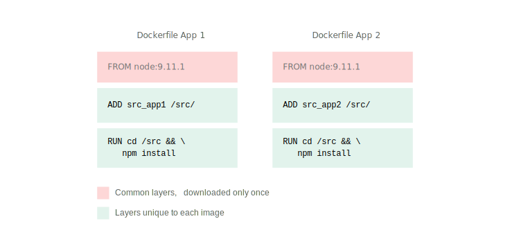
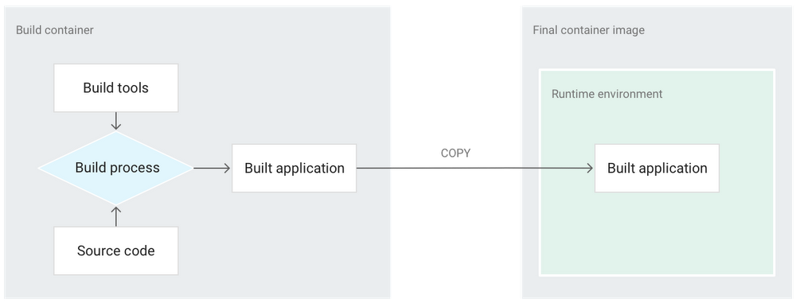
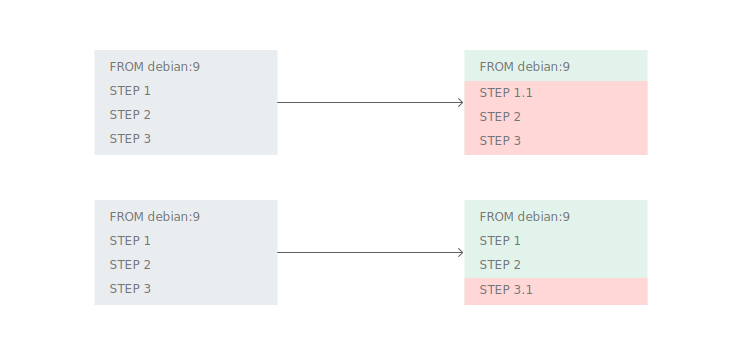
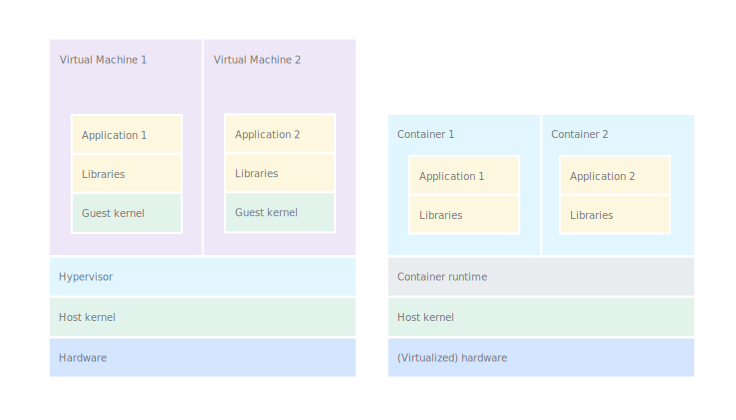

# Best practices for writing Dockerfiles

[TOC]

Container 기반의 클러스터 환경에서는 컨테이너 이미지를 빌드하는 과정은 굉장히 중요한 부분입니다. 예를 들어 컨테이너 이미지가 작을 수록 클러스터에 배포되고 실행되는 시간을 단축시킬 수 있으며 줄어든 크기만큼 클라우드 환경에서의 비용이 감소하게 됩니다. 또한 쉽게 Scale In/Out이 가능한 형태로 애플리케이션을 패키징하여 빌드가 이루어져야 될 것입니다. 여기에서는 이러한 관점에서 Dockerfile을 Build하는 방법에 관한 내용을 다루고 있습니다.

하기의 기술된 내용은 [Docker의 공식문서](https://docs.docker.com/develop/develop-images/dockerfile_best-practices/)와 [Google Cloud의 컨테이너 빌드](https://cloud.google.com/solutions/best-practices-for-building-containers#package_a_single_application_per_container)를 위한 권장사항의 내용은 기반으로 작성된 내용입니다. 


참고 : 모든 컨테이너 및 이미지 삭제

```bash
docker rm -f $(docker ps -aq)
docker rmi -f $(docker images -aq)
```


## Decouple applications


하나의 컨테이너에는 하나의 애플리케이션만 탑재하는 것이 좋습니다. 

여러 개의 애플리케이션이 있는 경우보다 보다 쉽고 간단하게 Scale Out이 가능하고 컨테이너를 재사용 할 수 있기 때문입니다. 예를 들어, 하나의 컨테이너에 여러 개의 앱이 있는 경우 수명 주기가 다를 수 있고 다른 상태일 수도 있습니다. 만약 컨테이너는 실행 중이지만 여러개의 애플리케이션 중 하나가 다운되거나 응답하지 않는 상황이 생길 수 있습니다. 이러한 경우 만약 컨테이너를 재시작해야 한다면 시스템의 서비스의 중단 등과 같은 중대한 문제가 발생할 수도 있습니다.


## Dockerfile build

자세한 내용을 살펴보기 전에 앞서 다루어었던 Dockerfile의 Build 프로세스를 간단한 java application을 빌드하는 dockerfile로 실습을 진행해보고 이번 장에서 살펴볼 사항에 대해 알아보겠습니다.

앞서 Host Ubuntu상에서 가장 먼저 했던 것은 Dockerfile생성 전에 특정 디렉터리를 생성하고 그 안으로 진입해 dockerfile을 만드는 것이였습니다.

1. java 애플리케이션을 빌드 할 디렉터리를 생성합니다.

   ```bash
   # mkdir /lab/dockerfile1
   # cd /lab/dockerfile1
   ```

2. 간단한 java 애플리케이션을 하나 코딩합니다.

   ```bash
   # gedit /lab/dockerfile1/HelloDocker.java
   public class HelloDocker {
   	public static void main(String[] args) {
   		System.out.println("Hello Docker!!!");
   	}
   }
   ```

3. dockerfile을 생성합니다.

   ```bash
   # gedit /lab/dockerfile1/dockerfile
   ```

   ```dockerfile
   FROM java:8
   COPY . /home/user/hello
   WORKDIR /home/user/hello
   RUN javac HelloDocker.java
   CMD ["java","HelloDocker"]
   ```

4. 이미지를 생성합니다.

   ```bash
   # docker build -t localhost:5000/helldocker:v1 .
   Sending build context to Docker daemon  3.072kB
   Step 1/5 : FROM java:8
   8: Pulling from library/java
   5040bd298390: Pull complete 
   fce5728aad85: Pull complete 
   76610ec20bf5: Pull complete 
   60170fec2151: Pull complete 
   e98f73de8f0d: Pull complete 
   11f7af24ed9c: Pull complete 
   49e2d6393f32: Pull complete 
   bb9cdec9c7f3: Pull complete 
   Digest: sha256:c1ff613e8ba25833d2e1940da0940c3824f03f802c449f3d1815a66b7f8c0e9d
   Status: Downloaded newer image for java:8
    ---> d23bdf5b1b1b
   Step 2/5 : COPY . /home/user/hello
    ---> 10d51612189d
   Step 3/5 : WORKDIR /home/user/hello
    ---> Running in 9539294e0af5
   Removing intermediate container 9539294e0af5
    ---> c9843510ae14
   Step 4/5 : RUN javac HelloDocker.java
    ---> Running in b686c33f954a
   Removing intermediate container b686c33f954a
    ---> 8c1fd0448bfa
   Step 5/5 : CMD ["java","HelloDocker"]
    ---> Running in de223237be31
   Removing intermediate container de223237be31
    ---> d89dec785e05
   Successfully built d89dec785e05
   Successfully tagged localhost:5000/helldocker:v1
   ```

5. 다시한번 이미지를 빌드해보겠습니다.

   ```bash
   root@ubuntu:/dockerfile# docker build -t localhost:5000/helldocker:v2 .
   Sending build context to Docker daemon  3.072kB
   Step 1/5 : FROM java:8
    ---> d23bdf5b1b1b
   Step 2/5 : COPY . /home/user/hello
    ---> Using cache
    ---> a69534f53343
   Step 3/5 : WORKDIR /home/user/hello
    ---> Using cache
    ---> 0689d5b541ea
   Step 4/5 : RUN javac HelloDocker.java
    ---> Using cache
    ---> d04aac66b3d9
   Step 5/5 : CMD ["java","HelloDocker"]
    ---> Using cache
    ---> bf05d0cbb82c
   Successfully built bf05d0cbb82c
   Successfully tagged localhost:5000/helldocker:v2
   ```

6. 생성한 이미지를 실행합니다.

   ```bash
   # docker run localhost:5000/helldocker:v1
   Hello Docker!!!
   ```


위에서 수행한 Docker build 결과로 출력된 내용을 보면 몇가지 사항을 알 수 있습니다.

우선 docker build시 가장먼저 표시되는 출력내용을 보면 아래와 같은 내용을 확인 할 수 있습니다.

 `Sending build context to Docker daemon  2.607kB`

또한 위에서 다시한번 빌드를 했을때 이전과는 다르게 엄청나게 빠른 속도로 Bulid가 수행되고, 각각의 Step에서 `Using cache` 라는 다른 수행결과가 표시됩니다. 즉, 이전에 빌드된 결과가 cache로 저장되어 동일한 Step인 경우 Cache를 사용해 빠르게 빌드가 되었음을 알 수 있습니다.

이제 이러한 사전지식을 바탕으로 Dockerfile build시 아래와 같은 몇가지 고려해야 할 사항을 살펴 볼 예정입니다.

- Build context 이해하기
- 최적의 Base이미지 사용하기
- 공통 Base 이미지 고려하기
- Layer 최소화하기
- Build cache 매커니즘 이해하기
- Build cache 최적화하기
- 이미지에 올바른 태크하기
- 루트로 실행하지 않기


## Build context

build context란 build명령어를 수행하는 현재 디렉터리 또는 특정공간입니다.

build명령어가 수행되면 가장먼저 build context에 존재하는 이미지를 생성하는데 필요한 각종 파일과 실행파일, 소스코드등을 Docker daemon으로 전송합니다.

예를 들어 아래와 같이 디렉터리와 파일을 생성 후 특정 위치로 이동하면, build context는 /buildcontext가 되고 그 하위의 모든 파일 및 디렉터리는 docker build시 docker daemon으로 전송되게 됩니다.

```bash
root@ubuntu:/# mkdir -p /buildcontext/a/b/c
root@ubuntu:/# echo "hello" > /buildcontext/a/helloa.txt
root@ubuntu:/# echo "hello" > /buildcontext/a/b/hellob.txt
root@ubuntu:/# echo "hello" > /buildcontext/a/b/c/helloc.txt

root@ubuntu:/# cd /buildcontext
root@ubuntu:/buildcontext# tree
.
└── a
    ├── b
    │   ├── c
    │   │   └── helloc.txt
    │   └── hellob.txt
    └── helloa.txt
```

이와는 별개로 Docker는 build context 의 root폴더에 기본설정 (`.`)으로 Dockerfile이 포함되어져 있다고 가정하는데, 반드시 build root 디렉터리 일 필요는 없습니다. Dockerfile이 다른 특정 디렉터리에 존재하더라도 -f 옵션으로 Dockerfile이 위치한 특정위치를 지정할 수 있습니다.

예를 들어 위의 예제에서 dockerfile을 buildcontext가 아닌 다른 디렉터리에 생성해 특정위치를 지정할 수 있습니다.

```bash
root@ubuntu:/# cd /lab/dockerfile
root@ubuntu:/dockerfile# ls
dockerfile  HelloDocker.java
root@ubuntu:/dockerfile# mkdir /lab/dockerfile2
root@ubuntu:/dockerfile# mv /lab/dockerfile /lab/dockerfile2/
root@ubuntu:/dockerfile# ls /lab/dockerfile2
```

```bash
# docker build -t localhost:5000/helldocker:v3 -f /dockerfile2/dockerfile /dockerfile
```

build context 는 아래와 같이 특정 디렉토리 또는 URL 로 지정 할 수 있습니다.

- Using a path

  - build context (`.`)
  - build context(-f  옵션)

- Using a URL

  

### Using a path

- build context (`.`)의 예제 : 이 경우 build context는 현재폴더를 build context root디렉터리로 인지합니다. (커맨드의 마지막 옵션으로 준 “.” 으로 정의됨)


```bash
mkdir myproject && cd myproject
echo "hello" > hello
echo -e "FROM busybox\nCOPY /hello /\nRUN cat /hello" > Dockerfile
docker build -t helloapp:v1 .
```

- build context (`-f옵션`)의 예제 : -f 옵션으로 다른 위치에 존재하는 Docker파일의 위치를 지정할 수 있습니다. 중요한 것은 Dockerfile의 위치와는 관계없이 아래 context root 디렉터리로 지정된 폴더 하위의 파일들을 모두 Docker Deamon으로 보낸다는 사실입니다.


```bash
mkdir -p dockerfiles context
mv Dockerfile dockerfiles && mv hello context
docker build --no-cache -t helloapp:v2 -f dockerfiles/Dockerfile context
```


### Using a URL

GitLab이나 GitHub등과 같은 소스레파지토리를 아래와 같이 Build Context로 사용할 수 있습니다.

```
$ docker image build -t genx:1.0 git@gitlab.com:lucj/genx.git
```

이 경우 build context는 *gitlab.com/lucj/genx*안에 존재하는 파일들입니다.


### Should I filter the build context ?

build context 의 폴더의 모든 파일을 docker daemon으로 전송하는데, 만약 빌드하는데 불필요한 파일들(예를 들어 샘플데이터 등과 같은 테스트용 데이터나 설정파일)이 build context에 포함되어져 있다면 그것은 그만큼 빌드에 소요되는 시간과 자원을 낭비하게 되고,  `ADD` 나 `COPY`명령어로 파일을 복사할때 실수로 불필요한 파일이 Container안으로 복사되어 이미지 크기가 커질 수 있습니다.

예로써 위에서 실습한 docker build 예제에서 실수로 용량이 ㅌㅌ되는 이클립스 설치파일이 build context에 포함되었다고 가정해보고 실습해보겠습니다.

```bash
# mkdir /lab/dockerfile3
# cp /lab/dockerfile1/* /lab/dockerfile3/
# cd /lab/dockerfile3
# wget http://www.mirrorservice.org/sites/download.eclipse.org/eclipseMirror/technology/epp/downloads/release/neon/3/eclipse-jee-neon-3-linux-gtk-x86_64.tar.gz
# ls -al
total 332264
drwxr-xr-x  2 root root      4096  2월 26 14:06 .
drwxr-xr-x 31 root root      4096  2월 26 14:05 ..
-rw-r--r--  1 root root       115  2월 26 14:06 dockerfile
-rw-r--r--  1 root root 340217968  2월 26 14:05 eclipse-jee-oxygen-R-linux-gtk.tar.gz
-rw-r--r--  1 root root       115  2월 26 14:05 HelloDocker.java
```

build시 docker daemon으로 용량이 커다란 파일을 전송하기 때문에 이전과는 확연하게 느려진것을 확인 할 수 있습니다.

```bash
root@ubuntu:/dockerfile3# docker build -t localhost:5000/helldocker:v3 .
Sending build context to Docker daemon  340.2MB
Step 1/5 : FROM java:8
 ---> d23bdf5b1b1b
Step 2/5 : COPY . /home/user/hello
 ---> 0b839884db06
Step 3/5 : WORKDIR /home/user/hello
 ---> Running in 47b803793813
Removing intermediate container 47b803793813
 ---> 811dc443cded
Step 4/5 : RUN javac HelloDocker.java
 ---> Running in da5d7014da79
Removing intermediate container da5d7014da79
 ---> 11bc76569da2
Step 5/5 : CMD ["java","HelloDocker"]
 ---> Running in 519a669fff1d
Removing intermediate container 519a669fff1d
 ---> 76d4cae33ce1
Successfully built 76d4cae33ce1
Successfully tagged localhost:5000/helldocker:v3
```

이미지를 조회해보면 컨테이너에 이클립스 설치파일이 들어가 있어 크기가 커진것을 알 수 있습니다.

```bash
root@ubuntu:/dockerfile3# docker images -a
REPOSITORY                  TAG                 IMAGE ID            CREATED             SIZE
localhost:5000/helldocker   v3                  76d4cae33ce1        41 seconds ago      983MB
localhost:5000/helldocker   v1                  bf05d0cbb82c        About an hour ago   643MB
localhost:5000/helldocker   v2                  bf05d0cbb82c        About an hour ago   643MB

```


#### .dockerignore file

Docker에서는 이러한 상황을 방지하기 위한 방법으로 .dockerignore라는 파일로 컨텍스트에서 파일이나 디렉터리를 제외함으로써 Docker 데몬에 전송하므로 필요 없는 파일을 관리할 수 있게 지원합니다.

`.dockerignore` file:

```
# comment
*/temp*
*/*/temp*
temp?
```

build behavior:

| Rule        | Behavior                                                     |
| ----------- | ------------------------------------------------------------ |
| `# comment` | comment                                                      |
| `*/temp*`   | root디렉터리의 서브디렉터리들 중 temp로 시작되는 서브디렉터리 하위의 파일 및 temp로 시작되는 파일들을 제외합니다. |
| `*/*/temp*` | root디렉터리의 2레벨 밑의 서브디렉터리들 중 temp로 시작되는 서브디렉터리 하위의 파일 및 temp로 시작되는 파일들을 제외합니다. |
| `temp?`     | root 디렉터리 중 명칭의 길이가 4이고 temp로 시작하는 디렉터리나 파일들을 제외합니다. |

Docker는 Go 언어로 작성되어 있기 때문에 파일 매칭도 Go 언어의 규칙을 따릅니다. 더 자세한 사항은 go lang의 [filepath.Match](http://golang.org/pkg/path/filepath#Match)  및 docker document를 참고바랍니다.

위에서 실습했던 예제로 `.dockerignore` 파일을 적용해 다시한번 docker build를 수행해보겠습니다.

```bash
# mkdir /lab/dockerfile4
# cp /lab/dockerfile3/* /lab/dockerfile4/
# cd /lab/dockerfile4
# ls -al
total 332264
drwxr-xr-x  2 root root      4096  2월 26 14:10 .
drwxr-xr-x 32 root root      4096  2월 26 14:10 ..
-rw-r--r--  1 root root       115  2월 26 14:10 dockerfile
-rw-r--r--  1 root root 340217968  2월 26 14:10 eclipse-jee-oxygen-R-linux-gtk.tar.gz
-rw-r--r--  1 root root       115  2월 26 14:10 HelloDocker.java
```

```bash
# gedit /lab/dockerfile4/.dockerignore
eclipse-jee-neon-3-linux-gtk-x86_64.tar.gz
```

docker build를 수행합니다. 처음에 빌드한것처럼 다시 빠르게 빌드가 되는 것을 알 수 있습니다.

```bash
# docker build -t localhost:5000/helldocker:v4 .
Sending build context to Docker daemon  4.096kB
Step 1/5 : FROM java:8
 ---> d23bdf5b1b1b
Step 2/5 : COPY . /home/user/hello
 ---> be59b804d9b7
Step 3/5 : WORKDIR /home/user/hello
 ---> Running in c934fb744b37
Removing intermediate container c934fb744b37
 ---> 3c5c8614b4bd
Step 4/5 : RUN javac HelloDocker.java
 ---> Running in f0641213fbc5
Removing intermediate container f0641213fbc5
 ---> 8fa17e2ca9bf
Step 5/5 : CMD ["java","HelloDocker"]
 ---> Running in 297860958d50
Removing intermediate container 297860958d50
 ---> f167911740a3
Successfully built f167911740a3
Successfully tagged localhost:5000/helldocker:v4
```

이미지를 조회해보면 정상적으로 이클립스 설치파일이 제외되어 build된 것을 알 수 있습니다.

```bash
#  docker images -a
REPOSITORY                  TAG                 IMAGE ID            CREATED             SIZE
localhost:5000/helldocker   v4                  f167911740a3        35 seconds ago      643MB
```


## Layer

### 최소 크기의 Base 이미지 사용

Base 이미지는 Dockerfile의 `FROM` 명령에서 참조되는 밑바탕이 되는 이미지입니다. Dockerfile의 다른 모든 명령은 이 이미지 위에 빌드가 이루어지는데, Base 이미지가 작을수록 결과 이미지가 작아지고 다운로드 속도는 빨라집니다. 예를 들어 [alpine:3.7](https://hub.docker.com/r/library/alpine/tags/) 이미지는 [centos:7](https://hub.docker.com/r/library/centos/tags/) 이미지보다 71MB 더 작습니다.

또한 만약 애플리케이션이 Static 바이너리인 경우 자신만의 런타임 환경을 구축할 수 있는 빈 이미지인 [scratch](https://hub.docker.com/r/library/scratch/)  이미지를 사용할 수도 있는데 이것은 오로지 사용자의 애플리케이션만 포함된 최종 이미지를 얻을 수 있어 이미지 크기를 크게 줄일 수 있고, 또한 이미지에 패키징된 도구 및 소프트웨어의 수를 줄임으로써 잠재적 공격자가 시스템 공격시 사용할 수 있는 작업도구를 줄이는 것이므로 공격자로부터 컨테이너를 보호할 수 있습니다.

```dockerfile
FROM scratch
COPY mybinary /mybinary
CMD [ "/mybinary" ]
```

구글의 [distroless](https://github.com/GoogleContainerTools/distroless) 프로젝트는 여러 언어에 최소한의 기본 이미지를 제공합니다. 이미지에는 언어에 대한 런타임 종속 항목만 포함되며, Linux 배포판에서 기대할 수 있는 많은 도구(셸, 패키지 관리자 등)는 포함되어 있지 않습니다.

앞선 예제에서는 Base 이미지로 java:8을 사용했지만, 그다지 좋은 선택은 아닙니다.

아래와 같이 생성된 이미지로 컨테이너를 실행하고 java -version을 조회하면 jdk를 포함한 이미지이므로 크기가 크기 때문입니다. 만약 java파일을 미리 컴파일해서 실행파일만 실행할 수 있는 환경을 구성한다면 이미지의 크기가 크게 줄어들 것입니다.

```bash
# docker run -it localhost:5000/helldocker:v4 /bin/bash
root@180a626ad3dc:/home/user/hello# java -version
openjdk version "1.8.0_111"
OpenJDK Runtime Environment (build 1.8.0_111-8u111-b14-2~bpo8+1-b14)
OpenJDK 64-Bit Server VM (build 25.111-b14, mixed mode)
```

[DockerHub](https://hub.docker.com/_/openjdk?tab=description&page=2)에서 OpenJdk관련 이미지 중 Openjdk 11.0-jre 버전을 Base 이미지로 변경해보겠습니다.

jre로 변경했기때문에 미리 컴파일된 class파일은 COPY하였습니다.

```bash
# mkdir /lab/dockerfile5
# cd /lab/dockerfile5
# ls -al
total 12
drwxr-xr-x  2 root root 4096  2월 26 14:51 .
drwxr-xr-x 33 root root 4096  2월 26 14:50 ..
-rw-r--r--  1 root root  540  2월 26 14:51 HelloDocker.class
```

```bash
# gedit /lab/dockerfile
FROM openjdk:11.0-jre
COPY . /home/user/hello
WORKDIR /home/user/hello

CMD ["java","HelloDocker"]
```

```
# docker build -t localhost:5000/helldocker:v5 .
```

실제 컨테이너를 실행해보면 정상적으로 동작하는 것을 확인하는 것을 알 수 있고 이미지의 크기도 크게 줄어들었음을 알 수 있습니다.

```bash
root@ubuntu:/dockerfile5# docker run localhost:5000/helldocker:v5
Hello Docker!!!
root@ubuntu:/dockerfile5# docker images
REPOSITORY                  TAG                 IMAGE ID            CREATED              SIZE
localhost:5000/helldocker   v5                  56428750b6e5        About a minute ago   479MB
localhost:5000/helldocker   v4                  f167911740a3        About an hour ago    643MB
localhost:5000/helldocker   v3                  76d4cae33ce1        About an hour ago    983MB
```


### 공통 레이어로 이미지 만들기

Docker 이미지를 다운로드해야 하는 경우 Docker는 먼저 이미지에 있는 일부 레이어가 이미 있는지 확인합니다. 해당 레이어가 있는 경우 레이어는 다운로드되지 않습니다. 이 상황은 현재 다운로드 중인 이미지와 같은 기본 이미지를 이전에 다운로드한 경우 발생할 수 있습니다. 결과적으로 두 번째 이미지에서는 다운로드되는 데이터의 양이 훨씬 적습니다.

조직 단위의 거버넌스 측면에서 개발자에게 일련의 공통적인 표준 기본 이미지를 제공하여 이러한 데이터 감소를 활용할 수 있습니다. 배포환경에서 각 기본 이미지를 한 번만 다운로드하고, 그 후에는 각 이미지를 고유하게 만드는 레이어만 필요하게되어지므로 결과적으로 공통된 이미지가 많을수록 다운로드 속도가 빨라집니다.



### Minimize the number of layers

- In Docker 1.10 and higher : `FROM`, `RUN`, `COPY`, `ADD` 명령어로 작성된 Step만이 layer를 생성합니다. 다른 지시자들은 임시 이미지에서 생성되고 실제 이미지의 크기에는 영향을 미치지 않습니다. 

- In Docker 17.05 and higher :  [multi-stage builds](https://docs.docker.com/develop/develop-images/multistage-build/) 를 사용하여 필요한 Layer만 최종이미지에 담을 수 있습니다. multi-stage build는 보통 애플리케이션을 build하는 이미지와 package하는 이미지로 나누어 dockerfile을 작성하게 되는데, Docker build가 수행되는 과정에서 빌드하는 이미지의 최종 바이너리 파일을 package하는 이미지로 옴김으로써 최종 이미지의 사이즈를 크게 줄일 수 있습니다.


#### Don’t install unnecessary packages

복잡성, dependencies, file사이즈, 빌드시간을 줄이기 위해서는 불필요한 패키지를 설치하는 것을 피해야합니다. 예를 들어 text editor가 필요하지 않는 곳에는 text editor를 설치하지 않는 것이 좋습니다. 또한 이러한 작업은 애플리케이션의 해커 등의 공격자로부터 공격 영역을 줄이는 효과가 있습니다.


#### Sort multi-line arguments

자세한 내용을 설명하기 전에 동일한 내용의 Dockerfile을 다른 형식으로 작성한 예시를 보겠습니다.

- Dockerfile1

```
FROM debian:9

RUN apt-get update && \
    apt-get install -y \
    [buildpackage]
RUN [build my app]
RUN apt-get autoremove --purge \
    -y [buildpackage] && \
    apt-get -y clean && \
    rm -rf /var/lib/apt/lists/*
```

- Dockerfile2

```
FROM debian:9

RUN apt-get update && \
    apt-get install -y \
    [buildpackage] && \
    [build my app] && \
    apt-get autoremove --purge \
    -y [buildpackage] && \
    apt-get -y clean && \
    rm -rf /var/lib/apt/lists/*
```

위의 2가지 Dockerfile은 동일한 결과를 가져오지만 예기치 못한 상황이 발생할 가능성을 염두해두면, Dockerfile1형태의(RUN명령어를 여러줄로 작성한) Dockerfile을 잘못 작성된 것이라고 볼 수 있습니다.

Dockerfile의 RUN 명령은 작성된 순서에 따라 최종이미지의 레이어로 순차적으로 밑에서부터 생성됩니다. Layer를 만든 Step보다 나중 단계의 Step에서 이전 Step의 데이터를 제거해도 전체 이미지의 크기는 줄어들지 않습니다. 데이터는 그대로 있으며 더 깊은 레이어에 숨겨질 뿐이기 때문입니다.

Dockerfile1의 예에서 `[buildpackage]` 및 `/var/lib/apt/lists/*`의 파일이 첫 번째 `RUN` 파일에 해당하는 레이어에 여전히 존재합니다. 이 레이어는 이미지의 일부이므로 최종 이미지에서 이미지에 포함된 데이터에 액세스할 수 없는 경우에도 나머지는 업로드하고 다운로드해야 합니다.

Dockerfile의 올바른 버전에서는 모든 기능이 기본 제공 앱만 포함된 단일 레이어에서 수행됩니다. `[buildpackage]` 및 `/var/lib/apt/lists/*`의 파일은 결과 이미지의 어느 곳에도 존재하지 않으며 더 깊은 레이어에도 숨겨지지 않습니다.

예를 들어 위의 java 애플리케이션 예제의 dockerfile의 경우 조금더 이미지 크기를 줄이기 위해 컴파일 이후 java파일을 삭제하는 명령어를 추가하고자 한다면 따로 RUN 명령어를 작성하는 것이 아니라 한줄로 작성해야 된다는 의미입니다.

```dockerfile
FROM java:8
COPY . /home/user/hello
WORKDIR /home/user/hello
RUN javac HelloDocker.java && rm -rf HelloDocker.java
CMD ["java","HelloDocker"]
```

```bash
root@ubuntu:/dockerfile6# docker build -t localhost:5000/helldocker:v6 .
Sending build context to Docker daemon  3.072kB
Step 1/5 : FROM java:8
 ---> d23bdf5b1b1b
Step 2/5 : COPY . /home/user/hello
 ---> 8bb1a3af303f
Step 3/5 : WORKDIR /home/user/hello
 ---> Running in bae45311de01
Removing intermediate container bae45311de01
 ---> eb85373b384c
Step 4/5 : RUN javac HelloDocker.java && rm -rf HelloDocker.java
 ---> Running in 6fbd524b8372
Removing intermediate container 6fbd524b8372
 ---> 9c5c67675111
Step 5/5 : CMD ["java","HelloDocker"]
 ---> Running in a78c17288d2c
Removing intermediate container a78c17288d2c
 ---> f6dcdfe811f7
Successfully built f6dcdfe811f7
Successfully tagged localhost:5000/helldocker:v6
```


#### Use multi-stage builds



[Multi-stage builds](https://docs.docker.com/develop/develop-images/multistage-build/) (in [Docker 17.05](https://docs.docker.com/release-notes/docker-ce/#17050-ce-2017-05-04) or higher)는 Build Container에서는 애플리케이션 Build를 수행하고 그 결과물인 애플리케이션 바이너리만 최종 Container 이미지에 복사함으로써 최종이미지를 크게 줄여주는 좋은 방법입니다. 

변경전:

```dockerfile
FROM node:lts-alpine

# install simple http server for serving static content
RUN npm install -g http-server

# make the 'app' folder the current working directory
WORKDIR /app

# copy both 'package.json' and 'package-lock.json' (if available)
COPY package*.json ./

# install project dependencies
RUN npm install

# copy project files and folders to the current working directory (i.e. 'app' folder)
COPY . .

# build app for production with minification
RUN npm run build

EXPOSE 8080
CMD [ "http-server", "dist" ]
```

변경후:

```dockerfile
# build stage
FROM node:lts-alpine as build-stage
WORKDIR /app
COPY package*.json ./
RUN npm install
COPY . .
RUN npm run build

# production stage
FROM nginx:stable-alpine as production-stage
COPY --from=build-stage /app/dist /usr/share/nginx/html
EXPOSE 80
CMD ["nginx", "-g", "daemon off;"]
```

예제로 다루었던 java 애플리케이션의 경우도 위와 같이 Use multi-stage build를 사용하는 것이 효과적일 수 있습니다.

```
# mkdir -p /lab/dockerfile6
# cp /lab/dockerfile1/HelloDocker.java /lab/dockerfile6/
# cd /lab/dockerfile6
# gedit dockerfile
```

```dockerfile
# build stage
FROM java:8 as build-stage
COPY . /home/user/hello
WORKDIR /home/user/hello
RUN javac HelloDocker.java && rm -rf HelloDocker.java


# production stage
FROM openjdk:11.0-jre as production-stage
COPY --from=build-stage /home/user/hello /home/user/hello
WORKDIR /home/user/hello

CMD ["java","HelloDocker"]
```

```bash
root@ubuntu:/dockerfile6# docker build -t localhost:5000/helldocker:v6 .
Sending build context to Docker daemon  3.072kB
Step 1/8 : FROM java:8 as build-stage
 ---> d23bdf5b1b1b
Step 2/8 : COPY . /home/user/hello
 ---> ed7f957febd4
Step 3/8 : WORKDIR /home/user/hello
 ---> Running in 4b2e4af716b2
Removing intermediate container 4b2e4af716b2
 ---> c976d5d748ed
Step 4/8 : RUN javac HelloDocker.java && rm -rf HelloDocker.java
 ---> Running in 559f89846f77
Removing intermediate container 559f89846f77
 ---> 1b540b6f1884
Step 5/8 : FROM openjdk:11.0-jre as production-stage
 ---> 9df4aac22102
Step 6/8 : COPY --from=build-stage /home/user/hello /home/user/hello
 ---> 94386950b4a2
Step 7/8 : WORKDIR /home/user/hello
 ---> Running in 8f1cfaaba21f
Removing intermediate container 8f1cfaaba21f
 ---> 7d5d5a032b92
Step 8/8 : CMD ["java","HelloDocker"]
 ---> Running in 30d0b4439702
Removing intermediate container 30d0b4439702
 ---> d926d2f51eac
Successfully built d926d2f51eac
Successfully tagged localhost:5000/helldocker:v6
```

빌드된 이미지로 컨테이너를 수행해보면 정상적으로 작동하는 것을 확인 할 수 있고 이미지의 크기도 줄어든것을 알 수 있습니다.

```bash
root@ubuntu:/dockerfile6# docker run localhost:5000/helldocker:v6
Hello Docker!!!
root@ubuntu:/dockerfile6# docker images
REPOSITORY                  TAG                 IMAGE ID            CREATED             SIZE
localhost:5000/helldocker   v6                  d926d2f51eac        48 seconds ago      479MB
openjdk                     11.0-jre            9df4aac22102        2 weeks ago         479MB
java                        8                   d23bdf5b1b1b        2 years ago         643MB
```


### build cache 활용

서두에서도 잠깐 살펴보았지만, Dockerfile을 Build할때 Docker는 Dockerfile에 있는 Step에 따라 Build를 수행하는데, 이때 캐시된 Layer가 존재하면 기본설정으로 캐시에서 Layer를 찾아 재사용합니다. (캐시를 Disable하려면  `--no-cache=true` 을 주면됩니다.) 

이러한 매커니즘은 빌드배포환경 및 Cloud 환경에서 속도와 이미지 크기 측면에서 큰 장점을 갇고 있지만, 자칫 Build 오류로 이어질 수 있는 여지가 있어 몇가지 경우를 고려해야합니다.

그럼 먼저 Docker에서 Build시 캐시를 활용하는 매커니즘을 확인해보겠습니다.

- 캐시에 존재하는 부모 이미지로부터 시작하여 다음 Step들의 모든 캐시에 있는 Step을 비교하여 부모에서부터 동일한 Step까지 캐시에 있는 이미지를 재사용합니다. 
- 대부분의 지시자들은 지시자 명령어 문자열이 일치하는지 여부로 캐시 사용여부를 판단합니다.
-  `ADD` 과 `COPY` 지시자는 이미지 안의 파일들이 체크섬으로 기존 이미지의 체크섬과 비교/검사되고, 파일의 최종수정시간 및 마지막 액세스 시간은 고려되지 않습니다. 
- `ADD` 와 `COPY` 지시자 외에 다른 지시자들에서는 캐시 재사용확인을 위해 체크섬 값을 확인하지 않습니다. 예를 들어  `RUN apt-get -y update`의 경우 해당 명령어로 업데이트 된 파일들을 비교하지 않는다는 의미입니다.


#### Docker 빌드 캐시 최적화

##### Build Step 배치

Docker 빌드 캐시를 최대한 활용하려면 Dockerfile 맨 아래에 자주 변경되는 빌드 단계를 배치해야 합니다. 그렇치 않고 자주 변경되는 단계를 Dockerfile의 맨 위에 배치하면 그 하위의 Docker는 자주 변경되지 않는 다른 빌드 단계에 대해 빌드 캐시를 사용할 수 없으므로 비효율적인 상황이 발생하게 됩니다.

이러한 이유때문에 소스 코드를 복사하는 Step은 Dockerfile에서 가능한 한 늦게 배치하는 것이 좋습니다. 예로써 아래 그림에서  `STEP 1`을 변경하면 Docker는 `FROM debian:9` 단계의 레이어만 다시 사용하지만 `STEP 3`를 변경하면 Docker는 `STEP 1` *및* `STEP 2`의 레이어를 다시 사용할 수 있습니다.



##### apt-get update & install

Docker Build Step이 로컬 파일 시스템에 저장된 모든 종류의 Build 캐시에 의존하는 경우 이 캐시는 동일한 Build Step에서 수행되어야 합니다. 

예로써 설명하면 아래와 같이 Dockerfile을 작성하는 대신

```dockerfile
FROM debian:9

RUN apt-get update
RUN apt-get install -y nginx
```

하나의 `RUN` 단계에서 2개의 RUN 명령을 병합해 사용해야 한다는 뜻입니다.

```dockerfile
FROM debian:9

RUN apt-get update && \
    apt-get install -y nginx
```

위와 같이 RUN명령을 병합해 사용하지 않으면 Build캐시의 레이어 재사용으로 인해 예기치 않은 다른 결과를 초래할 수 있습니다. 

만약 nginx의 버전이 변경되어 아래와 같이 dockerfile을 변경했다고 가정하면, 아래 Dockerfile을 빌드시 `RUN apt-get update Step`은 캐시에 존재하는 Layer를 재활용하므로 `RUN apt-get install -y nginx.v1`하는 시점에서의 패키지 관리자는 이전 캐시에 저장된 저장소를 참조하게 되는 상황이 발생합니다.

```dockerfile
FROM debian:9

RUN apt-get update
RUN apt-get install -y nginx.v1
```


## 이미지에 올바르게 태그하기

컨테이너 이미지는 하나의 소프트웨어를 패키징하고 출시하는 방법입니다. 이미지를 태그하면 사용자가 소프트웨어의 특정 버전을 식별하여 다운로드할 수 있으므로 컨테이너 이미지의 태그 정책과 소프트웨어의 출시 정책을 긴밀하게 연결해야 합니다.

여기서는 Docker Container를 Tag하는 일반적인 두가지 방법에 대해 살펴봅니다.

- SemVer(Semantic Versioning)를 사용하여 태그하기
- Git 커밋 해시를 사용하여 태그하기

> Docker 이미지는 일반적으로 이름과 태그라는 2가지 구성요소로 식별됩니다. 
>
> 예를 들어 `google/cloud-sdk:193.0.0` 이미지의 경우
>
>  'google/cloud-sdk'는 이름이고 
>
> '193.0.0'은 태그입니다. 
>
> Docker 명령어에 태그를 제공하지 않으면 기본적으로 '최신' 태그가 사용됩니다. 


### *SemVer*(Semantic Versioning)를 사용하여 태그하기

오픈소스 및 솔루션 등과 같은 소프트웨어를 배포하는 일반적인 방법은 배포되는 애플리케이션을 '태그'(예: `git tag` 명령어)하는 것입니다. [*SemVer*(Semantic Versioning) ](https://semver.org/)을 사용하면 버전 번호를 관리를 용이하게 할 수 있는데 Tag를 3부분(X,Y,Z)으로 구성/관리하게 됩니다.

- X는 이전 버전과 호환되지 않는 API 변경에 대해서만 증가되는 Major 버전입니다.
- Y는 새로운 기능을 위해 증가되는 Minor 버전입니다.
- Z는 버그 수정을 위해 증가되는 Patch 버전입니다.


### Git 커밋 해시를 사용하여 태그하기

오픈소스 및 솔루션과 같은 경우 사용자들을 위해 명시적인 Tag가 필요하겠지만 그렇지 않은 경우 Git 커밋해시를 사용하는 것도 Tag에 소스추적성을 갖출 수 있어 좋은 선택일 수 있습니다. 

CI/CD 배포 자동화 시스템을 사용중이고, 애플리케이션의 배포가 자주 이루어지는 소프트웨어의 경우 SemVer과 같은 명시적인 Tag방법은 꽤 까다롭고 번거로울 수 있습니다. 이 경우 Tag의 버전 번호를 처리하는 일반적인 방법은 Git 커밋 SHA-1 해시를 버전 번호로 사용하는 것입니다. 이렇게 하면 편의성이 증대되고 Docker 이미지로부터 소스가 추적 가능하게 되는 이점을  가질수 있습니다.

git 해시값은 git rev-parse-short명령으로 알수 있습니다.


## 루트로 실행하지 않기

컨테이너는 Linux Host 상에서 Host와 커널을 공유한 격리된 공간을 제공합니다. 기본적으로 Docker 컨테이너 내의 프로세스는 호스트 머신에 액세스할 수 없지만, 컨테이너는 호스트 머신의 커널을 공유하므로 컨테이너 격리는 Hypervisor의 가상 머신만큼 안전한 격리를 제공하지는 않습니다. 

따라서 해커 등의 공격자가 컨테이너 밖으로 나갈 수 있는 취약점을 발견한다면, 컨테이너 내에서 프로세스가 루트로 실행 중인 경우 공격자는 호스트 머신에 대한 루트 액세스 권한을 얻을 수도 있습니다.



이 가능성을 피하기 위한 권장사항은 컨테이너 내에서 루트로 프로세스를 실행하지 않는 것입니다. Dockerfile에서 User를 생성하고 최소한의 권한을 부여하고 `USER` 지시자로 Container를 실행해야 합니다.

- 유저 및 유저그룹 생성
- 최소한의 권한부여
- USER 지시자로 실행 USER 변경

현실에서는 어려운 점이 있습니다. 유명 소프트웨어 패키지의 상당수는 기본 프로세스를 루트로 실행합니다. 루트 실행을 방지하려면 권한이 높지 않은 알 수 없는 사용자로 실행 가능하도록 컨테이너를 설계합니다. 이 방식은 많은 경우 다양한 폴더의 권한을 조정해야 함을 의미합니다. [컨테이너당 애플리케이션 하나](https://cloud.google.com/solutions/best-practices-for-building-containers#package_a_single_app_per_container) 권장사항에 따르고 단일 사용자([루트가 아닌 것이 좋음](https://cloud.google.com/solutions/best-practices-for-operating-containers#avoid_running_as_root))로 단일 애플리케이션을 실행 중인 경우 컨테이너에서 모든 사용자에게 폴더 또는 파일에 대한 읽기/쓰기 권한을 부여하는 것은 문제가 되지 않습니다.

컨테이너가 권장사항을 준수하는지 여부를 확인하는 간단한 방법은 임의의 사용자로 로컬에서 컨테이너를 실행하여 올바르게 작동하는지 여부를 테스트하는 것입니다. `[YOUR_CONTAINER]`를 컨테이너 이름으로 바꿉니다.

```
docker run --user $((RANDOM+1)) [YOUR_CONTAINER]
```

컨테이너에 외부 볼륨이 필요한 경우 [fsGroup Kubernetes 옵션](https://kubernetes.io/docs/tasks/configure-pod-container/security-context/#set-the-security-context-for-a-pod)을 구성하여 특정 Linux 그룹에 이 볼륨의 소유권을 부여할 수 있습니다. 이 구성은 외부 파일 소유권 문제를 해결합니다.

권한이 높지 않은 사용자가 실행하는 프로세스는 1024 미만의 포트를 바인딩할 수 없습니다. 이 경우 다른 포트로 트래픽을 라우팅하도록 Kubernetes Services를 구성할 수 있으므로 일반적으로는 문제가 되지 않습니다. 예를 들어 포트 8080에 바인딩하고 Kubernetes Service로 포트 80의 트래픽을 리디렉션하도록 HTTP 서버를 구성할 수 있습니다.


