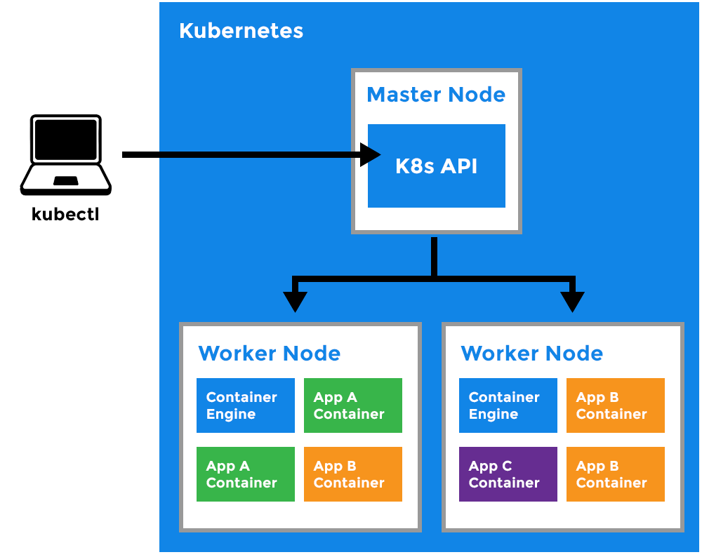
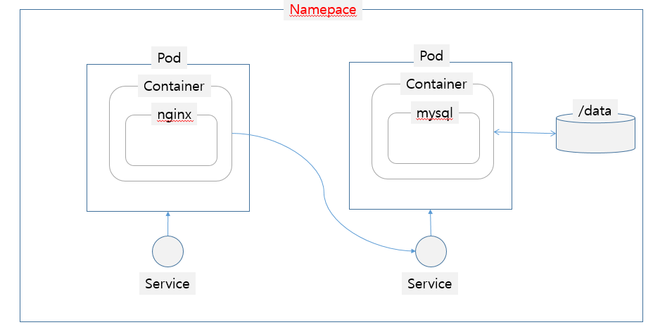
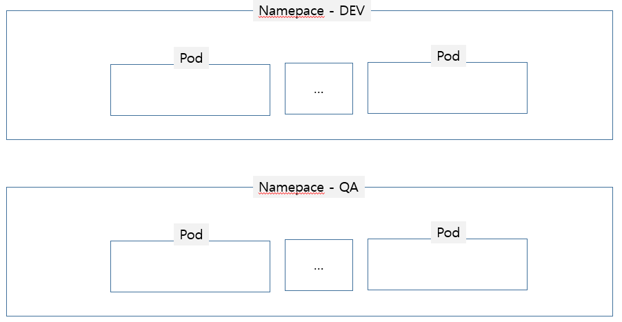

# What is Kubernetes?

*Outline*

[TOC]

Kubernetes 또는 k8s (*첫글자 k와 끝글자 s를 제외한 8 글자인 “ubernete”를 8로 대체한 약어*) 또는 간단히 "kube"는 컨테이너 응용 프로그램의 배포, 확장 및 관리를 자동화하는 container orchestration 오픈소스 플랫폼입니다. 

Kubernetes는 컨테이너화된 애플리케이션들에 대해 

- 컨테이너를 실행하는 호스트 그룹을 클러스터링 할 수 있습니다.
- 적절한 위치에 배포하고 (auto-placement) 서비스할 수 있습니다.
- 자동으로 복구할 수 있습니다. (auto-restart)
- 자동으로 추가(scaling), 복제(replication), 업데이트(rolling update), 롤백(rollback) 할 수 있습니다.


<출처:https://medium.com/@carlosedp/multiple-traefik-ingresses-with-letsencrypt-https-certificates-on-kubernetes-b590550280cf>


## Cluster

Kubernetes 내 Master와 여러개의 Node로 구성된 추상 개념으로, 컨테이너화된 애플리케이션을 배포, 관리하는 논리적인 환경입니다.

## Master와 Node



### Master

쿠버네티스 관리자는 Master Node를 통해 클러스터를 관리합니다.  Master Node는 1대 이상 구축할 수 있고 본 과정에서는 Master VM에 1대 구성되어 있습니다. 구성요소인 API Server, Controller Manager, Scheduler, etcd 등으로 클러스터내 연결된 노드들의 이벤트를 감지하고, Workerd Node에게 배포, 스케일링 등의 명령을 내립니다.

### Node

VM머신으로 실제 Docker Engine이 구동되어 컨테이너가 실행되는 서버입니다. 

Master의 API Server로부터 Master의 명령을 받아컨테이너의 상태를 관리합니다.

(Node == Worker == Minion)


## Kubernetes Object 

Kubernetes에서 Object를 생성하고자 할때 Kubernetes 시스템에 해당 객체의 Spec과 원하는 상태나 특성 등을 알려주어야 합니다.  Object를 생성하는 방법은 3가지로 구분될 수 있는데

- API Request
- kubectl 명령어
- kubectl 명령어 with yaml

Cluster상의 리소스 배포는 일반적으로 YAML(YAML Ain't Markup Language) 형식으로 정의한 파일을`kubectl create` 또는 `kubectl apply` 명령어를 사용해 배포하는 것이 일반적이므로 본 과정에서도 주로 kubectl apply 명령어로 Object를 생성합니다.


### Spec and Status

모든 Kubernetes Object는 Object Spec과 Status를 가지고 있습니다. Kubernetes 사용자는 Spec을 통해 Object에 대해 원하는 상태나 특성을 정의하고 Status는 그러한 정의에 대한 Kubernetes 시스템 상에서의 실제 상태를 나타냅니다. 

다음 예제는 NGINX 웹 서버의 Deployment를 생성하는 예제입니다. 

Deployment의 주요Spec은 *3*개의 복제본을 만들고, Lavel selector가  app: nginx입니다.

ReplicaSet의 주요Spec은 Pod안에 컨테이너를 명세하고 있습니다.  nginx이미지로 *80* 포트가 컨테이너에서 열리도록 지정하고 CPU 및 메모리에 대한 리소스 요청 및 제한도 정의하고 있습니다.

여기서 혼동하기 쉬운부분은 아래  Deployment는 하위에 2개의 Spec이 존재하고 있다는 사실입니다.

즉 먼저나온 spec은 Deployment의 spec이며, 두번째로 나온 spec은  ReplicaSet의 spec입니다.

```
apiVersion: apps/v1 # for versions before 1.9.0 use apps/v1beta2
kind: Deployment
metadata:
  name: nginx-deployment
spec:
  selector:
    matchLabels:
      app: nginx
  replicas: 2 # tells deployment to run 2 pods matching the template
  template:
    metadata:
      labels:
        app: nginx
    spec:
      containers:
      - name: nginx
        image: nginx:1.7.9
        ports:
        - containerPort: 80
```

배포명령어

```
# kubectl apply -f XXX.yaml
```

배포확인

```
# kubectl get pod
```

리소스 관련 주요 명령어

```
# kubectl get {Object타입} {Object명} -o {출력형식}
Object타입
  - pod
  - svc
  - deployment 등
출력형식
  - yaml : yaml파일 형식으로 출력
  - json : json파일 형식으로 출력
  
# kubectl get pod my-nginx
# kubectl get pod my-nginx -o yaml
# kubectl get pod my-nginx -o json


# kubectl get {Object타입} {Object명} -w
-w -tail과 같이 연속성을 가지는 Object 확인시
# kubectl get pod my-nginx -w

# Object의 상세내용을 출력하고자 할때
# kubectl describe {Object타입} {Object명}
# kubectl describe pod my-nginx

# Object를 삭제
# kubectl delete {Object타입} {Object명}
# kubectl delete pod my-nginx
```


## Namespace





Kubernetes는 동일한 Cluster위에 여러개의 가상 Cluster를 지원합니다. 이러한 가상 Cluster는 Pod 및 Deployment와 같은 Kubernetes 리소스를 논리적인 단위로 그룹화할 수 있는데, 이러한 가상의 Cluster를 namespace라고 합니다.

아래 명령어로 클러스터 내의 namespace를 조회할 수 있습니다.

```shell
root@master:~# kubectl get namespaces
NAME          STATUS   AGE
default       Active   10d
kube-public   Active   10d
kube-system   Active   10d
```

Kubernetes를 설치하면 초기셋팅으로 아래와 같은 namespace가 조회됩니다.

- `default` The default namespace for objects with no other namespace
- `kube-system` The namespace for objects created by the Kubernetes system
- `kube-public` 이 namespace 역시 자동으로 생성되는 namespace로써,  Kubernetes Cluster 전체에서 볼수 있는 리소스에 사용될 수 있으며, 모든 사용자가 볼 수 있습니다.


### Subdividing your cluster using Kubernetes namespaces

구성된 클러스터를 namespace를 통해 동일한 phisical machine에 여러개의 cluster로 분할하여 사용할 수 있습니다.  여기서는 개발자들이 사용하는 dev cluster, 운영을 위한 prod cluster로 namespace를 생성하는 예제입니다.

```
gedit /lab/namespace/namespace-dev.yaml
```

```
apiVersion: v1
kind: Namespace
metadata:
  name: development
  labels:
    name: development
```

```
geidt /lab/namespace/namespace-prod.yaml
```

```
apiVersion: v1
kind: Namespace
metadata:
  name: production
  labels:
    name: production
```

생성한 yaml파일을 cluster에 배포합니다.

```
root@master:/lab/namespace# kubectl apply -f /lab/namespace
namespace/development created
namespace/production created
```

배포된 결과를 조회하면 아래와 같이 development, production 의 namespace가 추가된 것을 확인할 수 있습니다.

```
root@master:/lab/namespace# kubectl get namespaces --show-labels
NAME          STATUS   AGE     LABELS
default       Active   6d23h   <none>
development   Active   52s     name=development
kube-public   Active   6d23h   <none>
kube-system   Active   6d23h   <none>
production    Active   52s     name=production
```


그럼 신규로 생성된 namespace를 context로 지정해 pod를 생성해보도록하겠습니다.

context를 지정하지 않으면  object를 생성할 때 option으로 아래와 같이 namespace를 주어야 해당되는 namespace에 배포가 됩니다.

```
$ kubectl --namespace=<insert-namespace-name-here> run nginx --image=nginx
$ kubectl --namespace=<insert-namespace-name-here> get pods
```

kubectl config view 명령어로 현재 설정된 cluster config정보를 조회해봅니다. 현재는 default로 생성된 kubernetes-admin@kubernetes라는 context만 존재하는 것을 확인할 수 있습니다. 

```bash
# kubectl config view
apiVersion: v1
clusters:
- cluster:
    certificate-authority-data: DATA+OMITTED
    server: https://10.0.2.21:6443
  name: kubernetes
contexts:
- context:
    cluster: kubernetes
    user: kubernetes-admin
  name: kubernetes-admin@kubernetes
current-context: kubernetes-admin@kubernetes
kind: Config
preferences: {}
users:
- name: kubernetes-admin
  user:
    client-certificate-data: REDACTED
    client-key-data: REDACTED
```

이제 여기에 위에서 만든 namespace 두개를 추가해 client에서 context로 접속해 봅시다.

```bash
# kubectl config set-context dev --namespace=development --cluster=kubernetes --user=kubernetes-admin
# kubectl config set-context prod --namespace=production --cluster=kubernetes --user=kubernetes-admin

# kubectl config view
apiVersion: v1
clusters:
- cluster:
    certificate-authority-data: DATA+OMITTED
    server: https://10.0.2.21:6443
  name: kubernetes
contexts:
- context:
    cluster: kubernetes
    namespace: development
    user: kubernetes-admin
  name: dev
- context:
    cluster: kubernetes
    user: kubernetes-admin
  name: kubernetes-admin@kubernetes
- context:
    cluster: kubernetes
    namespace: production
    user: kubernetes-admin
  name: prod
current-context: kubernetes-admin@kubernetes
kind: Config
preferences: {}
users:
- name: kubernetes-admin
  user:
    client-certificate-data: REDACTED
    client-key-data: REDACTED
```

정상적으로  context가 추가되면, client에서 사용할 context를 지정할 수 있는데, 여기서는 사용 할 context를 dev로 지정합니다.

```bash
root@master:/lab/namespace# kubectl config use-context dev
Switched to context "dev".
root@master:/lab/namespace# kubectl config current-context
dev
```

접속된 context에 pod를 배포합니다.

```
kubectl run snowflake --image=kubernetes/serve_hostname --replicas=2
```

아래와 같이 정상적으로 pod가 조회됨을 확인 할 수 있습니다.

그러나 위에서 언급했듯이 pod, service 등의 배포가 되는 scope는 namespace에 의해 결정되기 때문에 context를 prod로 바꾸었을때는 다른 namespace에 존재하는 pod가 조회되지 않는 것을 확인 할 수 있습니다.

```bash
# kubectl get pods
NAME                         READY   STATUS    RESTARTS   AGE
snowflake-7868b99dcb-fhnbf   1/1     Running   0          37s
snowflake-7868b99dcb-vp8jt   1/1     Running   0          37s

# kubectl config use-context prod
Switched to context "prod".
root@master:/lab/namespace# kubectl get pods
No resources found.

# kubectl get pods --all-namespaces
NAMESPACE     NAME                              READY   STATUS    RESTARTS   AGE
default       my-nginx-pod                      1/1     Running   0          5d23h
default       redis                             1/1     Running   1          6d19h
development   snowflake-7868b99dcb-fhnbf        1/1     Running   0          44s
development   snowflake-7868b99dcb-vp8jt        1/1     Running   0          44s
kube-system   coredns-576cbf47c7-rdxfv          1/1     Running   0          7d4h
kube-system   coredns-576cbf47c7-wp2x6          1/1     Running   0          7d4h
kube-system   etcd-master                       1/1     Running   0          7d4h
kube-system   kube-apiserver-master             1/1     Running   0          7d4h
kube-system   kube-controller-manager-master    1/1     Running   0          7d4h
kube-system   kube-proxy-8q8qn                  1/1     Running   0          7d4h
kube-system   kube-proxy-9qpxw                  1/1     Running   0          7d4h
kube-system   kube-proxy-ck4xq                  1/1     Running   0          7d4h
kube-system   kube-scheduler-master             1/1     Running   0          7d4h
kube-system   metrics-server-7c4d7cb844-cgmnk   1/1     Running   0          6d20h
kube-system   weave-net-j6p5r                   2/2     Running   0          7d4h
kube-system   weave-net-k7b4k                   2/2     Running   0          7d4h
kube-system   weave-net-l5wgs                   2/2     Running   0          7d4h

```


