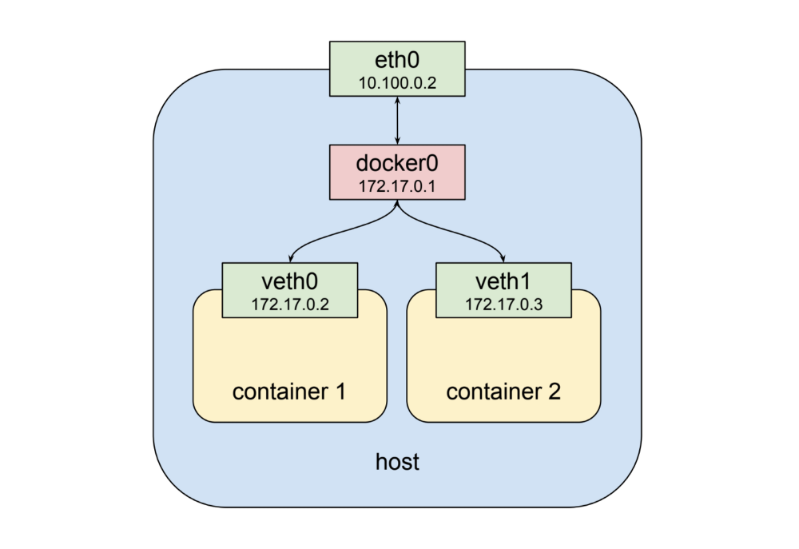
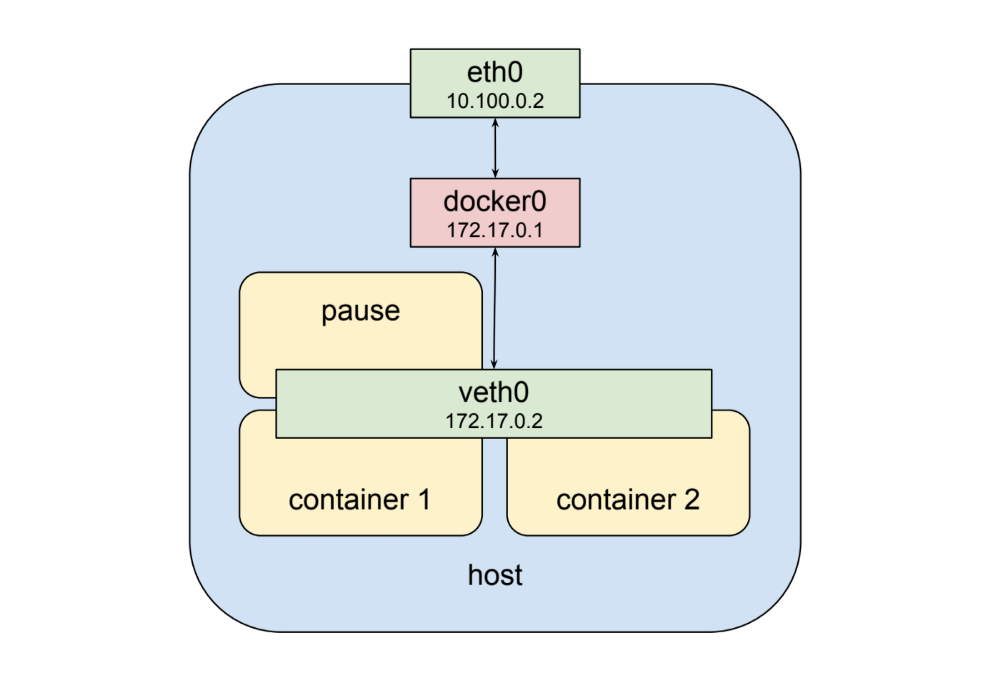
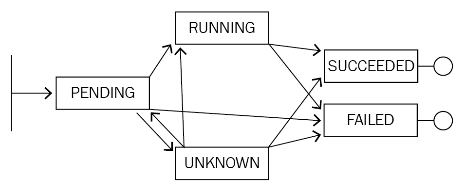

# Pod


*Outline*

[TOC]


**Pod는 Kubernetes에서 이용되는 Container의 관리단위로 생성/관리/배포가능한 가장작은 단위의 유닛이며 Cluster내에서 실제 Application 구동되는 Object입니다.**

Pod는 하나 이상의 Container로 구성되며, 동일한 Pod 내에서는 storage/network를 공유 할 수 있습니다.

Kubernetes에서는 Docker가 가장 많이 쓰이는 Container Runtime 모듈이지만, 다른 Container Runtime 모듈도 지원합니다.


## Pod Networking

Docker에서는 Container들과의 통신을 위해 동일한 Network상에 구성해야 하나 Pod은 개별 IP를 가지며, Pod내의 Container는 동일한 IP를 가집니다.

하지만 Pod은 언제든지 Scale Out/In이 가능하고, 삭제/복제가 가능하므로 자체IP를 가지고 있음에도 불구하고 다른 Pod들과의 통신을 위해서는 반드시 Service Object를 통해 통신해야 합니다.


#### Docker VS Kubernetes Container Network

##### Docker Container Network



##### Kubernetes Container Network




## Pod Templates

Pod는 위에서 보았듯이 Pod Object안에 여러개의 Container를 담을 수 잇는 구조로 되어 있습니다. Yaml 파일도 그에 맞게 Pod의 스펙으로 여러개의 Container를 Spec으로 구성할 수 있도록 되어 있습니다.

```
mkdir -p /lab/pod
gedit /lab/pod/pod.yaml
```

```yaml
apiVersion: v1
kind: Pod
metadata:
  labels:
    run: my-nginx
  name: my-nginx
  namespace: default        
spec:
  containers:
  - image: nginx:1.14.1
    imagePullPolicy: Always
    name: my-nginx
    ports:
    - containerPort: 80
      protocol: TCP
```

작성된 yaml 파일은 kubectl apply 명령어로 kubernetes 클러스터에 배포해봅시다.

```
kubectl apply -f /lab/pod/pod.yaml
```

배포된 내용을 확인해봅시다.

```bash
# kubectl get pod
NAME       READY   STATUS    RESTARTS   AGE
my-nginx   1/1     Running   0          51s

# kubectl get pod -o wide
NAME       READY   STATUS    RESTARTS   AGE     IP          NODE    NOMINATED NODE
my-nginx   1/1     Running   0          2m37s   10.40.0.3   node1   <none>

# kubectl describe pod my-nginx
Name:               my-nginx
Namespace:          default
Priority:           0
PriorityClassName:  <none>
Node:               node1/10.0.2.22
Start Time:         Wed, 24 Apr 2019 09:51:17 +0900
Labels:             run=my-nginx
Annotations:        kubectl.kubernetes.io/last-applied-configuration:
                      {"apiVersion":"v1","kind":"Pod","metadata":{"annotations":{},"labels":{"run":"my-nginx"},"name":"my-nginx","namespace":"default"},"spec":{...
Status:             Running
IP:                 10.40.0.3
Containers:
  my-nginx:
    Container ID:   docker://e12d36fe66e0e73dddc52a9e14d020af01537011ac62c28b54cbc53bbee88541
    Image:          nginx:1.14.1
    Image ID:       docker-pullable://nginx@sha256:32fdf92b4e986e109e4db0865758020cb0c3b70d6ba80d02fe87bad5cc3dc228
    Port:           80/TCP
    Host Port:      0/TCP
    State:          Running
      Started:      Wed, 24 Apr 2019 09:51:26 +0900
    Ready:          True
    Restart Count:  0
    Environment:    <none>
    Mounts:
      /var/run/secrets/kubernetes.io/serviceaccount from default-token-l7h6w (ro)
Conditions:
  Type              Status
  Initialized       True 
  Ready             True 
  ContainersReady   True 
  PodScheduled      True 
Volumes:
  default-token-l7h6w:
    Type:        Secret (a volume populated by a Secret)
    SecretName:  default-token-l7h6w
    Optional:    false
QoS Class:       BestEffort
Node-Selectors:  <none>
Tolerations:     node.kubernetes.io/not-ready:NoExecute for 300s
                 node.kubernetes.io/unreachable:NoExecute for 300s
Events:
  Type    Reason     Age    From               Message
  ----    ------     ----   ----               -------
  Normal  Scheduled  2m56s  default-scheduler  Successfully assigned default/my-nginx to node1
  Normal  Pulling    2m54s  kubelet, node1     pulling image "nginx:1.14.1"
  Normal  Pulled     2m47s  kubelet, node1     Successfully pulled image "nginx:1.14.1"
  Normal  Created    2m47s  kubelet, node1     Created container
  Normal  Started    2m47s  kubelet, node1     Started container
```


## Pod Lifecycle



이번에는 Kubernetes에서 Pod를 배포한 이후의 Pod의 라이프사이클에 대해 알아봅시다. Kubernetes에서 Pod를 배포하고 kubectl get pod 명령어를 통해 배포된 결과를 조회하면 아래와 같이 Pod의 상태를 볼수 있는 필드를 볼 수 있습니다.

```bash
root@master:~# kubectl get pod
NAME                       READY   STATUS    RESTARTS   AGE
my-nginx-589ffc477-22xvz   1/1     Running   0          42s
my-nginx-589ffc477-4947h   1/1     Running   0          31s
my-nginx-589ffc477-8ll5t   1/1     Running   0          36s
my-nginx-589ffc477-md2l4   1/1     Running   0          48s
```

아래는 주요한 Pod의 상태는 Pod의 배포결과를 표시하는 필드로 아래와 같은 상태를 가집니다. 

| Value       | Description                                                  |
| ----------- | ------------------------------------------------------------ |
| `Pending`   | Pod 배포명령을 내린 직후 Pod의 상태를 조회해보면 Pending이라는 상태를 확인 할 수 있습니다. 이 상태를 Pod내의 Container 이미지가 다운로드되기전의 대기 상태를 뜻합니다. |
| `Running`   | Pod의 Container가 Node에 정상적으로 생성되어 그 안의 프로세스가 정상적으로 동작하고 있는 상태로일반적인 Pod의 경우 정상적으로 Pod가 배포되면 Running상태가 됩니다. |
| `Succeeded` | 주로 Job과 같은 Pod리소스에서 확인할 수 있는 형태로 Pod의 Containers 컨테이너가 생성되어 프로세스를 실행하고 정상적으로 종료된 상태입니다. |
| `Failed`    | Pod안의 모든 Containers가 종료되었으나 한개 이상의 Container가 정상적으로 종료되지 않은 상태입니다. |
| `Unknown`   | Pod의 상태를 확인할 수 없는 상태로, 주로 Host 머신과의 통신에 문제가 발생했을때 표시됩니다. |


## Service Accounts for Pods

Kubernetes에서는 계정 및 권한을 관리함에 있어 User Account와 Service Account 두가지로 구분하여 관리되어 집니다. 예를 들어`kubectl` 등의 명령어로 Cluster에 접근할때 Apiserver를 통해 특정 User Account로 인증과정을 거치게 되고,(별도의 설정을 하지 않는다면`admin`계정) Container안의 Process들은 Apiserver에 접근할 수 있는데, 이때 특정 Service Account로 인증을 받습니다.

여기서는 Pod에서 실행되는 프로세스가 Kubernetes API 접근시 사용되는 Service Account에 대해 살펴보겠습니다.

### Use the Default Service Account to access the API server.

Pod가 생성될때, Service Account를 명세하지 않았다면 자동으로 `default` 계정을 할당받아 Pod 내부에서 API로 접근할 수 있습니다.(default 계정의 권한은 클러스터 관리자가 설정할 수 있으므로 설정여부에 따라 권한 및 역할이 다를 수 있습니다.)

```
root@master:/lab/service/clusterip# kubectl get pod my-nginx-pod -o yaml
apiVersion: v1
kind: Pod
metadata:
...
spec:
  containers:
  - image: nginx
 ...
  restartPolicy: Always
  schedulerName: default-scheduler
  securityContext: {}
  serviceAccount: default
  serviceAccountName: default
...
```


```
# kubectl get serviceAccounts
NAME      SECRETS   AGE
default   1         25h
```

이렇게 생성된 Service Account는 Pod안에서 특정위치에 자동으로 마운트되어 Api 접속시 사용되어 집니다.

```
# kubectl apply -f https://k8s.io/examples/pods/storage/redis.yaml

# kubectl exec -it redis -- /bin/bash

# root@redis:/var/run/secrets/kubernetes.io# tree
.
`-- serviceaccount
    |-- ca.crt -> ..data/ca.crt
    |-- namespace -> ..data/namespace
    `-- token -> ..data/token
```


# Containers

## Images

### Updating Images

Kubernetes에서 Image배포시 Kubelet에서는 기본설정값으로 배포하려는 Images가 Node에 존재할 경우 이미지 다운로드를 skip합니다. 이러한 설정값은 Pod의 container spec에 imagePullPolicy 설정 값으로 정의 할 수 있으며, 아래와 같이 설정이 가능합니다.

#### imagePullPolicy

- Always : 배포시마다 레지스트리에서 이미지를 다운로드 받습니다.
- Never : 배포시 레지스트리에서 이미지를 다운로드 받지 않고 Node에 존재하는 이미지를 사용합니다. 만약 Node에 Image가 존재하지 않는다면 에러가 발생합니다. 
- IfNotPresent : Default설정값으로 배포하려는 Images가 Node에 존재할 경우 이미지 다운로드를 skip합니다.


### Pull an Image from a Private Registry

사내 ReDii와 같은 Private Registry를 이용하기 위해서는 다운로드 권한이 저장된 Secret을 생성하여 Container Image Spec에 해당 Key를 ImagePullSecrets 항목으로 설정해주어야 합니다.

```yaml
apiVersion: v1
kind: Pod
metadata:
  name: private-reg
spec:
  containers:
  - name: private-reg-container
    image: <your-private-image>
  imagePullSecrets:
  - name: regcred
```

Kubernetes Cluster에서 아래 명령어로 Secret을 생성해주면 됩니다.

```bash
kubectl create secret docker-registry regcred --docker-server=<your-registry-server> --docker-username=<your-name> --docker-password=<your-pword> --docker-email=<your-email>
```

- `<your-registry-server>` is your Private Docker Registry FQDN.
- `<your-name>` is your Docker username.
- `<your-pword>` is your Docker password.
- `<your-email>` is your Docker email.


