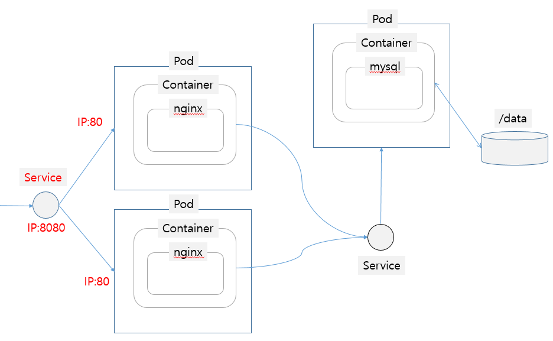
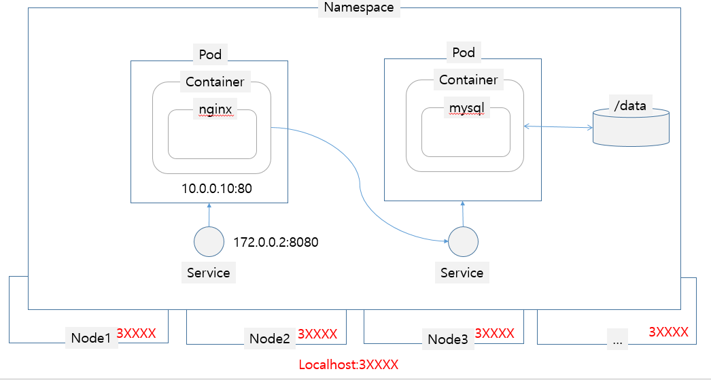
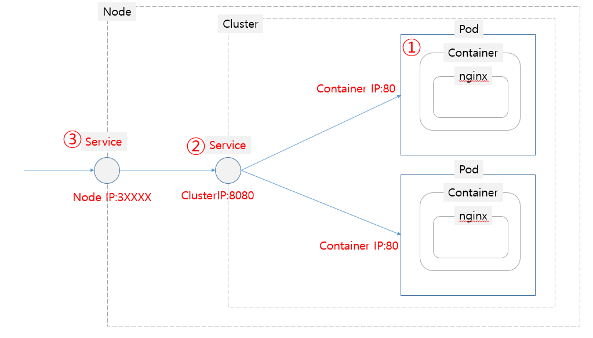

# Service


*Outline*

[TOC]




Pod는 ReplicaSet에 의해 동적으로 생성되고 소멸되기를 반복하기 때문에 각 Pod들은 고유의 IP주소를 가지고 있지만, 해당 IP는 동적으로 생성/소멸되는 이유로 안정적인 서비스를 할 수 없습니다. 따라서 Kubenetes Cluster내에서 포드와 포드간의 통신이 필요하다면(ex. Font-ent, Back-end 간 통신) Service Object를 생성하여 통신해야 합니다. 

위의 그림으로 보면 nginx  pod가 2개 생성되어 있고, 또 이것은 언제든 변화될 수 있는 Object이지만, 그 앞에 관문역할을 하는 Service를 둠으로써, 만약 외부에서 nginx를 연결한다고 해도 외부와 service는 그 설정값은 바뀌지 않게 함으로써 일관된 서비스가 유지될 수 있습니다.

## Service Template

```
apiVersion: v1
kind: Service
metadata:
  name: my-nginx
  labels:
    run: my-nginx
spec:
  type: NodePort
  ports:
  - port: 8080
    targetPort: 80
    protocol: TCP
  selector:
    run: my-nginx
```

위의 yaml 템플릿은 service의 명세를 기술한 것으로 이 yaml을 apply하게되면,

Service Object는 아래와 같이 생성됩니다.


> 이 서비스의 이름은 my-nginx입니다.

```
metadata:
  name: my-nginx
```


> 이 서비스의 Service Type은 NodePort입니다.  이것은 Kubernetes 클러스터를 외부로 노출시킬때 사용됩니다.

```
spec:
  type: NodePort
```


> Cluster 상에 노출되는 Port는 8080이며, 타겟이 되는 Pod(컨테이너)의 Port는 80입니다.

```
  ports:
  - port: 8080
    targetPort: 80
    protocol: TCP
```


> 이 서비스는 Pod중 Lavel값이 run: my-nginx인 Pod를 서비스합니다.

```
  selector:
    run: my-nginx
```


## **Service Object의 특징**

1. Service는 연동하는 대상에 따라 Service Type을 지정하여 원하는 서비스의 종류를 정의할 수 있습니다.
   - CluserIP
   - NodePort
   - LoadBalancer
   - ExternalName
   - Headless service
2. Service Object는 Label Selector를 통하여 해당 Service의 Pod들을 타겟팅하며, 해당 pod들의 로드밸런싱을 지원합니다.
3. Service yaml에 기술된 name은 Kubernetes Cluster상에서 해당 서비스의 Hostname을 뜻하며, 이것을 바탕으로 쿠버네티스 클러스터상에 DNS를 생성합니다.


### Service Type

Kubernetes에서는 해당 서비스를 어디에 노출시키느냐에 따라 아래와 같이 단계별로 그 Type을 설정해 노출시킬 수 있습니다.


- CluserIP : Kubernetes의 디폴트 설정으로 외부에서 접근가능한 IP를 할당받지 않기 때문에 Cluster내에서만 해당서비스를 노출할 때 사용되는 Type입니다.

- NodePort : 해당 서비스를 외부로 노출시키고자 할 때 사용되는 Service Type으로 외부에 Node IP와 Port를 노출시카는 것으로 아래 그림과 같이 Kubernetes Cluster상에 있는 모든 노드들에 대한 NodePort를 노출합니다. 

  

- LoadBalancer : 클라우드상에 존재하는 LoadBalancer에 연결하고자 할 때 사용되는 Service Type으로LoadBalancer의 외부 External IP를 통해 접근이 가능합니다.


### Service Name : DNS

Kubernetes는 자체 DNS서버를 가지고 있어 클러스터 내부에서만 사용가능한 DNS를 설정해서 사용할 수 있습니다. 이것은 Kubernetes상에서 통신할때 IP기반이 아닌 DNS를 통해 연결할 수 있음을 뜻하며 아래 그림과 같이 Pod에서 다른 Pod의 서비스를 연결할때 사용됩니다.


Web(호출하는쪽)  -  value: wordpress-mysql

```yaml
apiVersion: apps/v1
kind: Deployment
metadata:
  name: wordpress
...
      containers:
      - image: wordpress:4.8-apache
        imagePullPolicy: Never
        name: wordpress
        env:
        - name: WORDPRESS_DB_HOST
          value: wordpress-mysql
        - name: WORDPRESS_DB_PASSWORD
          valueFrom:
            secretKeyRef:
              name: mysql-pass
              key: password
        ports:
        - containerPort: 80
          name: wordpress
```

DB(호출받는쪽) - name: wordpress-mysql

```yaml
apiVersion: v1
kind: Service
metadata:
  name: wordpress-mysql
  labels:
    app: wordpress
spec:
  ports:
    - port: 3306
  selector:
    app: wordpress
    tier: mysql
  clusterIP: None
```

아래는 Kubernetes Cluster 안에서 nslookup 명령어로 위에서 생성한 my-nginx 서비스를 조회해본것입니다.

출력된 결과에서 처럼 Cluster내에서 자체 DNS를 관리하고 있는 것을 확인 할 수 있습니다.

```
[ root@curl-5cc7b478b6-rjq5d:/ ]$ nslookup my-nginx-svc
Server:    10.96.0.10
Address 1: 10.96.0.10 kube-dns.kube-system.svc.cluster.local

Name:      my-nginx-svc
Address 1: 10.101.62.208 my-nginx-svc.default.svc.cluster.local
```


## 실습

앞서 설명한 Service Type을 실습해보는 내용으로 사전에 아래와 같이 미리 각각의 서비스 Type 폴더에 해당되는 Pod와 Service Yaml파일을 생성해 두었습니다. 내용을 확인하시고 아래와 같이 명령어 한줄을 Master Node의 커맨드 상에 입력하면 배포가 완료됩니다.

```
lab
 └── service
     │
     ├── clusterip
     │   ├── nginx-pod.yaml
     │   └── nginx-svc.yaml
     │
     ├── loadbalancer
     │   ├── nginx-pod.yaml
     │   └── nginx-svc.yaml
     │
     └── nodeport
         ├── nginx-pod.yaml
         └── nginx-svc.yaml
         
# pod & service 배포
# cd /lab/sercie/{servicetype폴더}
# kubectl apply -f .
```


### Creating a Service - Cluster IP



 Creating a Pod

```bash
# mkdir -p /lab/service/clusterip/
# gedit /lab/service/clusterip/nginx-pod.yaml
```

```yaml
apiVersion: v1
kind: Pod
metadata:
  labels:
    run: my-nginx
  name: my-nginx-pod
  namespace: default
spec:
  containers:
  - image: nginx
    imagePullPolicy: Always
    name: my-nginx-container
    ports:
    - containerPort: 80
      protocol: TCP
```


Pod를 내부에 서비스하기 위해 Service - ClusterIP 로 만듭니다.

Creating a Service - Cluster IP

```bash
# gedit /lab/service/clusterip/nginx-svc.yaml
```

```yaml
apiVersion: v1
kind: Service
metadata:
  name: my-nginx-svc
  labels:
    run: my-nginx
spec:
  ports:
  - port: 80
    protocol: TCP
  selector:
    run: my-nginx
```

Pod & Service 생성

```bash
# kubectl apply -f /lab/service/clusterip
```

결과확인

Service를 조회해보면 Cluster 내부에서만 사용가능한 Cluster IP가 할당된 것을 확인 할 수 있으며, 클러스터에서 curl 명령을 통해 접근가능한 것을 확인 할 수 있습니다.

```bash
# kubectl get svc -o wide
NAME           TYPE        CLUSTER-IP      EXTERNAL-IP   PORT(S)   AGE   SELECTOR
kubernetes     ClusterIP   172.168.1.1     <none>        443/TCP   80m   <none>
my-nginx-svc   ClusterIP   172.168.1.240   <none>        80/TCP    74m   run=my-nginx

# kubectl describe svc my-nginx-svc
Name:              my-nginx-svc
Namespace:         default
Labels:            run=my-nginx
Annotations:       kubectl.kubernetes.io/last-applied-configuration:
                     {"apiVersion":"v1","kind":"Service","metadata":{"annotations":{},"labels":{"run":"my-nginx"},"name":"my-nginx-svc","namespace":"default"},...
Selector:          run=my-nginx
Type:              ClusterIP
IP:                172.168.1.240        # ClusterIP
Port:              <unset>  80/TCP      # Cluster Port
TargetPort:        80/TCP               # Container Port
Endpoints:         10.32.0.5:80         # Container IP
Session Affinity:  None


# curl http://172.168.1.240:80
<!DOCTYPE html>
<html>
<head>
<title>Welcome to nginx!</title>
<style>
    body {
        width: 35em;
        margin: 0 auto;
        font-family: Tahoma, Verdana, Arial, sans-serif;
    }
</style>
</head>
<body>
<h1>Welcome to nginx!</h1>
<p>If you see this page, the nginx web server is successfully installed and
working. Further configuration is required.</p>

<p>For online documentation and support please refer to
<a href="http://nginx.org/">nginx.org</a>.<br/>
Commercial support is available at
<a href="http://nginx.com/">nginx.com</a>.</p>

<p><em>Thank you for using nginx.</em></p>
</body>
</html>

```

#### Pods DNS

쿠버네티스 Cluster로 진입

```bash
# kubectl run curl --image=radial/busyboxplus:curl -i --tty
kubectl run --generator=deployment/apps.v1beta1 is DEPRECATED and will be removed in a future version. Use kubectl create instead.
If you don't see a command prompt, try pressing enter.

참고 : Session ended, resume using 'kubectl attach curl-5cc7b478b6-5lbq7 -c curl -i -t' command when the pod is running
```

DNS 확인

```bash
[ root@curl-5cc7b478b6-rjq5d:/ ]$ nslookup my-nginx-svc
Server:    10.96.0.10
Address 1: 10.96.0.10 kube-dns.kube-system.svc.cluster.local

Name:      my-nginx-svc
Address 1: 10.101.62.208 my-nginx-svc.default.svc.cluster.local

[ root@curl-5cc7b478b6-kb8w8:/ ]$ curl my-nginx-svc.default.svc.cluster.local
<!DOCTYPE html>
<html>
<head>
<title>Welcome to nginx!</title>
<style>
    body {
        width: 35em;
        margin: 0 auto;
        font-family: Tahoma, Verdana, Arial, sans-serif;
    }
</style>
</head>
<body>
<h1>Welcome to nginx!</h1>
<p>If you see this page, the nginx web server is successfully installed and
working. Further configuration is required.</p>

<p>For online documentation and support please refer to
<a href="http://nginx.org/">nginx.org</a>.<br/>
Commercial support is available at
<a href="http://nginx.com/">nginx.com</a>.</p>

<p><em>Thank you for using nginx.</em></p>
</body>
</html>

[ root@curl-5cc7b478b6-vwtmj:/ ]$ exit
Session ended, resume using 'kubectl attach curl-5cc7b478b6-vwtmj -c curl -i -t' command when the pod is running

```

이러한 내부 DNS로 아래 그림과 같이 Pod에서 다른 서비스 또는 다른 Pod로 통신이 가능합니다.


#### Namespaces and DNS

Service Object를 생성하면 해당 Service의 name으로 <namespace-name>를 포함해 아래와 같은 규칙을 가진 DNS가 cluster 내에 생성됩니다. 이것은 어떤 container(pod)에서 해당 service를 DNS로 호출하는 경우에  개발계, 운영계 등과 같이 multiful namespace를 구성했을때 동일한 설정의 구성을 가능하게 합니다. 이것은 만약 다른 namespace 예를 들면 개발계에서 운영계의 Service를 호출하고자 할때는 FQDN을 사용해야 한다는 뜻입니다.

```
<service-name>.<namespace-name>.svc.cluster.local 
```

#### Not All Objects are in a Namespace

대부분의 kubernetes 리소스들(ex. pod, service, replica..) 는 어떤 특정 namespace에 속하지만, 로우 레벨의 리소스들은(node와 persistentVolume 같은) 어떤 namespace에도 속하지 않습니다. 해당 내역을 살펴보기 위해서는 아래 명령어로 출력된 내용중 namespace가 false인 리소스는 namespace에 귀속되지 않는 리소스들입니다.

```
root@master:/lab/namespace# kubectl api-resources
NAME                              SHORTNAMES   APIGROUP                       NAMESPACED   KIND
bindings                                                                      true         Binding
componentstatuses                 cs                                          false        ComponentStatus
configmaps                        cm                                          true         ConfigMap
endpoints                         ep                                          true         Endpoints
events                            ev                                          true         Event
limitranges                       limits                                      true         LimitRange
namespaces                        ns                                          false        Namespace
nodes                             no                                          false        Node
persistentvolumeclaims            pvc                                         true         PersistentVolumeClaim
persistentvolumes                 pv                                          false        PersistentVolume
pods                              po                                          true         Pod
podtemplates                                                                  true         PodTemplate
replicationcontrollers            rc                                          true         ReplicationController
resourcequotas                    quota                                       true         ResourceQuota
secrets                                                                       true         Secret
serviceaccounts                   sa                                          true         ServiceAccount
services                          svc                                         true         Service
mutatingwebhookconfigurations                  admissionregistration.k8s.io   false        MutatingWebhookConfiguration
validatingwebhookconfigurations                admissionregistration.k8s.io   false        ValidatingWebhookConfiguration
customresourcedefinitions         crd,crds     apiextensions.k8s.io           false        CustomResourceDefinition
apiservices                                    apiregistration.k8s.io         false        APIService
controllerrevisions                            apps                           true         ControllerRevision
daemonsets                        ds           apps                           true         DaemonSet
deployments                       deploy       apps                           true         Deployment
replicasets                       rs           apps                           true         ReplicaSet
statefulsets                      sts          apps                           true         StatefulSet
tokenreviews                                   authentication.k8s.io          false        TokenReview
localsubjectaccessreviews                      authorization.k8s.io           true         LocalSubjectAccessReview
selfsubjectaccessreviews                       authorization.k8s.io           false        SelfSubjectAccessReview
selfsubjectrulesreviews                        authorization.k8s.io           false        SelfSubjectRulesReview
subjectaccessreviews                           authorization.k8s.io           false        SubjectAccessReview
horizontalpodautoscalers          hpa          autoscaling                    true         HorizontalPodAutoscaler
cronjobs                          cj           batch                          true         CronJob
jobs                                           batch                          true         Job
certificatesigningrequests        csr          certificates.k8s.io            false        CertificateSigningRequest
leases                                         coordination.k8s.io            true         Lease
events                            ev           events.k8s.io                  true         Event
daemonsets                        ds           extensions                     true         DaemonSet
deployments                       deploy       extensions                     true         Deployment
ingresses                         ing          extensions                     true         Ingress
networkpolicies                   netpol       extensions                     true         NetworkPolicy
podsecuritypolicies               psp          extensions                     false        PodSecurityPolicy
replicasets                       rs           extensions                     true         ReplicaSet
nodes                                          metrics.k8s.io                 false        NodeMetrics
pods                                           metrics.k8s.io                 true         PodMetrics
networkpolicies                   netpol       networking.k8s.io              true         NetworkPolicy
poddisruptionbudgets              pdb          policy                         true         PodDisruptionBudget
podsecuritypolicies               psp          policy                         false        PodSecurityPolicy
clusterrolebindings                            rbac.authorization.k8s.io      false        ClusterRoleBinding
clusterroles                                   rbac.authorization.k8s.io      false        ClusterRole
rolebindings                                   rbac.authorization.k8s.io      true         RoleBinding
roles                                          rbac.authorization.k8s.io      true         Role
priorityclasses                   pc           scheduling.k8s.io              false        PriorityClass
storageclasses                    sc           storage.k8s.io                 false        StorageClass
volumeattachments                              storage.k8s.io                 false        VolumeAttachment
```


###  Creating a Service - NodePort


 Creating a Pod

```bash
# mkdir -p /lab/service/nodeport/
# gedit /lab/service/nodeport/nginx-pod.yaml
```

```yaml
apiVersion: v1
kind: Pod
metadata:
  labels:
    run: my-nginx
  name: my-nginx-pod
  namespace: default
spec:
  containers:
  - image: nginx
    imagePullPolicy: Always
    name: my-nginx-container
    ports:
    - containerPort: 80
      protocol: TCP
```


 Pod를 외부에 서비스하기 위해 Node Port로 만듭니다.

Creating a Service - Node Port

```bash
# gedit /lab/service/nodeport/nginx-svc.yaml
```

```yaml
apiVersion: v1
kind: Service
metadata:
  name: my-nginx-svc
  labels:
    run: my-nginx
spec:
  type: NodePort
  ports:
  - port: 8080
    targetPort: 80
    protocol: TCP
  selector:
    run: my-nginx
```

Service 생성

```bash
kubectl apply -f /lab/service/nodeport/
```

결과확인

NodePort로 service를 생성하게 되면 자동으로 3XXXX대의 포트를 확인 할 수 있습니다. 이 Port가 모든 VM에 노출된 Node Port이고 Cluster 외부인 어느 VM에서나 접근이 가능합니다.

```bash
# kubectl get svc
NAME           TYPE        CLUSTER-IP      EXTERNAL-IP   PORT(S)          AGE
my-nginx-svc   NodePort    172.168.1.240   <none>        8080:31331/TCP   140m


# kubectl describe svc my-nginx-svc
Name:                     my-nginx-svc
Namespace:                default
Labels:                   run=my-nginx
Annotations:              kubectl.kubernetes.io/last-applied-configuration:
                            {"apiVersion":"v1","kind":"Service","metadata":{"annotations":{},"labels":{"run":"my-nginx"},"name":"my-nginx-svc","namespace":"default"},...
Selector:                 run=my-nginx
Type:                     NodePort
IP:                       172.168.1.240       # Cluster IP
Port:                     <unset>  8080/TCP   # Cluster Port
TargetPort:               80/TCP              # Container Port
NodePort:                 <unset>  31331/TCP  # Node Port
Endpoints:                10.32.0.5:80        # Container IP, Port
Session Affinity:         None
External Traffic Policy:  Cluster
Events:                   <none>

> VM IP로 접근
# curl localhost:31331

> Mater, Node 등 모든 node VM내의 Firefox에서 아래 url로 접근가능
http://localhost:31331


```


###  Creating a Service - LoadBalancer


실습을 시작하기전에 가상의 로드밸런서를 생성해줍니다.

```bash
root@master:/k8s/metallb# kubectl apply -f /k8s/metallb/
namespace/metallb-system created
serviceaccount/controller created
serviceaccount/speaker created
clusterrole.rbac.authorization.k8s.io/metallb-system:controller created
clusterrole.rbac.authorization.k8s.io/metallb-system:speaker created
role.rbac.authorization.k8s.io/config-watcher created
clusterrolebinding.rbac.authorization.k8s.io/metallb-system:controller created
clusterrolebinding.rbac.authorization.k8s.io/metallb-system:speaker created
rolebinding.rbac.authorization.k8s.io/config-watcher created
daemonset.apps/speaker created
deployment.apps/controller created
Error from server (NotFound): error when creating "/k8s/metallb/example-layer2-config.yaml": namespaces "metallb-system" not found

위와같이 namespaces "metallb-system" not found 에러가 발생할것입니다.
네임스페이가 생성이 되지 않은 상태에서 일괄생성을 시도했기 때문에 발생한 에러로 다시한번 아래 명령어를 수행합니다.
root@master:/k8s/metallb# kubectl apply -f /k8s/metallb/
configmap/config created
namespace/metallb-system unchanged
serviceaccount/controller unchanged
serviceaccount/speaker unchanged
clusterrole.rbac.authorization.k8s.io/metallb-system:controller unchanged
clusterrole.rbac.authorization.k8s.io/metallb-system:speaker unchanged
role.rbac.authorization.k8s.io/config-watcher unchanged
clusterrolebinding.rbac.authorization.k8s.io/metallb-system:controller unchanged
clusterrolebinding.rbac.authorization.k8s.io/metallb-system:speaker unchanged
rolebinding.rbac.authorization.k8s.io/config-watcher unchanged
daemonset.apps/speaker unchanged
deployment.apps/controller unchanged

```

Creating a Pod

```bash
root@master:~# gedit /lab/service/loadbalancer/nginx-pod.yaml
```

```yaml
apiVersion: v1
kind: Pod
metadata:
  labels:
    run: my-nginx
  name: my-nginx-pod
  namespace: default
spec:
  containers:
  - image: nginx
    imagePullPolicy: Always
    name: my-nginx-container
    ports:
    - containerPort: 80
      protocol: TCP
```


Creating a Service - LoadBalancer

```bash
# gedit /lab/service/loadbalancer/nginx-svc.yaml
```

```yaml
apiVersion: v1
kind: Service
metadata:
  name: my-nginx-svc
  labels:
    run: my-nginx
spec:
  type: LoadBalancer
  ports:
  - port: 3000
    targetPort: 80
    protocol: TCP
  selector:
    run: my-nginx
```

Object 생성

```bash
kubectl apply -f /lab/service/loadbalancer
```

결과확인

VM상에 가상으로 설치한 loadbalancer에 서비스가 매핑된것을 확인 할 수 있습니다.

가상으로 설치한 loadbalancer의 IP는 192.168.1.240 이며, Cluster상에서 해당IP로 nginx 서비스에 접근이 가능합니다.(crul http://192.168.1.240:8080), 이 IP는 실제 클라우드 상에서는 클라우드 벤더가 제공하는 로드밸런서 장비의 외부로 노출된 공인IP입니다.

```bash
root@master:/lab/service/loadbalancer# kubectl get svc
NAME           TYPE           CLUSTER-IP      EXTERNAL-IP     PORT(S)          AGE
kubernetes     ClusterIP      172.168.1.1     <none>          443/TCP          7m1s
my-nginx-svc   LoadBalancer   172.168.1.240   192.168.1.240   3000:30947/TCP   30s

root@master:/lab/service/loadbalancer# kubectl describe svc my-nginx-svc
Name:                     my-nginx-svc
Namespace:                default
Labels:                   run=my-nginx
Annotations:              kubectl.kubernetes.io/last-applied-configuration:
                            {"apiVersion":"v1","kind":"Service","metadata":{"annotations":{},"labels":{"run":"my-nginx"},"name":"my-nginx-svc","namespace":"default"},...
Selector:                 run=my-nginx
Type:                     LoadBalancer
IP:                       172.168.1.240
LoadBalancer Ingress:     192.168.1.240
Port:                     <unset>  3000/TCP
TargetPort:               80/TCP
NodePort:                 <unset>  30947/TCP
Endpoints:                10.32.0.5:80
Session Affinity:         None
External Traffic Policy:  Cluster
Events:
  Type    Reason       Age   From                Message
  ----    ------       ----  ----                -------
  Normal  IPAllocated  44s   metallb-controller  Assigned IP "192.168.1.240"

root@master:/lab/service/loadbalancer# curl http://192.168.1.240:3000
<!DOCTYPE html>
<html>
<head>
<title>Welcome to nginx!</title>
<style>
    body {
        width: 35em;
        margin: 0 auto;
        font-family: Tahoma, Verdana, Arial, sans-serif;
    }
</style>
</head>
<body>
```

### Creating a Service - ExternalName

```bash
# gedit /lab/service/external/external-svc.yaml
```

```yaml
kind: Service
apiVersion: v1
metadata:
  name: myservice
spec:
  type: ExternalName
  externalName: www.github.com
  ports:
  - port: 80
```

Object 생성

```bash
kubectl apply -f /lab/service/external/external-svc.yaml
```


### Headless services

때때로 Pod에 접속할 때 서비스의 로드밸런싱과 Service IP가 필요하지 않는 경우가 있습니다. (Statefulset의 경우) 이러한 경우, 서비스타입 (`.spec.clusterIP`)을 None으로 지정하여 Headless 서비스를 생성할 수 있습니다.

Headless 서비스는 아래와 같은 특징이 있습니다.

- 클러스터IP가 존재하지 않으며, 로드밸런싱이나 프락시가 없습니다.

- DNS의 경우 selector를 구성했는지여부에 따라 자동으로 구성됩니다.

  **selector를 구성한 경우**

  endpoints controller는 API에 `Endpoints` record를 생성하고, Service호출시 Endpoints의 A record가 리턴되도록 DNS를 수정합니다.

  **selector를 구성하지 않은 경우**

  endpoints controller는 `Endpoints` record를 생성하지 않습니다. 다만, DNS 시스템에서 ExternalName에 해당되는 CNAME record를 찾거나, 서비스와 동일한 이름을 가진 `Endpoints`들의 A record를 찾습니다.

```
# mkdir -p /lab/service/headless
# gedit /lab/service/headless/nginx-headless-svc.yaml
```

```
apiVersion: v1
kind: Service
metadata:
  name: nginx-headless-svc
  labels:
    run: my-nginx
spec:
  ports:
  - port: 80
    protocol: TCP
  clusterIP: None
  selector:
    run: my-nginx
```

```
kubectl apply -f /lab/service/headless/nginx-headless-svc.yaml
```

결과를 확인해보면 IP가 존재하지 않는 ClusterIP Type의 서비스가 생성된 것을 확인 할 수 있습니다.

```
kubectl get svc
NAME                 TYPE        CLUSTER-IP      EXTERNAL-IP   PORT(S)   AGE
kubernetes           ClusterIP   172.168.1.1     <none>        443/TCP   105m
my-nginx-svc         ClusterIP   172.168.1.124   <none>        80/TCP    72m
nginx-headless-svc   ClusterIP   None            <none>        80/TCP    5s
root@k8sm:/# kubectl describe svc nginx-headless-svc
Name:              nginx-headless-svc
Namespace:         default
Labels:            run=my-nginx
Annotations:       kubectl.kubernetes.io/last-applied-configuration:
                     {"apiVersion":"v1","kind":"Service","metadata":{"annotations":{},"labels":{"run":"my-nginx"},"name":"nginx-headless-svc","namespace":"defa...
Selector:          run=my-nginx
Type:              ClusterIP
IP:                None
Port:              <unset>  80/TCP
TargetPort:        80/TCP
Endpoints:         10.32.0.2:80
Session Affinity:  None
Events:            <none>
```

그럼 위에서 언급한 Endpoints(Pod)의 DNS가 생성되었는지 확인해보겠습니다.

```
root@k8sm:/# kubectl attach curl-66959f6557-7rqgf -c curl -i -t
If you don't see a command prompt, try pressing enter.
[ root@curl-66959f6557-7rqgf:/ ]$ nslookup nginx-headless-svc
Server:    172.168.1.10
Address 1: 172.168.1.10 kube-dns.kube-system.svc.cluster.local

Name:      nginx-headless-svc
Address 1: 10.32.0.2 10-32-0-2.my-nginx-svc.default.svc.cluster.local
[ root@curl-66959f6557-7rqgf:/ ]$ nslookup my-nginx-svc
Server:    172.168.1.10
Address 1: 172.168.1.10 kube-dns.kube-system.svc.cluster.local

Name:      my-nginx-svc
Address 1: 172.168.1.124 my-nginx-svc.default.svc.cluster.local
```

nslookup nginx-headless-svc 명령어로 DNS를 조회해보면 리턴되는 DNS는 Pod의 IP주로가 리턴되는 것을 확인 할 수 있습니다.

# Ingress

Ingress는 Kubernetes v1.1 추가된 기능으로 `NodePort` 와`LoadBalancer` 와 마찬가지로 애플리케이션의 Service를 외부로 노출할때 사용되는 리소스입니다.

외부에서 들어온 HTTP와 HTTPS 트래픽을 ingress resouce를 생성하여 Cluster내부의 Service로 L7영역에서 라우팅하며  로드밸런싱, TLS, 도메인 기반의 Virtual Hosting을 제공합니다.

이러한 기능은 NodePort로 서비스를 노출하는 것에 비해 외부의 서비스를 보다 손쉽게 관리할 수 있도록해줍니다.


Ingress는 실질적인 라우팅 기능을 제공하는 Ingress Controller와 Ingress  리소스로 구성할 수 있는데, ingress 리소스는 외부의 URLs을 Cluster 내부의 Service로 라우팅하는 rule이 정의되어 있으며, Ingress Controller에는 다양한 구현체가 존재하며, 여기서는 nginx ingress controller를 설치해 실습해 보도록하겠습니다.


## Single Service Ingress

```
apiVersion: extensions/v1beta1
kind: Ingress
metadata:
  name: single-ingress
spec:
  backend:
    serviceName: my-nginx-svc
    servicePort: 80
```


```
root@master:/lab/service/ingress# kubectl get ingress
NAME             HOSTS   ADDRESS         PORTS   AGE
single-ingress   *       192.168.1.240   80      2m17s
root@master:/lab/service/ingress# curl http://192.168.1.240
<!DOCTYPE html>
<html>
<head>
<title>Welcome to nginx!</title>
<style>
    body {
        width: 35em;
        margin: 0 auto;
        font-family: Tahoma, Verdana, Arial, sans-serif;
    }
</style>
</head>
<body>
<h1>Welcome to nginx!</h1>
<p>If you see this page, the nginx web server is successfully installed and
working. Further configuration is required.</p>

<p>For online documentation and support please refer to
<a href="http://nginx.org/">nginx.org</a>.<br/>
Commercial support is available at
<a href="http://nginx.com/">nginx.com</a>.</p>

<p><em>Thank you for using nginx.</em></p>
</body>
</html>

```

## Simple fanout

> foo.bar.com -> 178.91.123.132 -> / foo    service1:4200
> ​                                                            / bar    service2:8080

```shell
apiVersion: extensions/v1beta1
kind: Ingress
metadata:
  name: simple-fanout-example
  annotations:
    nginx.ingress.kubernetes.io/rewrite-target: /
spec:
  rules:
  - host: foo.bar.com
    http:
      paths:
      - path: /foo
        backend:
          serviceName: service1
          servicePort: 4200
      - path: /bar
        backend:
          serviceName: service2
          servicePort: 8080
```

## Name based virtual hosting

> ```none
> foo.bar.com --|                 |-> foo.bar.com service1:80
>               | 178.91.123.132  |
> bar.foo.com --|                 |-> bar.foo.com service2:80
> ```

```
apiVersion: extensions/v1beta1
kind: Ingress
metadata:
  name: name-virtual-host-ingress
spec:
  rules:
  - host: foo.bar.com
    http:
      paths:
      - backend:
          serviceName: service1
          servicePort: 80
  - host: bar.foo.com
    http:
      paths:
      - backend:
          serviceName: service2
          servicePort: 80
```


> ```none
> foo.bar.com --|                 |-> foo.bar.com service1:80
>               | 178.91.123.132  |
> bar.foo.com --|                 |-> bar.foo.com service2:80
>                                 |-> bar.foo.com service3:80
> ```

```
apiVersion: extensions/v1beta1
kind: Ingress
metadata:
  name: name-virtual-host-ingress
spec:
  rules:
  - host: foo.bar.com
    http:
      paths:
      - backend:
          serviceName: service1
          servicePort: 80
  - host: bar.foo.com
    http:
      paths:
      - backend:
          serviceName: service2
          servicePort: 80
  - http:
      paths:
      - backend:
          serviceName: service3
          servicePort: 80
```


