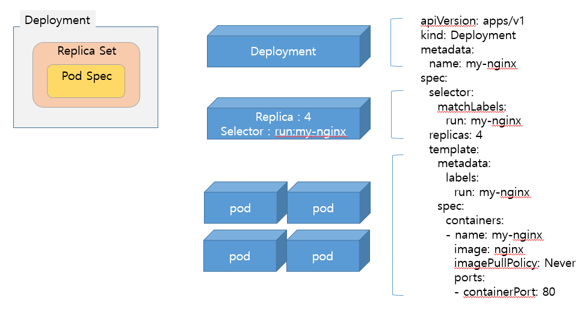

# 	Deployment


*Outline*

[TOC]

## ReplicaSet

Replication Controller의 새로운 버전으로 Label  Selector를 통해 노드 상의 여러 Pod의 생성/복제/삭제 등의 라이프 싸이클을 관리합니다.

1. 지정한 Replica의 숫자만큼 Pod 수 생성/유지
2. Label  Selector를 통한 Pod 타겟팅

간단한 ReplicaSet 예제를 통해 실습해 봅시다.

```
mkdir -p /lab/replicaset
cd /lab/replicaset
gedit /lab/replicaset/replicaset.yaml
```

```
apiVersion: apps/v1
kind: ReplicaSet
metadata:
  name: my-nginx
  labels:
    app: nginx
spec:
  replicas: 3
  selector:
    matchLabels:
      app: nginx
  template:
    metadata:
      labels:
        app: nginx
    spec:
      containers:
      - name: nginx
        image: nginx:1.10
```

kubectl apply 명령어를 통해 작성된 yaml 파일을 배포합니다.

```
kubectl apply -f /lab/replicaset/replicaset.yaml
```

배포된 내용을 확인해보겠습니다.

```
# kubectl get rs
NAME       DESIRED   CURRENT   READY   AGE
my-nginx   3         3         0       7s

# kubectl get pod
NAME             READY   STATUS              RESTARTS   AGE
my-nginx-59rf8   0/1     ContainerCreating   0          11s
my-nginx-cgmnk   0/1     ContainerCreating   0          11s
my-nginx-vp8jt   0/1     ContainerCreating   0          11s
```


## Deployment



Kubernetes에서 어플리케이션 단위를 관리하는 Controller 이며 Kubernetes의 최소 유닛인 Pod에 대한 기준스펙을 정의한 Object이다.

Kubernetes에서는 각 Object를 독립적으로 생성하기 보다는 Deployment를 통해서 생성하는 것을 권장하고 있으며,  Pod와 ReplicaSet의 기준정보를 지정할 수 있다.

이러한 Deployment는 

1. Pod의 scale in / out 되는 기준을 정의한다.
2. Pod의 배포되고 update 되는 모든 버전을 추적할 수 있다.
3. 배포된 Pod에 대한 rollback을 수행할 수 있다. 

**즉, 개념적으로 Deployment = ReplicaSet +Pod+history이며 ReplicaSet 을 만드는 것보다 더 윗 단계의 선언(추상표현)이다.**


## Templates

Deployment는 위에서 보았듯이 Deployment안에 ReplicaSet과 Pod를 담을 수 잇는 구조로 되어 있습니다. 

```
apiVersion: apps/v1beta1
kind: Deployment
metadata:
  # Deployment 객체의 Unique한 명칭
  name: deployment-example
spec:
  # Deployment label selector for pod
  selector:
    matchLabels:
      app: nginx
  # 3 Pods should exist at all times.
  replicas: 3
  template:
    metadata:
      labels:
        # Pod의 라벨
        app: nginx
    spec:
      containers:
      - name: nginx
        # Run this image
        image: nginx:1.10
```


### Creating a Deployment 

참고 : 이전 실습내역 삭제

```bash
root@master:/k8s/metallb# kubectl get svc
NAME           TYPE        CLUSTER-IP      EXTERNAL-IP   PORT(S)   AGE
kubernetes     ClusterIP   172.168.1.1     <none>        443/TCP   151m
my-nginx-svc   ClusterIP   172.168.1.239   <none>        80/TCP    117m
root@master:/k8s/metallb# kubectl delete svc my-nginx-svc
service "my-nginx-svc" deleted

root@master:/k8s/metallb# kubectl get pod
NAME                    READY   STATUS    RESTARTS   AGE
curl-5cc7b478b6-vwtmj   1/1     Running   2          107m
my-nginx-pod            1/1     Running   0          117m
root@master:/k8s/metallb# kubectl delete pod my-nginx-pod
pod "my-nginx-pod" deleted
```


Creating a Deployment to the cluster

```bash
# mkdir -p /lab/deployment
# cd /lab/deployment
# gedit /lab/deployment/nginx-deployment.yaml
```

Deployment yaml파일 생성

```yaml
apiVersion: apps/v1
kind: Deployment
metadata:
  name: my-nginx-deployment
spec:
  selector:
    matchLabels:
      run: my-nginx
  replicas: 2
  template:
    metadata:
      labels:
        run: my-nginx
    spec:
      containers:
      - name: my-nginx-container
        image: nginx
        imagePullPolicy: Always
        ports:
        - containerPort: 80
```

Deployment 생성

```bash
# kubectl apply -f /lab/deployment/nginx-deployment.yaml --record=true
```

결과확인

```bash
root@master:/k8s/metallb# kubectl get deployment
NAME                  DESIRED   CURRENT   UP-TO-DATE   AVAILABLE   AGE
curl                  1         1         1            1           110m
my-nginx-deployment   2         2         2            2           15s

root@master:/k8s/metallb# kubectl get rs
NAME                             DESIRED   CURRENT   READY   AGE
curl-5cc7b478b6                  1         1         1       111m
my-nginx-deployment-6877c7847d   2         2         2       65s

root@master:/k8s/metallb# kubectl get pod
NAME                                   READY   STATUS    RESTARTS   AGE
curl-5cc7b478b6-vwtmj                  1/1     Running   2          111m
my-nginx-deployment-6877c7847d-j6nml   1/1     Running   0          71s
my-nginx-deployment-6877c7847d-wr7c9   1/1     Running   0          71s

```


### Delete pod

장애가 발생한 상황을 가정하여 Pod한개를 삭제해보자

```bash
root@master:/k8s/metallb# kubectl get pod
NAME                                   READY   STATUS    RESTARTS   AGE
curl-5cc7b478b6-vwtmj                  1/1     Running   2          111m
my-nginx-deployment-6877c7847d-j6nml   1/1     Running   0          71s
my-nginx-deployment-6877c7847d-wr7c9   1/1     Running   0          71s

root@master:/k8s/metallb# kubectl delete pod my-nginx-deployment-6877c7847d-j6nml
pod "my-nginx-deployment-6877c7847d-j6nml" deleted

root@master:/k8s/metallb# kubectl get pod
NAME                                   READY   STATUS        RESTARTS   AGE
curl-5cc7b478b6-vwtmj                  1/1     Running       2          114m
my-nginx-deployment-6877c7847d-7pm2c   1/1     Running       0          5s
my-nginx-deployment-6877c7847d-j6nml   0/1     Terminating   0          4m4s
my-nginx-deployment-6877c7847d-wr7c9   1/1     Running       0          4m4s
```

삭제를 하자마자 Deployment에서 선언한 replicas에 의해 신규로 1개의 pod가 생성었음을 알 수 있다.


### Updating a Deployment

#### ReplicaSet Edit

ReplicaSet의  replicas의 숫자를 2에서 4로 변경해봅시다.

```bash
# kubectl edit deployment my-nginx-deployment
spec:
  progressDeadlineSeconds: 600
  replicas: 4
```

결과확인 - 위에서 변경한 갯수대로 변경되었는지 확인합니다.

```bash
root@master:/k8s/metallb# kubectl get pod
NAME                                   READY   STATUS    RESTARTS   AGE
my-nginx-deployment-6877c7847d-9vwwj   1/1     Running   0          22s
my-nginx-deployment-6877c7847d-gqp2g   1/1     Running   0          22s
my-nginx-deployment-6877c7847d-nx9zq   1/1     Running   0          22s
my-nginx-deployment-6877c7847d-sqg22   1/1     Running   0          22s
```


### Rolling Back a Deployment

이번에는 이미지를 다른 버전으로 업데이트하고 이전 버전의 이미지로 돌리는 과정을 실습해봅시다.

#### 이미지 Update

Pod의 이미지를 nginx:latest 에서 nginx:1.9.1으로 변경해봅니다.

변경에 대한 이력을 기록하기 위해 annotations에 change-cause을 추가할 수도 있습니다. 이것은 추후에 이력조회시 변경내용으로 조회되는 항목입니다.

```
# gedit /lab/deployment/nginx-deployment.yaml
```

```
apiVersion: apps/v1
kind: Deployment
metadata:
  name: my-nginx-deployment
  annotations:
    kubernetes.io/change-cause: "set image nginx 1.9.1"
spec:
  selector:
    matchLabels:
      run: my-nginx
  replicas: 4
  template:
    metadata:
      labels:
        run: my-nginx
    spec:
      containers:
      - name: my-nginx-container
        image: nginx:1.9.1
        imagePullPolicy: Always
        ports:
        - containerPort: 80
```

Deployment 생성

```bash
# kubectl apply -f /lab/deployment/nginx-deployment.yaml
```

결과확인

```bash
root@master:/k8s/metallb# kubectl get deployment
NAME                  DESIRED   CURRENT   UP-TO-DATE   AVAILABLE   AGE
curl                  1         1         1            1           110m
my-nginx-deployment   2         2         2            2           15s

root@master:/k8s/metallb# kubectl get rs
NAME                             DESIRED   CURRENT   READY   AGE
curl-5cc7b478b6                  1         1         1       111m
my-nginx-deployment-6877c7847d   2         2         2       65s

root@master:/k8s/metallb# kubectl get pod
NAME                                   READY   STATUS    RESTARTS   AGE
curl-5cc7b478b6-vwtmj                  1/1     Running   2          111m
my-nginx-deployment-6877c7847d-j6nml   1/1     Running   0          71s
my-nginx-deployment-6877c7847d-wr7c9   1/1     Running   0          71s


```

Deployment이력조회

```shell
# kubectl rollout history deployment.v1.apps/my-nginx-deployment
deployment.apps/my-nginx-deployment 
REVISION  CHANGE-CAUSE
1         kubectl apply --filename=/lab/deployment/nginx-deployment.yaml --record=true
2         set image nginx 1.9.1


상세조회를 위해서는 버전옵션을 추가할 수 있습니다.
# kubectl rollout history deployment.v1.apps/my-nginx-deployment --revision=2
deployment.apps/my-nginx-deployment with revision #2
Pod Template:
  Labels:	pod-template-hash=846f7cc5d6
	run=my-nginx
  Annotations:	kubernetes.io/change-cause: set image nginx 1.9.1
  Containers:
   my-nginx-container:
    Image:	nginx:1.9.1
    Port:	80/TCP
    Host Port:	0/TCP
    Environment:	<none>
    Mounts:	<none>
  Volumes:	<none>
```

그럼 이제 버전1로 롤백을 해봅시다.

```
# kubectl rollout undo deployment.v1.apps/my-nginx-deployment --to-revision=1
```


### Delete Deployment

위에서 언급했지만 Deployment 는 하위의 ReplicaSet과 Pod를 관리하는 리소스입니다. 따라서 Deployment를 삭제하면 하위의  ReplicaSet과 Pod이 함께 삭제됩니다.

```bash
# kubectl delete deployment my-nginx-deployment
deployment.extensions "my-nginx-deployment" deleted

# kubectl get rs
No resources found.

# kubectl get pods
NAME                                   READY   STATUS        RESTARTS   AGE
my-nginx-deployment-6877c7847d-sm4cs   0/1     Terminating   0          2m35s
my-nginx-deployment-6877c7847d-zbqxk   0/1     Terminating   0          2m38s
my-nginx-deployment-6877c7847d-zxhlq   0/1     Terminating   0          2m38s

```

