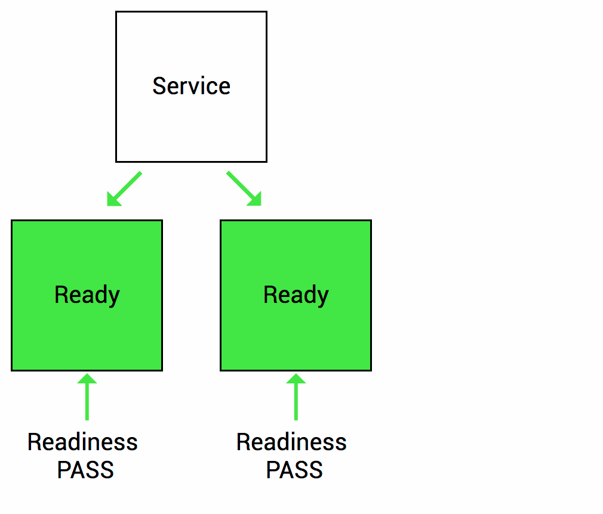
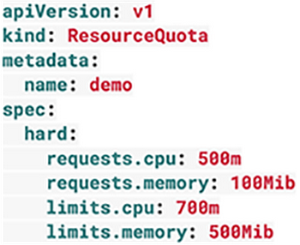
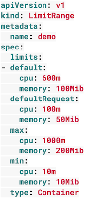

# Pod Configuration

*Outline*

[TOC]


이번 장은 앞서 알아보았던 Pod에 추가적으로 설정해야 할 사항을 알아보는 과정입니다.

먼저 Pod에서 추가적으로 설정 할 사항들을 알아보기 전에 지금까지 우리가 살펴본 Kubernetes Object에 정리해봅시다.

앞서 가장먼저 살펴본 Pod는 Kubernetes의 가장 기본이되는 Unit으로 Container를 담는 Object입니다. 그리고 Pod를 내부/외부로 서비스하기 위해 Service객체를 생성하여 통신하는 것을 알았습니다. 마지막으로는 Deployment Object는 Pod를 특정한 원하는 상태로 유지시켜주는 객체입니다.

이러한 내용을 바탕으로 아래와 같은 상황을 고려해 Pod에 추가적으로 필요한 것을 살펴봅시다.


우리가 지금까지 배운 내용으로 즉, Service, Deployment를 객체를 통해 어떤 서비스를 무중단으로 배포하고 운영한다고 가정해봅시다.

무중단으로 배포되고 운영된다는 것은 서비스가 지속적으로 이루어지는 상황에서, 위의 그림과 같이 하나의 Pod가 문제가 생기면 새로운 Pod가 생성되고, 새로운 버전이 릴리즈되면 기존 버전의 Pod가 제거되고 새로운 버전의 Pod가 생성되는 것입니다.

이 경우 지금까지 배운 내용으로만 배포했을 때 몇가지 문제에 부딪 힐 수 있습니다.

- 새로운 Pod가 배포될 때, kubernetes에서는 새롭게 생성된 Pod가 로딩이 완료되어 준비가 되면 내/외부로부터 온 트래픽을 새롭게 생성된 Pod로 보낼 것입니다. 

  이것은 큰 문제를 발생시킬 수 있습니다. 왜냐하면 kubernetes에서는 Pod가 준비되었는지 여부를 컨테이너가 생성되었는지 여부를 판단해 Pod의 준비여부를 판단하기 때문입니다.

  보통의 애플리케이션은 자체적으로 로딩하는데 어느정도 시간이 걸리게 마련입니다. 이러한 문제로 인해 애플리케이션이 준비완료가 되기 전에 트래픽이 새로운 Pod로 들어 올 수 있는 것입니다. 비유하자면 서버를 키자마자 서비스 요청을 서버로 보낸것입니다.

- 위와 비슷한 관점으로 다른 상황이 있을 수 있습니다. 앞서 알아 보았듯이 Deployment는 Pod의 정상동작여부를 체크해 문제가 발생하면 해당되는 Pod를 제거하고 새로운 Pod를 생성합니다.

  하지만 이 역시도 정상동작여부를 체크할때 컨테이너가 정상동작하는지를 체크합니다. 우리에게 중요한 것은 컨테이너 안의 애플리케이션이 정상동작하는지 여부입니다. 따라서 이 경우에도 실제 애플리케이션의 서비스에 문제가 생기더라도 kubernetes에서는 정상으로 판단하여 트래픽은 문제가 발생한 Pod에 계속해서 보내게 되는 것입니다.

우리는 여기서 이러한 문제들을 해결하기 위한 Kubernetes에서 제공하는 Container probe를 알아 볼 것입니다.


## Container probes

아래의 내용은 Google Cloud의 [Kubernetes best practice article](https://cloud.google.com/blog/products/gcp/kubernetes-best-practices-setting-up-health-checks-with-readiness-and-liveness-probes)을 기반으로 작성되었습니다.

분산환경의 시스템은 시스템이 작동하기 위해 필요한 애플리케이션의 수가 많기 때문에 관리에 어려움이 있습니다. 규모가 작은 애플리케이션이더라도 이를 감지하고, 그것을 정상적으로 동작하도록 작업하는 일은 매우 어려운 일입니다. 따라서 이러한 일들을 자동으로 구현하기 위해 Kubernetes에서는 Health checks 기능으로 이를 해결하고 있습니다.

Health check는 애플리케이션이 동작하고 있는지 문제가 발생하는지 확인하는 간단한 방법입니다. 만약 애플리케이션의 인스턴스가 정상적으로 동작하지 않을 경우 다른 서비스는 문제가 발생한 애플리케이션에 액세스하거나 요청을 보내서는 안되고, 정상적으로 서비스가 되는 인스턴스에 요청을 보내야합니다.. 대신 문제가 발생한 애플리케이션이 정상 상태로 돌아왔을때는 다시 정상으로 돌아온 애플리케이션에도 요청을 보낼 수도 있어야합니다. 물론 그렇게 되기 위해서는 문제가 발생한 애플리케이션을 정상으로 돌려놓는 기능도 필요합니다.

기본적으로 Kubernetes에서는 Pod가 시작될때 모든 Container에 트래픽을 보내 만약 트래픽에 대해 문제가 발생하면 Container를 다시시작합니다. 이러한 default health check기능은 간단한 애플리케이션에서는 무난하게 사용되어질 수 있지만, 보다 근본적으로 사용자 지정 health check를 만들어 배포하면 보다 강력한 배포구조를 가질 수 있습니다.

### Types of health checks

Kubernetes는 두가지 health checks 기능을 제공합니다.

**Readiness**

Readiness probe는 Container안의 애플리케이션이 서비스 할 준비가 되면 Kubernetes에 알리도록 설계되었습니다. 이러한 구조는 Service가 Pod로 트래픽을 보내기전에 Readiness probe 검사단계가 통과되어야만 해당 Pod로 트래픽을 보내는 것을 의미합니다.

예를 들어, 애플리케이션이 시작되고 서비스되기까지 얼마정도의 시간이 걸린다고 가정해봅시다. 이러한 상황에서는 Container의 프로세스가 시작되더라도 애플리케이션이 서비스를 받아들일 준비가 되지 않았으므로, Kubernetes의 Service가 트래픽을 보내더라도, 실제 애플리케이션은 동작하지 않게되지만, Kubernetes는 기본적으로 Container 프로세스가 시작되면 트래픽을 보내기 때문에 문제가 발생 할 수 있습니다. 이러한 경우에 우리는 readiness probe를 사용해 문제를 해결할 수 있게 되는 것입니다. readiness probe 검사단계를 적용하면 Kubernetes는 readiness probe가 통과되어야만 트래픽을 Pod로 보내게되므로 문제가 발생하는 상황을 미연에 방지할 수 있습니다.



**Liveness**

Liveness probe는 배포된 애플리케이션의 상태가 정상인지 비정상인지 여부를 판단하여 Kubernetes에 알리도록 설계되어 있습니다. 만약 애플리케이션에 문제가 발생하면 Kubernetes는 문제가 발생한 Pod를 제거하고 새로운 Pod를 시작하게 됩니다.

예를 들어, 배포한 애플리케이션에 Deadlock이 발생하여 더이상 서비스를 제공할 수 없는 상태가 되었다고 가정해봅시다. 이러한 경우에도 Container의 프로세스는 동작중이기 때문에 기본적으로 Kubernetes 문제가 발생한 Container의 상황을 인지할 수 없게 되고 문제가 발생한 애플리케이션으로 트래픽을 계속 보내게 됩니다. Liveness probe를 적용하게 되면 Kubernetes에서 문제가 발생한 애플리케이션의 상황을 인지해 새로운 Container를 시작할 수 있기 때문에 이러한 상황을 미연에 방지할 수 있습니다.


### Type of Probes

Probe는 Kubelet에 의해 주기적으로 수행되는데, 아래의 3가지 타입으로 container에 구현된 Handler를 호출함으로써 Health Check를 수행합니다. 

**HTTP**

HTTP probe는 가장 일반적으로 사용되는 liveness probe 타입입니다. 애플리케이션의 HTTP 서버로 probe 에 설정한 트래픽을 보내 200~400 의 응답코드를 받으면 정상, 그 이외의 응답코드를 받으면 비정상으로 마킹됩니다.

**Command**

command probe는 Container안에서 해당 command를 수행한 결과가 정상인지 여부를 체크하는 probe타입으로 만약 command 수행결과코드가 0이 리턴되면 정상, 그렇지 않타면 비정상으로 마킹됩니다. command probe 타입은 애플리케이션에 HTTP 서버를 실행할 수 없을 경우 유용하게 사용될 수 있습니다.

**TCP**

TCP probe 타입은 Kubernetes가 지정된 포트로 TCP연결을 시도해 연결에 성공하면 정상, 연결할 수 없다면 비정상으로 마킹하게됩니다. TCP Probe는 HTTP probe나 command probe를 사용할 수 없을 경우에 유용하며, 대표적인 유형으로 [gRPC](https://grpc.io/) 나 FTP service가 있습니다.


### Configure Liveness and Readiness Probes

#### Define a liveness HTTP request

```
# mkdir -p /lab/pod/probe/
# gedit /lab/pod/probe/http-liveness.yaml
```

```
apiVersion: v1
kind: Pod
metadata:
  labels:
    test: liveness
  name: liveness-http
spec:
  containers:
  - name: liveness
    image: k8s.gcr.io/liveness
    args:
    - /server
    livenessProbe:
      httpGet:
        path: /healthz
        port: 8080
        httpHeaders:
        - name: X-Custom-Header
          value: Awesome
      initialDelaySeconds: 3
      periodSeconds: 3
```

- `periodSeconds` liveness probe의 수행주기를 설정하는 필드로 위 예제에서는 매 3초마다 liveness probe를 수해하게 됩니다.

- `initialDelaySeconds` Pod가 생성되고 Conainer가 시작된 이후 최초 probe가 수행되기전에 Delay를 주는 시간

  > Probe는 다양한 방법으로 설정 될 수 있습니다. 예를 들어 얼마나 자주 수행되어야 하는지, 정상 및 비정상을 판단하는 임계값은 무엇인지, 응답을 기다리는 시간은 얼마만큼 지정해야하는지 등을 지정 할 수 있습니다.
  >
  > 하지만 무엇보다도 중요한 설정은 liveness probe를 사용할 때 initialDelaySeconds를 적절히 설정하는 것입니다. 위에서 언급했듯이 liveness probe가 비정상 값을 받게되면 Pod가 다시 시작되게 되는데, 애플리케이션의 서비스가 준비되는데 일정한 시간이 소요되므로, 준비되기 전에  liveness probe가 동작하게 되면, Pod는 비정상 상태로 인지되고, 계속해서 Pod를 재시작하게 됩니다.
  >
  > 따라서, 이러한 상황을 방지하기위해, initialDelaySeconds 설정값으로  [p99](https://www.quora.com/What-is-p99-latency) startup time을 셋팅하거나 평균적인 시작시간을 측정하여 initialDelaySeconds 값을 셋팅해두어야합니다. 다만, 배포가 지속되면서 애플리케이션의 준비시간이 변경될 수 있으므로, 지속적으로 initialDelaySeconds을 변경적용하는 것이 좋습니다.

initialDelaySeconds이후에 kubelet은 HTTP GET request를  Container안에서 동작하고 있는 server의 8080 포트로 `/healthz` path에 요청을 보낼것입니다.  위에서 언급했듯이 success code를 리턴하게 되면, kubelet은 Container가 정상동작하고 있다고 마킹 할 것이고 만약  failure code를 리턴한다면 Container를 제거하고 다시작할 것입니다.

Container 안의 애플리케이션 소스를 보면 아래와 같이 최초 10초 동안에만 200으로 리턴코드를 보내고, 10초 이후에는 500코드를 보내도록 코딩되어 있습니다. 따라서, 10초 이후에는 Container가 Restart될 것입니다.

전체소스는 [server.go](https://github.com/kubernetes/kubernetes/blob/master/test/images/liveness/server.go).를 참조바랍니다.

```
http.HandleFunc("/healthz", func(w http.ResponseWriter, r *http.Request) {
    duration := time.Now().Sub(started)
    if duration.Seconds() > 10 {
        w.WriteHeader(500)
        w.Write([]byte(fmt.Sprintf("error: %v", duration.Seconds())))
    } else {
        w.WriteHeader(200)
        w.Write([]byte("ok"))
    }
})
```

아래 명령어로 Pod를 배포합니다.

```bash
# kubectl apply -f /lab/pod/probe/http-liveness.yaml
```

10초 후에 아래 명령어로 Pod의 상세내역을 확인해보면 Events로 liveness probe에 의해 Unhealthy 로 마킹되어 Container가 Kill되고 재시작되었음을 알 수 있다.

```shell
# kubectl get pods -w
NAME            READY   STATUS    RESTARTS   AGE
liveness-http   1/1     Running   0          9s
liveness-http   1/1   Running   1     27s
liveness-http   1/1   Running   2     47s

# kubectl describe pod liveness-http

Events:
  Type     Reason     Age                From               Message
  ----     ------     ----               ----               -------
  Normal   Scheduled  94s                default-scheduler  Successfully assigned default/liveness-http to node1
  Normal   Pulled     47s (x3 over 88s)  kubelet, node1     Successfully pulled image "k8s.gcr.io/liveness"
  Normal   Created    46s (x3 over 88s)  kubelet, node1     Created container
  Normal   Started    46s (x3 over 87s)  kubelet, node1     Started container
  Warning  Unhealthy  28s (x9 over 76s)  kubelet, node1     Liveness probe failed: HTTP probe failed with statuscode: 500
  Normal   Pulling    27s (x4 over 92s)  kubelet, node1     pulling image "k8s.gcr.io/liveness"
  Normal   Killing    27s (x3 over 70s)  kubelet, node1     Killing container with id docker://liveness:Container failed liveness probe.. Container will be killed and recreated.
```


#### Define a liveness command

```
# gedit /lab/pod/probe/exec-liveness.yaml
```

```
apiVersion: v1
kind: Pod
metadata:
  labels:
    test: liveness
  name: liveness-exec
spec:
  containers:
  - name: liveness
    image: k8s.gcr.io/busybox
    args:
    - /bin/sh
    - -c
    - touch /tmp/healthy; sleep 30; rm -rf /tmp/healthy; sleep 600
    livenessProbe:
      exec:
        command:
        - cat
        - /tmp/healthy
      initialDelaySeconds: 5
      periodSeconds: 5
```

- `periodSeconds` liveness probe의 수행주기를 설정하는 필드로 위 예제에서는 매 5초마다 liveness probe를 수해하게 됩니다.
- `initialDelaySeconds` Pod가 생성되고 Conainer가 시작된 이후 최초 probe가 수행되기전에 Delay를 주는 시간

initialDelaySeconds이후에 kubelet은  Container안에서 `cat /tmp/healthy` 명령을 수행 할 것입니다. 그 결과 리턴된 코드가 0이면 정상 그렇지 않으면 비정상을 마킹하게 되고, Container를 재시작하게 됩니다.

Container가 시작되고 아래와 같은 명령어를 내부에서 수행하므로

```shell
/bin/sh -c "touch /tmp/healthy; sleep 30; rm -rf /tmp/healthy; sleep 600"
```

처음 30초 동안은 probe값이 정상코드로 리턴되지만 30초 이후에는 비정상으로 마킹될 것입니다.

아래 명령어로 Pod를 생성합니다.

```shell
kubectl apply -f /lab/pod/probe/exec-liveness.yaml
```

30초 후에 아래 명령어로 Pod의 상세내역을 확인해보면 Events로 liveness probe에 의해 Unhealthy 로 마킹되어 Container가 Kill되고 재시작되었음을 알 수 있다.

```bash
# kubectl get pods -w
NAME            READY   STATUS              RESTARTS   AGE
liveness-exec   0/1     ContainerCreating   0          5s
liveness-exec   1/1   Running   0     6s
liveness-exec   1/1   Running   1     79s

# kubectl describe pod liveness-exec
Events:
  Type     Reason     Age                  From               Message
  ----     ------     ----                 ----               -------
  Normal   Scheduled  2m32s                default-scheduler  Successfully assigned default/liveness-exec to node1
  Normal   Pulled     74s (x2 over 2m27s)  kubelet, node1     Successfully pulled image "k8s.gcr.io/busybox"
  Normal   Created    74s (x2 over 2m27s)  kubelet, node1     Created container
  Normal   Started    74s (x2 over 2m26s)  kubelet, node1     Started container
  Warning  Unhealthy  31s (x6 over 116s)   kubelet, node1     Liveness probe failed: cat: can't open '/tmp/healthy': No such file or directory
  Normal   Pulling    1s (x3 over 2m31s)   kubelet, node1     pulling image "k8s.gcr.io/busybox"
  Normal   Killing    1s (x2 over 76s)     kubelet, node1     Killing container with id docker://liveness:Container failed liveness probe.. Container will be killed and recreated.
```


#### Define a TCP liveness probe

```bash
# gedit /lab/pod/probe/tcp-liveness-readiness.yaml
```

```yaml
apiVersion: v1
kind: Pod
metadata:
  name: goproxy
  labels:
    app: goproxy
spec:
  containers:
  - name: goproxy
    image: k8s.gcr.io/goproxy:0.1
    ports:
    - containerPort: 8080
    readinessProbe:
      tcpSocket:
        port: 8080
      initialDelaySeconds: 5
      periodSeconds: 10
    livenessProbe:
      tcpSocket:
        port: 8080
      initialDelaySeconds: 15
      periodSeconds: 20
```

위의 예제는 readiness와 liveness probe를 모두 사용한 예제입니다. readiness probe는 Container가 시작되고 5초 이후 처음 수행하고 그 후 매 10초마다 수행하는 설정이고, liveness Probe는 Container가 시작되고 15초 이후 처음 수행하고 그 후 매 20초마다 수행하는 설정입니다. 두 Probe모두 8080 포트로 TCP connection을 체크하게됩니다.

아래 명령어로 Pod를 생성합니다.

```shell
# kubectl apply -f /lab/pod/probe/tcp-liveness-readiness.yaml
```

15초 후에 Pod의 이벤트를 조회해봅니다.

```shell
# kubectl describe pod goproxy

Events:
  Type    Reason     Age   From               Message
  ----    ------     ----  ----               -------
  Normal  Scheduled  18s   default-scheduler  Successfully assigned default/goproxy to node1
  Normal  Pulling    17s   kubelet, node1     pulling image "k8s.gcr.io/goproxy:0.1"
  Normal  Pulled     12s   kubelet, node1     Successfully pulled image "k8s.gcr.io/goproxy:0.1"
  Normal  Created    12s   kubelet, node1     Created container
  Normal  Started    12s   kubelet, node1     Started container
```

##### Use a named port

You can use a named [ContainerPort](https://kubernetes.io/docs/reference/generated/kubernetes-api/v1.13/#containerport-v1-core) for HTTP or TCP liveness checks:

```yaml
ports:
- name: liveness-port
  containerPort: 8080
  hostPort: 8080

livenessProbe:
  httpGet:
    path: /healthz
    port: liveness-port
```


#### Define readiness probes

때때로 애플리케이션을 시작할 때에 어느정도 시간이 소요될 수 있습니다. 어떤 애플리케이션은 초기 시작시 데이터의 로딩시간이 필요할 수도 있고, 외부의 어떤 서비스와 연동되기 위한 시간이 필요할 수도 있습니다. 이런 경우에 정상적으로 서비스가 레디가 되는 것을 체크하는데 사용되어 질 수 있는 것이 readiness probe입니다.

Readiness probe의 설정은 liveness probe를 설정하는 방법과 동일합니다. 다만 `readinessProbe` 필드대신`livenessProbe` 필드로 설정하면 됩니다.

```yaml
readinessProbe:
  exec:
    command:
    - cat
    - /tmp/healthy
  initialDelaySeconds: 5
  periodSeconds: 5
```


### Configure Probes

[Probes](https://kubernetes.io/docs/reference/generated/kubernetes-api/v1.13/#probe-v1-core) 는 보다 정확한 health체크를 위해 많은 설정필드를 가지고 있습니다. 

- `initialDelaySeconds`: Pod가 생성되고 Conainer가 시작된 이후 최초 probe가 수행되기전에 Delay를 주는 시간
- `periodSeconds`: probe의 수행주기를 설정. Default 10 seconds. Minimum value 1.
- `timeoutSeconds`: probe 수행 응답을 기다리는 timeout 시간을 설정. Default 1 second. Minimum value 1.
- `successThreshold`: probe가 최소 몇번을 성공해야 성공으로 마킹할 것인지를 설정하는 필드. Default 1. Minimum value 1.
- `failureThreshold`: probe가 최소 몇번을 실패해야 실패로 마킹할 것인지를 설정하는 Pod가 시작되고 Pobe가 실패하면 Kubernetes는 failureThreshold에 설정된 만큼 다시 probe를 시도할 것입니다. 다만 failureThreshold의 숫자만큼 실패하면 실패로 마킹되고 다시 probe를 시도하지 않고 포기하게 됩니다.  Defaults 3. Minimum value 1.

[HTTP probes](https://kubernetes.io/docs/reference/generated/kubernetes-api/v1.13/#httpgetaction-v1-core) 는 추가적으로 아래와 같은 필드를 더 설정할 수 있습니다.

- `host`: 연결하려는 Host Name, default는 pod IP. 
- `scheme`: HTTP or HTTPS. Defaults to HTTP.
- `path`: HTTP server에 접근하려는 경로.
- `httpHeaders`: Custom header 설정값. 
- `port`: container에 접근하려는 Port.


## Resource  할당

Kubernetes에서 Pod는 스케쥴링할때 Container가 실제로 수행 할 수 있는 충분할 컴퓨팅 리소스를 갖는 것은 매우 중요합니다. 만약 어떤 애플리케이션이 수행되기 위한 리소스보다 적은 리소스로 Node에 할당되게 되면, 메모리나 CPU문제로 애플리케이션이 중단될 수 있기때문입니다. 또한 애플리케이션은 때때로 필요한 것보다 더 많은 리소스기 필요 할 수도 있습니다.

### Resource requests and limits

Resource requests and limit은 Kubernetes가 CPU 및 메모리와 같은 리소스를 제어하는 매커니즘입니다.

Container를 명세할때 아래와 같이 각각의 Container에서 필요한 CPU와 RAM을 CPU는 Milicore단위(1,000 Milicore = 1Core)로 Memory는 Mbyte단위로 리소스의 requests과 limits(요청과 제한)이라는 측면에서 정의할 수 있습니다. Container가 리소스를 Request하면 Kubernetes는 리소스를 제공할 수 있는 노드에서만 스케쥴링이 되고, Limit는 Container가 특정 리소스를 초과하지 않도록 제한합니다.

```yaml
apiVersion: v1
kind: Pod
metadata:
  name: frontend
spec:
  containers:
  - name: wp
    image: wordpress
    resources:
      requests:
        memory: "64Mi"
        cpu: "250m"
      limits:
        memory: "128Mi"
        cpu: "500m"
```

#### cpu

CPU 요청과 관련하여 고려해야 할 사항 중 한가지는 Node의 CPU core수보다 큰 값을 입력하면 Pod가 스케쥴링 되지 않는다는 것입니다. 예로써 Kubernetes 클러스터는 dual core VM으로 구성되어 있는데 Pod에는 4개의 core를 입력했다면 Pod가 스케쥴링 되지 않는다는 것입니다.

특별한 경우가 아니라면 CPU요청은 1이하로 하고 Replica에 의해 오토스케일링되는 것을 염두해서 Pod를 설계해야합니다. 이렇게 설정하는 것이 시스템을 보다 유연하고 신뢰성있게 구성할 수 있습니다.

#### Memory

Memory도 CPU와 마찬가지로 Node의 메모리보다 더 큰 요청을 셋팅하게되면 Pod는 스케쥴링되지 않습니다. 또한 메모리는 CPU와 달리 Kubernetes에서 메모리 사용량을 조절할 수 없으므로 Container가 메모리 제한을 초과하게 되면 애플리케이션(Container)가 종료되는데, Pod가 Deployment, StatefulSet, DaemonSet 또는 다른 유형의 컨트롤러에 의해 관리되는 경우, 기존 Pod는 종료되고 새로운 Pod가 시작됩니다.

### Namespace settings

클러스터는 Namespace로 구성될 수 있는데, 만약 그 중 한 Namespace가 과도한 요청이 있을 경우 전체 클러스터에 영향을 미칠 수 있습니다. 따라서 이러한 경우를 제한하기 위해서는 Namespace 레벨에서 ResourceQuotas와 LimitRanges 를 설정하는 것이 중요합니다.

**ResourceQuotas**

Namespace를 생성한 후, ResourceQuota를 통해 Namespace의 CPU 및 메모리를 제한 할 수 있습니다.




**LimitRange**

ResourceQuotas는 Namespace 전체영역에 대한 리소스의 제한을 정의하는반면, LimitRange는 개별 컨테이너 단위의 리소스에 대한 제약입니다. 즉, 사용자들이 개별 컨테이너에 대한 리소스를 정의 할때 해당되는 범위를 제한하는 개념입니다. 이렇게 함으로써, 사용자들은 초소형 또는 초대형 컨테이너를 생성 할 수 없게 됩니다.




