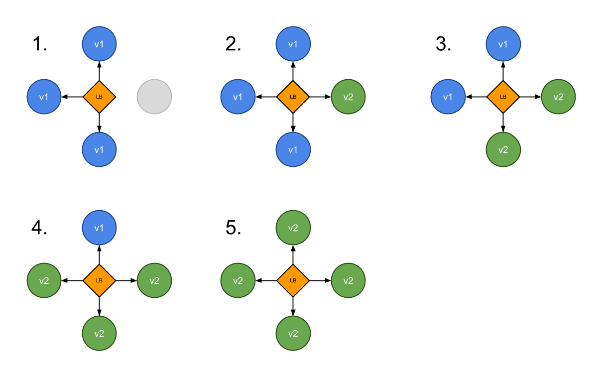
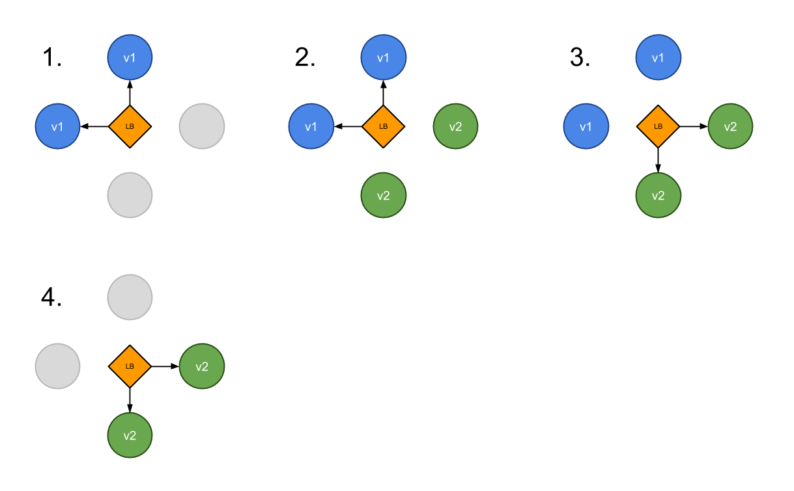
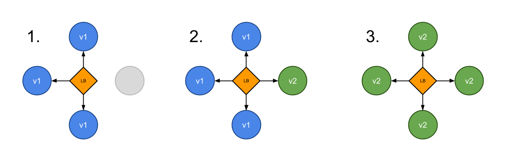
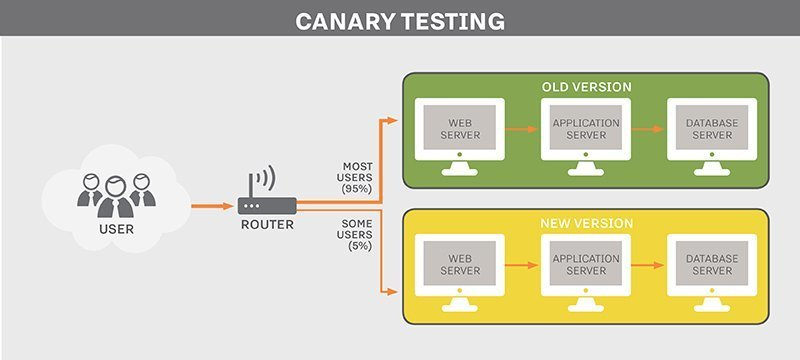

# Deployment strategies


*Outline*

[TOC]

Kubernetes 환경에서 애플리케이션을 배포하기 위한 방법은 여러가지가 있습니다. 여기서는 이러한 여러가지 배포전략을 소개하고 간략한 실습을 수행해 봄으로써 릴리즈되는 애플리케이션의 환경과 상황에 맞게 최선의 배포전략을 선택 수 있게 하기 위한 이해를 돕기 위한 과정입니다.

하기의 배포전략으로 기술된 내용은 Container Solution사의 [블로그](https://container-solutions.com/kubernetes-deployment-strategies/) 글과 [깃허브](https://github.com/ContainerSolutions/k8s-deployment-strategies)를 기초로 작성되었으며, 배포전략의 개념과 이해를 돕기위한 실습과정으로 실제 클라우드환경에서 개발/운영상의 배포는 CI/CD와 연계되어 Kubernetes 배포판으로 배포하는 것이 일반적입니다. 


- [recreate](https://github.com/ContainerSolutions/k8s-deployment-strategies/blob/master/recreate): 기존 버전을 삭제하고 신규버전을 릴리즈

- [ramped](https://github.com/ContainerSolutions/k8s-deployment-strategies/blob/master/ramped): 신규버전을 rolling update하게 릴리즈

- [blue/green](https://github.com/ContainerSolutions/k8s-deployment-strategies/blob/master/blue-green): 신규버전을 릴리즈하고 기존의 트래픽을 전환

- [canary](https://github.com/ContainerSolutions/k8s-deployment-strategies/blob/master/canary): 일부 사용자에게만 신규버전을 릴리즈


## Recreate – best for development environment

Recreate전략은 기존 Version A를 제거하고 Version B를 배포하는 전략으로 Cloud환경에서 비용이 적게 들고, 간편한 설정으로 인해 Development Environment 환경에서 선택할 수 있는 좋은 전략입니다.  Recreate은 Deployment에 strategy of type을 Recreate 으로 지정함으로써 간단한게 어플리케이션을 배포하는 전략입니다.

```
  strategy:
    type: Recreate
```

다만 이러한 Recreate전략은 기존 A버전의 애플리케이션이 중단되면 대체할 수 있는 애플리케이션이 없기 때문에 B버전의 애플리케이션이 시작되기까지 Downtime이 발생하게 됩니다.


V1배포

```
# mkdir -p /lab/deploymentstrategies/recreate/
# gedit /lab/deploymentstrategies/recreate/app-v1.yaml
```

```
apiVersion: v1
kind: Service
metadata:
  name: my-app
  labels:
    app: my-app
spec:
  type: NodePort
  ports:
  - name: http
    port: 80
    targetPort: http
  selector:
    app: my-app
---
apiVersion: apps/v1
kind: Deployment
metadata:
  name: my-app
  labels:
    app: my-app
spec:
  replicas: 3
  selector:
    matchLabels:
      app: my-app
  strategy:
    type: Recreate
  selector:
    matchLabels:
      app: my-app
  template:
    metadata:
      labels:
        app: my-app
        version: v1.0.0
      annotations:
        prometheus.io/scrape: "true"
        prometheus.io/port: "9101"
    spec:
      containers:
      - name: my-app
        image: containersol/k8s-deployment-strategies
        ports:
        - name: http
          containerPort: 8080
        - name: probe
          containerPort: 8086
        env:
        - name: VERSION
          value: v1.0.0
        livenessProbe:
          httpGet:
            path: /live
            port: probe
          initialDelaySeconds: 5
          periodSeconds: 5
        readinessProbe:
          httpGet:
            path: /ready
            port: probe
          periodSeconds: 5
```

```
# kubectl apply -f /lab/deploymentstrategies/recreate/app-v1.yaml
```

정상적으로 배포되었는지 확인합니다.

```
root@master:/# kubectl get pods
NAME                      READY   STATUS    RESTARTS   AGE
my-app-795fd8bb48-29jsz   1/1     Running   0          64s
my-app-795fd8bb48-m5d6c   1/1     Running   0          64s
my-app-795fd8bb48-pktpg   1/1     Running   0          64s

root@master:/# kubectl get svc
NAME         TYPE        CLUSTER-IP      EXTERNAL-IP   PORT(S)        AGE
kubernetes   ClusterIP   172.168.1.1     <none>        443/TCP        18d
my-app       NodePort    172.168.1.240   <none>        80:32601/TCP   67s

root@master:/# curl localhost:32601
Host: my-app-795fd8bb48-pktpg, Version: v1.0.0
```

배포과정을 확인하기위해 Master Node에서 새로운 터미널을 열고 아래명령어를 입력합니다.

```
$ while sleep 0.1; do curl localhost:32601; done
```


V2배포

```
# gedit /lab/deploymentstrategies/recreate/app-v2.yaml
```

```
apiVersion: apps/v1
kind: Deployment
metadata:
  name: my-app
  labels:
    app: my-app
spec:
  replicas: 3
  strategy:
    type: Recreate

  # The selector field tell the deployment which pod to update with
  # the new version. This field is optional, but if you have labels
  # uniquely defined for the pod, in this case the "version" label,
  # then we need to redefine the matchLabels and eliminate the version
  # field from there.
  selector:
    matchLabels:
      app: my-app
  template:
    metadata:
      labels:
        app: my-app
        version: v2.0.0
      annotations:
        prometheus.io/scrape: "true"
        prometheus.io/port: "9101"
    spec:
      containers:
      - name: my-app
        image: containersol/k8s-deployment-strategies
        ports:
        - name: http
          containerPort: 8080
        - name: probe
          containerPort: 8086
        env:
        - name: VERSION
          value: v2.0.0
        livenessProbe:
          httpGet:
            path: /live
            port: probe
          initialDelaySeconds: 5
          periodSeconds: 5
        readinessProbe:
          httpGet:
            path: /ready
            port: probe
          periodSeconds: 5
```

```
# kubectl apply -f /lab/deploymentstrategies/recreate/app-v2.yaml
```


다음 실습을 위해 생성된 모든 리소스를 삭제합니다.

```
kubectl delete all -l app=my-app
```


## Ramped(Rolling Update) 

Ramped(Rolling Update) 는 Kubernetes에서 쉽고 효율적으로 사용 할 수 있는 무중단 배포전략으로  특징은 전체서비스를 중단 후 Pod를 update하는 것이 아니라, 한번에 N개의 pod를 update합니다. 이러한 배포방법은 자원을 효율적으로 사용하면서 전체 서비스가 끈김없이 지속될 수 있는 효과를 가져오며, Deployment에 strategy of type을 Recreate 으로 지정함으로써 간단한게 어플리케이션을 배포하는 전략입니다.

```
  strategy:
    type: RollingUpdate
    rollingUpdate:
      maxSurge: 1
      maxUnavailable: 0
```




V1배포

```
# mkdir -p /lab/deploymentstrategies/rolling/
# gedit /lab/deploymentstrategies/rolling/app-v1.yaml
```

```
apiVersion: v1
kind: Service
metadata:
  name: my-app
  labels:
    app: my-app
spec:
  type: NodePort
  ports:
  - name: http
    port: 80
    targetPort: http
  selector:
    app: my-app
---
apiVersion: apps/v1
kind: Deployment
metadata:
  name: my-app
  labels:
    app: my-app
spec:
  replicas: 3
  selector:
    matchLabels:
      app: my-app
  template:
    metadata:
      labels:
        app: my-app
        version: v1.0.0
      annotations:
        prometheus.io/scrape: "true"
        prometheus.io/port: "9101"
    spec:
      containers:
      - name: my-app
        image: containersol/k8s-deployment-strategies
        ports:
        - name: http
          containerPort: 8080
        - name: probe
          containerPort: 8086
        env:
        - name: VERSION
          value: v1.0.0
        livenessProbe:
          httpGet:
            path: /live
            port: probe
          initialDelaySeconds: 5
          periodSeconds: 5
        readinessProbe:
          httpGet:
            path: /ready
            port: probe
          periodSeconds: 5
```

```
# kubectl apply -f /lab/deploymentstrategies/rolling/app-v1.yaml
```

정상적으로 배포되었는지 확인합니다.

```
root@master:/# kubectl get pods
NAME                      READY   STATUS    RESTARTS   AGE
my-app-795fd8bb48-29jsz   1/1     Running   0          64s
my-app-795fd8bb48-m5d6c   1/1     Running   0          64s
my-app-795fd8bb48-pktpg   1/1     Running   0          64s

root@master:/# kubectl get svc
NAME         TYPE        CLUSTER-IP      EXTERNAL-IP   PORT(S)        AGE
kubernetes   ClusterIP   172.168.1.1     <none>        443/TCP        18d
my-app       NodePort    172.168.1.240   <none>        80:32601/TCP   67s

root@master:/# curl localhost:32601
Host: my-app-795fd8bb48-pktpg, Version: v1.0.0
```

배포과정을 확인하기위해 Master Node에서 새로운 터미널을 열고 아래명령어를 입력합니다.

```
$ while sleep 0.1; do curl localhost:32601; done
```


배포과정을 확인하기위해 Master Node에서 새로운 터미널을 열고 아래명령어를 입력합니다.

```
# su root
# printf -v no_proxy1 '%s,' 172.168.1.{1..255};
# printf -v no_proxy2 '%s,' 10.32.0.{1..255};

# export no_proxy="localhost,http://sds.redii.net,127.0.0.1,182.193.17.192,sds.redii.net,localaddress,*.cluster.local,10.0.2.21,10.0.2.22,10.0.2.24,192.168.1.240,10.32.0.0/24,172.168.1.0/24,${no_proxy1%,},${no_proxy2%,}";
# export NO_PROXY="localhost,http://sds.redii.net,127.0.0.1,182.193.17.192,sds.redii.net,localaddress,*.cluster.local,10.0.2.21,10.0.2.22,10.0.2.24,192.168.1.240,10.32.0.0/24,172.168.1.0/24,${no_proxy1%,},${no_proxy2%,}";
# export KUBECONFIG=/etc/kubernetes/admin.conf
# watch kubectl get po
```


V2배포

```
# gedit /lab/deploymentstrategies/rolling/app-v2.yaml
```

```
apiVersion: apps/v1
kind: Deployment
metadata:
  name: my-app
  labels:
    app: my-app
spec:
  replicas: 3

  # Here we define the rolling update strategy
  # - maxSurge define how many pod we can add at a time
  # - maxUnavailable define how many pod can be unavailable
  #   during the rolling update
  #
  # Setting maxUnavailable to 0 would make sure we have the appropriate
  # capacity during the rolling update.
  # You can also use percentage based value instead of integer.
  strategy:
    type: RollingUpdate
    rollingUpdate:
      maxSurge: 1
      maxUnavailable: 0

  # The selector field tell the deployment which pod to update with
  # the new version. This field is optional, but if you have labels
  # uniquely defined for the pod, in this case the "version" label,
  # then we need to redefine the matchLabels and eliminate the version
  # field from there.
  selector:
    matchLabels:
      app: my-app
  template:
    metadata:
      labels:
        app: my-app
        version: v2.0.0
      annotations:
        prometheus.io/scrape: "true"
        prometheus.io/port: "9101"
    spec:
      containers:
      - name: my-app
        image: containersol/k8s-deployment-strategies
        ports:
        - name: http
          containerPort: 8080
        - name: probe
          containerPort: 8086
        env:
        - name: VERSION
          value: v2.0.0
        livenessProbe:
          httpGet:
            path: /live
            port: probe
          initialDelaySeconds: 5
          periodSeconds: 5
        readinessProbe:
          httpGet:
            path: /ready
            port: probe

          # Intial delay is set to a high value to have a better
          # visibility of the ramped deployment
          initialDelaySeconds: 15
          periodSeconds: 5
```

```
# kubectl apply -f /lab/deploymentstrategies/rolling/app-v2.yaml
```


다음 실습을 위해 생성된 모든 리소스를 삭제합니다.

```
kubectl delete all -l app=my-app
```


## Blue/Green deployments

Blue/green deployment는 Blue는 기존 버전, Green은 새로운 기능을 포함한 새로운 버전으로, 두 버전이 모두 운영환경에 존재하는 상태에서 운영환경에서 Green버전을 테스트한 후 문제가 없으면 Green으로 연결된 트래픽을 Green으로 변경해 배포하는 전략입니다. 장점으로는 배포한 버전(Green)이 문제가 발생했을 경우 신속하게 Blue로 트래픽을 전환할 수 있다는 장점이 있는 반면, 단점으로는 배포시 두배의 리소스가 소요된다는 점과 Stateful한 애플리케이션의 경우는 핸들링하기가 어렵다는 단점이 있습니다.

우리는 앞서 Service 리소스를 살펴보면서 Service가 Pod를 찾는 과정은 Lavel Selector를 이용한다는 것을 알았습니다. Blue/green deployment의 트래픽 전환은 Lavel Selector에 기술된 스펙을 V1에서 V2로 변경함으로써 트래픽을 변경하는 효과를 가져오게 합니다.

V1 Service 변경 전

```
  selector:
    app: my-app
    version: v1.0.0
```

V1 Service 변경 후

```
  selector:
    app: my-app
    version: v2.0.0
```



V1배포

```
# mkdir -p /lab/deploymentstrategies/blue-green/
# gedit /lab/deploymentstrategies/blue-green/app-v1.yaml
```

```
apiVersion: v1
kind: Service
metadata:
  name: my-app
  labels:
    app: my-app
spec:
  type: NodePort
  ports:
  - name: http
    port: 80
    targetPort: http

  # Note here that we match both the app and the version
  selector:
    app: my-app
    version: v1.0.0
---
apiVersion: apps/v1
kind: Deployment
metadata:
  name: my-app-v1
  labels:
    app: my-app
spec:
  replicas: 3
  selector:
    matchLabels:
      app: my-app
      version: v1.0.0
  template:
    metadata:
      labels:
        app: my-app
        version: v1.0.0
      annotations:
        prometheus.io/scrape: "true"
        prometheus.io/port: "9101"
    spec:
      containers:
      - name: my-app
        image: containersol/k8s-deployment-strategies
        ports:
        - name: http
          containerPort: 8080
        - name: probe
          containerPort: 8086
        env:
        - name: VERSION
          value: v1.0.0
        livenessProbe:
          httpGet:
            path: /live
            port: probe
          initialDelaySeconds: 5
          periodSeconds: 5
        readinessProbe:
          httpGet:
            path: /ready
            port: probe
          periodSeconds: 5
```

```
# kubectl apply -f /lab/deploymentstrategies/blue-green/app-v1.yaml
```

정상적으로 배포되었는지 확인합니다.

```
root@master:/# kubectl get pods
NAME                      READY   STATUS    RESTARTS   AGE
my-app-795fd8bb48-29jsz   1/1     Running   0          64s
my-app-795fd8bb48-m5d6c   1/1     Running   0          64s
my-app-795fd8bb48-pktpg   1/1     Running   0          64s

root@master:/# kubectl get svc
NAME         TYPE        CLUSTER-IP      EXTERNAL-IP   PORT(S)        AGE
kubernetes   ClusterIP   172.168.1.1     <none>        443/TCP        18d
my-app       NodePort    172.168.1.240   <none>        80:32601/TCP   67s

root@master:/# curl localhost:32601
Host: my-app-795fd8bb48-pktpg, Version: v1.0.0
```


V2배포

```
# gedit /lab/deploymentstrategies/blue-green/app-v2.yaml
```

```
apiVersion: v1
kind: Service
metadata:
  name: my-app-v2
  labels:
    app: my-app
spec:
  type: NodePort
  ports:
  - name: http
    port: 80
    targetPort: http

  # Note here that we match both the app and the version
  selector:
    app: my-app
    version: v2.0.0
---
apiVersion: apps/v1
kind: Deployment
metadata:
  name: my-app-v2
  labels:
    app: my-app
spec:
  replicas: 3
  selector:
    matchLabels:
      app: my-app
      version: v2.0.0
  template:
    metadata:
      labels:
        app: my-app
        version: v2.0.0
      annotations:
        prometheus.io/scrape: "true"
        prometheus.io/port: "9101"
    spec:
      containers:
      - name: my-app
        image: containersol/k8s-deployment-strategies
        ports:
        - name: http
          containerPort: 8080
        - name: probe
          containerPort: 8086
        env:
        - name: VERSION
          value: v2.0.0
        livenessProbe:
          httpGet:
            path: /live
            port: probe
          initialDelaySeconds: 5
          periodSeconds: 5
        readinessProbe:
          httpGet:
            path: /ready
            port: probe
          periodSeconds: 5
```

```
# kubectl apply -f /lab/deploymentstrategies/blue-green/app-v2.yaml
```

배포과정을 확인하기위해 Master Node에서 새로운 2개를 터미널을 열고 아래명령어를 입력합니다.

```
$ while sleep 0.1; do curl localhost:32601; done
```

```
$ while sleep 0.1; do curl localhost:31663; done
```

V2의 테스트가 완료되었다는 가정하에 V1로가는 트래픽을 V2로 변경합니다.

```
# kubectl patch service my-app -p '{"spec":{"selector":{"version":"v2.0.0"}}}'
```


다음 실습을 위해 생성된 모든 리소스를 삭제합니다.

```
kubectl delete all -l app=my-app
```


## Canary deployments

Canary deployment는 운영환경에서 V1로 배포된 애플리케이션을 V2로 점진적으로 트래픽을 이동시키는 방법입니다. 예를 들어 동일한 애플리케이션에 대한 사용자 요청을 90%는 V1로 나머지 10%를 새롭게 배포된 V2로 보내는 전략입니다. 이러한 배포방법은 배포할 애플리케이션에 대한 테스트가 부족하거나 안정성에 대한 확인이 없을 경우 사용되게 됩니다.





여기서는 Kubernetes의 Service와 Lavel을 이용해 Canary Deployment를 실습해보는 예제입니다.

V1배포

```
# mkdir -p /lab/deploymentstrategies/canary/
# gedit /lab/deploymentstrategies/canary/app-v1.yaml
```

```
apiVersion: v1
kind: Service
metadata:
  name: my-app
  labels:
    app: my-app
spec:
  type: NodePort
  ports:
  - name: http
    port: 80
    targetPort: http
  selector:
    app: my-app
---
apiVersion: apps/v1
kind: Deployment
metadata:
  name: my-app-v1
  labels:
    app: my-app
spec:
  replicas: 4
  selector:
    matchLabels:
      app: my-app
      version: v1.0.0
  template:
    metadata:
      labels:
        app: my-app
        version: v1.0.0
      annotations:
        prometheus.io/scrape: "true"
        prometheus.io/port: "9101"
    spec:
      containers:
      - name: my-app
        image: containersol/k8s-deployment-strategies
        ports:
        - name: http
          containerPort: 8080
        - name: probe
          containerPort: 8086
        env:
        - name: VERSION
          value: v1.0.0
        livenessProbe:
          httpGet:
            path: /live
            port: probe
          initialDelaySeconds: 5
          periodSeconds: 5
        readinessProbe:
          httpGet:
            path: /ready
            port: probe
          periodSeconds: 5
```

```
# kubectl apply -f /lab/deploymentstrategies/canary/app-v1.yaml
```


V2배포

```
# gedit /lab/deploymentstrategies/canary/app-v2.yaml
```

```
apiVersion: apps/v1
kind: Deployment
metadata:
  name: my-app-v2
  labels:
    app: my-app
spec:
  replicas: 1
  selector:
    matchLabels:
      app: my-app
      version: v2.0.0
  template:
    metadata:
      labels:
        app: my-app
        version: v2.0.0
      annotations:
        prometheus.io/scrape: "true"
        prometheus.io/port: "9101"
    spec:
      containers:
      - name: my-app
        image: containersol/k8s-deployment-strategies
        ports:
        - name: http
          containerPort: 8080
        - name: probe
          containerPort: 8086
        env:
        - name: VERSION
          value: v2.0.0
        livenessProbe:
          httpGet:
            path: /live
            port: probe
          initialDelaySeconds: 5
          periodSeconds: 5
        readinessProbe:
          httpGet:
            path: /ready
            port: probe
          periodSeconds: 5
```

```
# kubectl apply -f /lab/deploymentstrategies/canary/app-v2.yaml
```

정상적으로 배포되었는지 확인합니다.

```
root@master:/# kubectl get pods
NAME                      READY   STATUS    RESTARTS   AGE
my-app-795fd8bb48-29jsz   1/1     Running   0          64s
my-app-795fd8bb48-m5d6c   1/1     Running   0          64s
my-app-795fd8bb48-pktpg   1/1     Running   0          64s

root@master:/# kubectl get svc
NAME         TYPE        CLUSTER-IP      EXTERNAL-IP   PORT(S)        AGE
kubernetes   ClusterIP   172.168.1.1     <none>        443/TCP        18d
my-app       NodePort    172.168.1.240   <none>        80:32601/TCP   67s

root@master:/# curl localhost:32601
Host: my-app-795fd8bb48-pktpg, Version: v1.0.0

```


배포과정을 확인하기위해 Master Node에서 터미널을 열고 아래명령어를 입력합니다.

```
$ while sleep 0.1; do curl localhost:31842; done
```


V2의 기능이 이상이 없다고 판단되면, V2의 Pod를 늘려주고, V1의 Pod는 삭제합니다.

```
# kubectl scale --replicas=5 deploy my-app-v2
```

```
# kubectl delete deploy my-app-v1
```


다음 실습을 위해 생성된 모든 리소스를 삭제합니다.

```
kubectl delete all -l app=my-app
```


