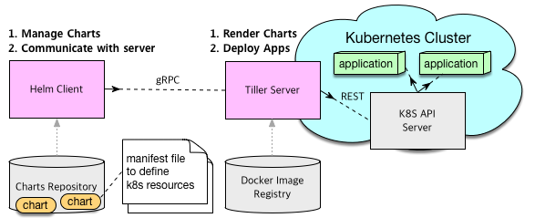

# Helm

Kubernetes에서 소프트웨어를 관리하고 배포하는 쉬운 방법을 제공하는 패키지 관리자로 CNCF에서 선택한 Helm에 대해 설명합니다. 아래 내용은 헬름 공식 홈페이지 문서와 깃허브에 있는 내용을 번역한 내용입니다.

- <https://helm.sh/docs/>
- https://github.com/helm/helm/blob/master/docs


## Why Helm?

Helm을 쉽게 설명하자면, npm, apt, yum과 같은 패키지매니지먼트 도구라고 생각할 수 있습니다. 하지만 CI/CD와 애플리케이션이 구동환경인 인프라스트럭처의 관점에서 보면 단순 패키지매니지먼트보다는 더 큰 역할을 할 수 있다는 것을 알 수 있습니다.

Deployment History

Helm에서 배포된 애플리케이션은 Helm release로 관리됩니다. release된 버전 기록을 자동으로 유지 관리하고, 배포 후 문제가 발생하면 이전상태로 되돌아가는것이 용이합니다. 또한 Helm차트 자체를 SCM툴들을 이용해서 관리하고 협업 할 수 있습니다.

CI/CD Pipeline

또한 여러 CI/CD Pipeline을 제공해 배포작업을 구성하고 자동화하는데 용이합니다.

멀티스테이징

또다른 특징은 배포 중에 애플리케이션 구성을 할 수 있다는 점입니다. 예를 들어 개발/Staging/운영환경에 따라 Pod의 복제본의 수 및 PV의 용량을 다른게 설정할 필요가 있는데 Helm은 동일한 헬름차트로 만들어 모든 환경에서 사용할 수 있습니다.

```bash
# Production
helm install demo-app
# Development
helm install --set replicas=1 --set persistence.enabled=false demo-app
```


## Helm 및 저장소 설치

### 서비스 계정 만들기

Helm을 배포하려면 먼저 서비스 계정과 Tiller 서비스에 대한 역할 바인딩이 필요합니다. RBAC 지원 클러스터에서 Helm/Tiller를 보호하는 방법에 대한 자세한 내용은 [Tiller, 네임스페이스 및 RBAC](https://docs.helm.sh/using_helm/#tiller-namespaces-and-rbac)를 참조하세요.

`helm-rbac.yaml`이라는 파일을 만들고 다음 YAML에 복사합니다.

```
# mkdir -p /lab/helm/install/
# gedit /lab/helm/install/helm-rbac.yaml
```

```yaml
apiVersion: v1
kind: ServiceAccount
metadata:
  name: tiller
  namespace: kube-system
---
apiVersion: rbac.authorization.k8s.io/v1
kind: ClusterRoleBinding
metadata:
  name: tiller
roleRef:
  apiGroup: rbac.authorization.k8s.io
  kind: ClusterRole
  name: cluster-admin
subjects:
  - kind: ServiceAccount
    name: tiller
    namespace: kube-system
```

`kubectl apply` 명령을 사용하여 서비스 계정 및 역할 바인딩을 만듭니다.

```console
kubectl apply -f /lab/helm/install/helm-rbac.yaml
```


### Helm 구성 - Client

1. Download

   ```
   wget https://storage.googleapis.com/kubernetes-helm/helm-v2.13.0-linux-amd64.tar.gz
   ```

2. Unpack

   ```
   tar -zxvf helm-v2.13.0-linux-amd64.tar.gz
   ```

3. bin폴더로 이동

   ```
   mv linux-amd64/helm /usr/local/bin/helm
   ```

   

### Helm 구성 - Tiller

Tiller를 클러스터에 배포하려면 [helm init](https://docs.helm.sh/helm/#helm-init) 명령을 사용합니다. 

```console
helm init --service-account tiller
```


### 저장소 구성

차트뮤지엄 구성

```
curl -LO https://s3.amazonaws.com/chartmuseum/release/latest/bin/linux/amd64/chartmuseum
chmod +x ./chartmuseum
mv ./chartmuseum /usr/local/bin
```

```
chartmuseum --debug --port=8080 \
  --storage="local" \
  --storage-local-rootdir="./chartstorage"
```

```
helm install stable/chartmuseum
```

레파지토리 추가

```
helm repo add chartmuseum http://172.168.1.6:8080
helm repo list
```

차트 index update

```
helm repo update
```


## Three Big Concepts



#### Charts

헬름차트는 단순히 특별한 디렉터리 구조로 정의된 YAML 템플릿 파일의 모음입니다. YAML 파일에는 Kubernetes Object를 구성하는 service, deployment 등이 정의되어 있습니다.

```bash
~>tree demo-chart/
demo-chart/
├── Chart.yaml
├── templates
│   ├── deployment.yaml
│   ├── rbac.yaml
│   └── service.yaml
└── values.yaml
```

*File structure of a Helm chart*

#### Releases

Helm 차트로 Kubernetes 클러스터에 설치된 애플리케이션

#### Repositories

Helm chart 저장소 https://hub.kubeapps.com/, <https://kubeapps.com/>와 같은 공개 저장소와 조직 또는 개인이 구성할 수 있는 private 저장소가 있습니다.

```bash
# helm search wordpress
NAME            	CHART VERSION	APP VERSION	DESCRIPTION                                             
stable/wordpress	5.7.0        	5.1.1      	Web publishing platform for building blogs and websites.

```


## 'helm search': Finding Charts

helm search 명령어로 레파지로부터 차트를 검색할 수 있습니다. Kuberetes 공식 레파지토리는 stable로 명칭되어 있습니다.

```
$ helm search
NAME                 	VERSION 	DESCRIPTION
stable/drupal   	0.3.2   	One of the most versatile open source content m...
stable/jenkins  	0.1.0   	A Jenkins Helm chart for Kubernetes.
stable/mariadb  	0.5.1   	Chart for MariaDB
stable/mysql    	0.1.0   	Chart for MySQL
...
```

```
$ helm search mysql
NAME               	VERSION	DESCRIPTION
stable/mysql  	0.1.0  	Chart for MySQL
stable/mariadb	0.5.1  	Chart for MariaDB
```

검색결과로 mariadb 도 같이 검색된 것은 mariadb description 내용 중에 mysql이 포함되어 있기 때문입니다.

helm inspect 명령으로 관련내용을 확인 할 수 있습니다.

```
$ helm inspect stable/mariadb
Fetched stable/mariadb to mariadb-0.5.1.tgz
description: Chart for MariaDB
engine: gotpl
home: https://mariadb.org
keywords:
- mariadb
- mysql
- database
- sql
...
```


## 'helm install': Installing a Package

```
$ helm install stable/mariadb
Fetched stable/mariadb-0.3.0 to /Users/mattbutcher/Code/Go/src/k8s.io/helm/mariadb-0.3.0.tgz
NAME: happy-panda
LAST DEPLOYED: Wed Sep 28 12:32:28 2016
NAMESPACE: default
STATUS: DEPLOYED

Resources:
==> extensions/Deployment
NAME                     DESIRED   CURRENT   UP-TO-DATE   AVAILABLE   AGE
happy-panda-mariadb   1         0         0            0           1s

==> v1/Secret
NAME                     TYPE      DATA      AGE
happy-panda-mariadb   Opaque    2         1s

==> v1/Service
NAME                     CLUSTER-IP   EXTERNAL-IP   PORT(S)    AGE
happy-panda-mariadb   10.0.0.70    <none>        3306/TCP   1s


Notes:
MariaDB can be accessed via port 3306 on the following DNS name from within your cluster:
happy-panda-mariadb.default.svc.cluster.local

To connect to your database run the following command:

   kubectl run happy-panda-mariadb-client --rm --tty -i --image bitnami/mariadb --command -- mysql -h happy-panda-mariadb
```

차트가 설치되면 새로운 release 객체가 생성됩니다. 이때 release 명칭은 위의 예에서는 happy-panda 가 됩니다.

(만약 명칭을 변경하고 싶다면 helm install에 `--name` flag를 사용하면 됩니다.)

helm은 설치가 종료되는 시점까지 install 명령이 대기하고 있지 않으므로, install 명령 후에는  `helm status`명령어로 배포된 상태를 조회해야 합니다.

```
$ helm status happy-panda
Last Deployed: Wed Sep 28 12:32:28 2016
Namespace: default
Status: DEPLOYED

Resources:
==> v1/Service
NAME                     CLUSTER-IP   EXTERNAL-IP   PORT(S)    AGE
happy-panda-mariadb   10.0.0.70    <none>        3306/TCP   4m

==> extensions/Deployment
NAME                     DESIRED   CURRENT   UP-TO-DATE   AVAILABLE   AGE
happy-panda-mariadb   1         1         1            1           4m

==> v1/Secret
NAME                     TYPE      DATA      AGE
happy-panda-mariadb   Opaque    2         4m


Notes:
MariaDB can be accessed via port 3306 on the following DNS name from within your cluster:
happy-panda-mariadb.default.svc.cluster.local

To connect to your database run the following command:

   kubectl run happy-panda-mariadb-client --rm --tty -i --image bitnami/mariadb --command -- mysql -h happy-panda-mariadb
```


### Customizing the Chart Before Installing

Helm차트는 환경 또는 상황에 따라 그에 맞게 설치할 수 있도록 차트를 사용자 지정하여 설치할 수 있습니다.

helm inspect values 명령어를 사용하여 차트에서 어떤 옵션을 구성할 수 있는지 확인해봅시다.

```
helm inspect values stable/mariadb
Fetched stable/mariadb-0.3.0.tgz to /Users/mattbutcher/Code/Go/src/k8s.io/helm/mariadb-0.3.0.tgz
## Bitnami MariaDB image version
## ref: https://hub.docker.com/r/bitnami/mariadb/tags/
##
## Default: none
imageTag: 10.1.14-r3

## Specify a imagePullPolicy
## Default to 'Always' if imageTag is 'latest', else set to 'IfNotPresent'
## ref: https://kubernetes.io/docs/user-guide/images/#pre-pulling-images
##
# imagePullPolicy:

## Specify password for root user
## ref: https://github.com/bitnami/bitnami-docker-mariadb/blob/master/README.md#setting-the-root-password-on-first-run
##
# mariadbRootPassword:

## Create a database user
## ref: https://github.com/bitnami/bitnami-docker-mariadb/blob/master/README.md#creating-a-database-user-on-first-run
##
# mariadbUser:
# mariadbPassword:

## Create a database
## ref: https://github.com/bitnami/bitnami-docker-mariadb/blob/master/README.md#creating-a-database-on-first-run
##
# mariadbDatabase:
```

해당 value는 config파일을 만들어 오버라이딩 할 수있습니다.

```
$ cat << EOF > config.yaml
mariadbUser: user0
mariadbDatabase: user0db
EOF
$ helm install -f config.yaml stable/mariadb
```


Yaml 파일을 만들지 않고 install 명령어시 `--set` 옵션으로  Release되는 애플리케이션에 Value를 전달할 수도 있습니다.

```
ㅇㅇㅇ
```


### More Installation Methods

The `helm install` command can install from several sources:

- A chart repository (as we've seen above)

- A local chart archive (`helm install foo-0.1.1.tgz`)

- An unpacked chart directory (`helm install path/to/foo`)

- A full URL (`helm install https://example.com/charts/foo-1.2.3.tgz`)

  

## 'helm upgrade' and 'helm rollback': Upgrading a Release, and Recovering on Failure

chart의 새버젼이 나오거나 이미 release한 chart의 설정값을 변경하고 싶을때는 helm upgrade 명령어로 수행이 가능합니다.

```
$ helm upgrade -f panda.yaml happy-panda stable/mariadb
Fetched stable/mariadb-0.3.0.tgz to /Users/mattbutcher/Code/Go/src/k8s.io/helm/mariadb-0.3.0.tgz
happy-panda has been upgraded. Happy Helming!
Last Deployed: Wed Sep 28 12:47:54 2016
Namespace: default
Status: DEPLOYED
...
```

위의 명령어는 happy-panda release를 panda.yaml 파일 내용과 함께 동일한 chart로 upgrade 하는 명령어입니다.

만약 새롭게 변경된 panda.yaml의 내용이 아래와 같다고 가정하면,

```
mariadbUser: user1
```

`helm get values` 명령어로 변경된 내용을 확인 할 수 있습니다.

```
$ helm get values happy-panda
mariadbUser: user1
```


만약 릴리즈 중에 문제가 발생하였다면 `helm rollback [RELEASE] [REVISION]`명령어로 롤백할 수 있습니다.

```
$ helm rollback happy-panda 1
```

위의 rollback 명령어는 릴리즈 버전을 1로 돌리는 명령어 입니다. 릴리즈 버전은 설치, 업그레이드 또는 롤백이 발생 할 때마다 버전번호가 1씩 증가합니다. 첫번째 번호는 항상 1입니다. `helm history [RELEASE]`명령어로 특정 릴리즈에 대한 이력을 확인 할 수 있습니다.


## 'helm delete': Deleting a Release

`helm delete` 명령어로 release 를 삭제할 수 있습니다.

```
$ helm delete happy-panda
```

삭제 되었는지 helm list 명령어로 확인해 봅니다.

```
$ helm list
NAME           	VERSION	UPDATED                        	STATUS         	CHART
inky-cat       	1      	Wed Sep 28 12:59:46 2016       	DEPLOYED       	alpine-0.1.0
```

만약 삭제된 릴리즈를 포함한 모든 릴리즈 내역까지 같이 조회하려면  `helm list --all` 를 사용하면 됩니다.

비슷하게 `helm list --deleted` 옵션으로 조회하면 삭제된 릴리즈만 표시됩니다.

```
⇒  helm list --all
NAME           	VERSION	UPDATED                        	STATUS         	CHART
happy-panda   	2      	Wed Sep 28 12:47:54 2016       	DELETED        	mariadb-0.3.0
inky-cat       	1      	Wed Sep 28 12:59:46 2016       	DEPLOYED       	alpine-0.1.0
kindred-angelf 	2      	Tue Sep 27 16:16:10 2016       	DELETED        	alpine-0.1.0
```

Helm은 삭제된 릴리즈의 레코드를 유지하므로 릴리즈 이름을 다시 사용할 수 없습니다. 만약 릴리즈 이름을 재사용해야한다면  `--replace`옵션을 주면 됩니다. 이것은 기존 릴리즈를 재사용하고 해당 리소스는 새로운 리소스로 대체됩니다.


## 'helm repo': Working with Repositories

지금까지 우리는 공식레파지토리인 stable저장소에서만 차트를 설치했지만, 다른 저장소를 사용하여 helm으로 릴리즈할 수 있습니다. 헬름은 `helm repo`명령어로 저장소를 제어할 수 있는 기능을 제공합니다.

 `helm repo list`명령어로 클러스터에 설정되어 있는 저장소를 조회할 수 있습니다.

```
$ helm repo list
NAME           	URL
stable         	https://kubernetes-charts.storage.googleapis.com
local          	http://localhost:8879/charts
mumoshu        	https://mumoshu.github.io/charts
```

새로운 저장소를 추가하기 위해서 `helm repo add`를 입력합니다.

```
$ helm repo add dev https://example.com/dev-charts
```

차트 저장소의 차트들은 자주 변경되기 때문에 `helm repo update`명령어로 최신의 저장소 인덱스를 업데이트 해주어야 합니다.


## Creating Your Own Charts

`helm create`를 사용하여 헬름 템플릿을 생성 할 수 있습니다.

```
root@k8sm:/home/k8sm/helm# helm create deis-workflow
Creating deis-workflow
root@k8sm:/home/k8sm/helm# tree
.
└── deis-workflow
    ├── charts
    ├── Chart.yaml
    ├── templates
    │   ├── deployment.yaml
    │   ├── _helpers.tpl
    │   ├── ingress.yaml
    │   ├── NOTES.txt
    │   ├── service.yaml
    │   └── tests
    │       └── test-connection.yaml
    └── values.yaml
```

생성된 템플릿을 수정한 후에는  `helm lint`명령어로 편집한 차트에 대해 유효성체크를 할 수 있습니다.

```
root@k8sm:/home/k8sm/helm/deis-workflow# helm lint
==> Linting .
[INFO] Chart.yaml: icon is recommended

1 chart(s) linted, no failures
```

이렇게 편집한 차트를 배포하기 위해서는  `helm package`명령어로 차트를 패키징하고 `helm install`로 설치하면 됩니다.

```
$ helm package deis-workflow
deis-workflow-0.1.0.tgz
```

```
$ helm install ./deis-workflow-0.1.0.tgz
...
```


